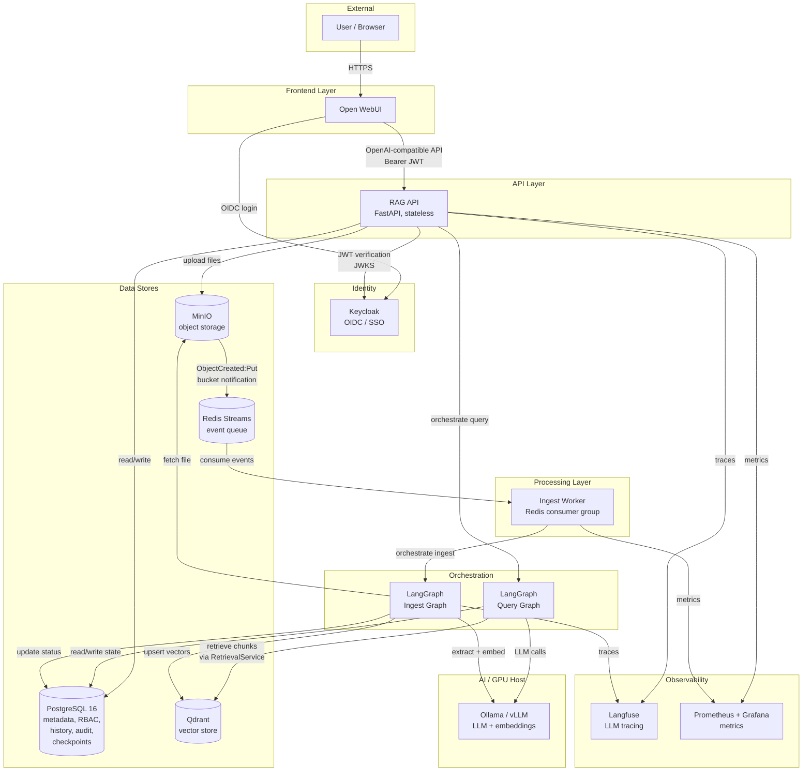
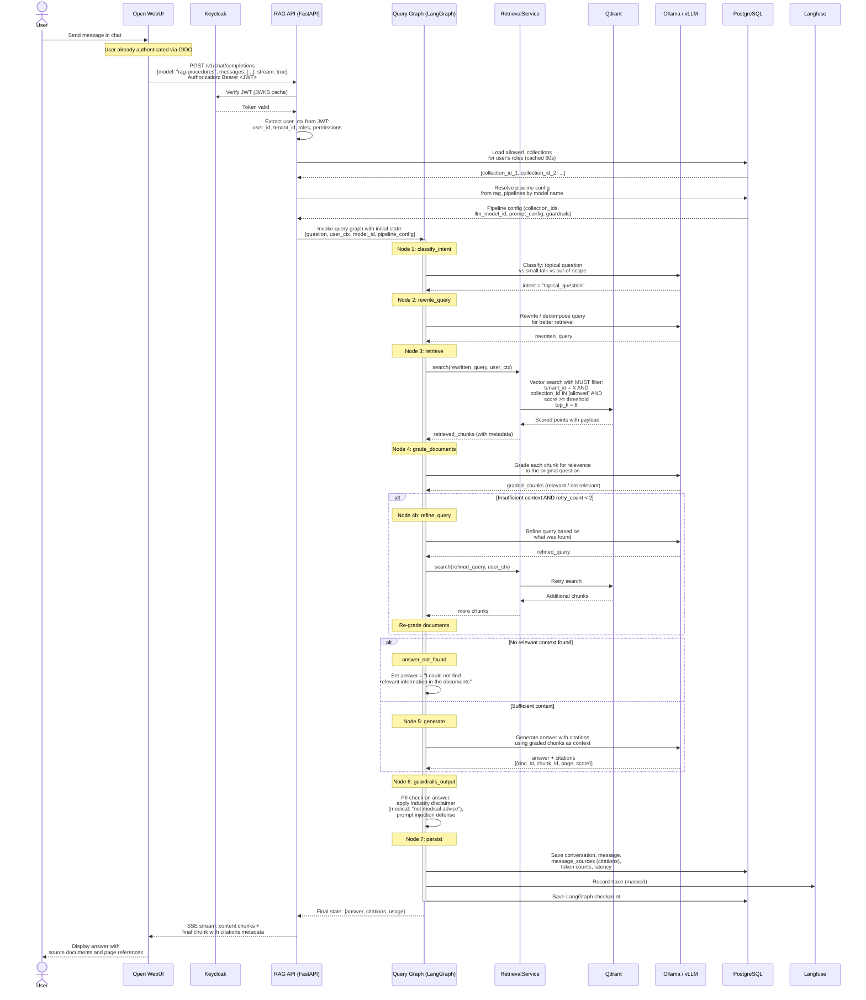
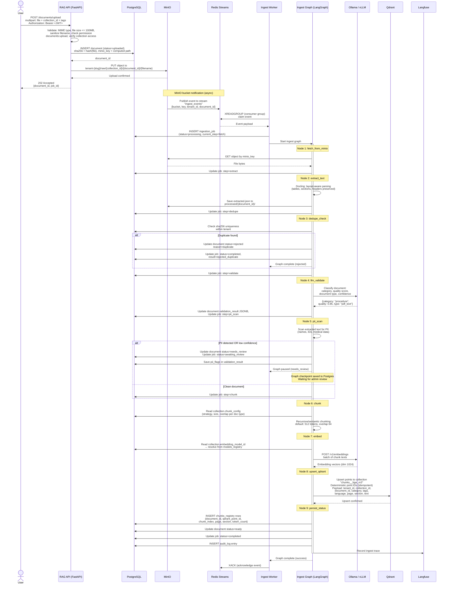
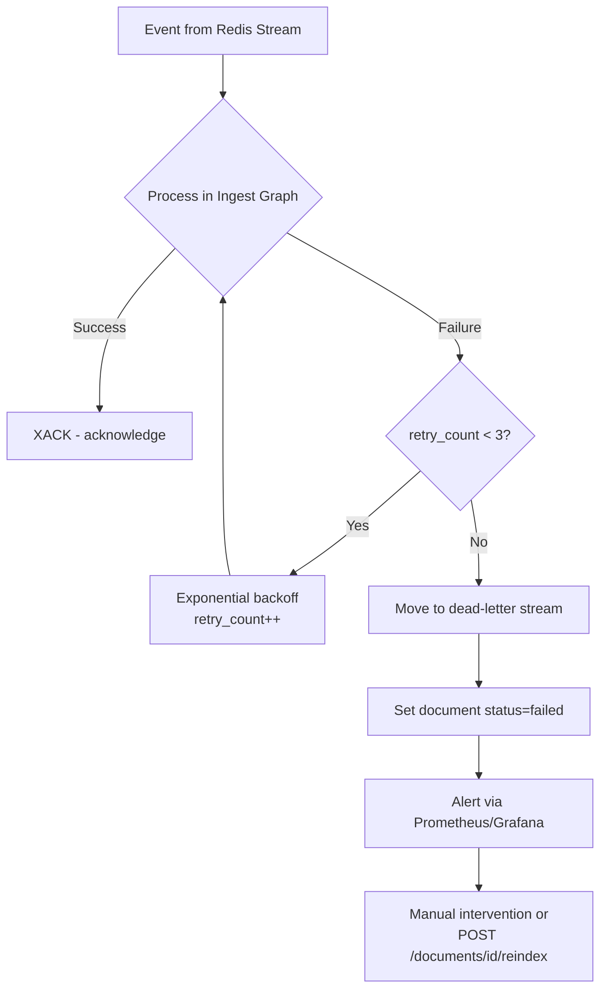
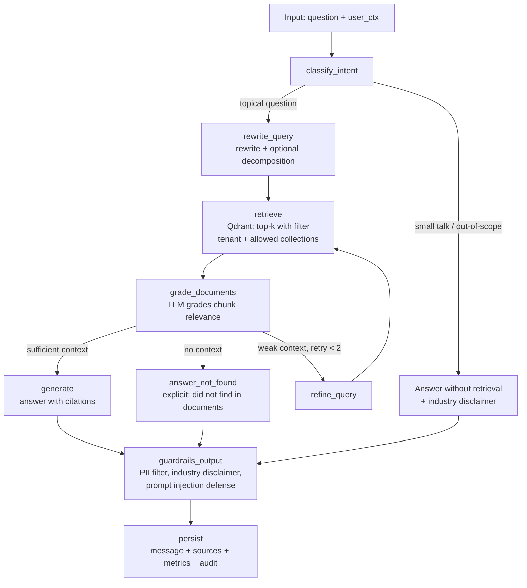
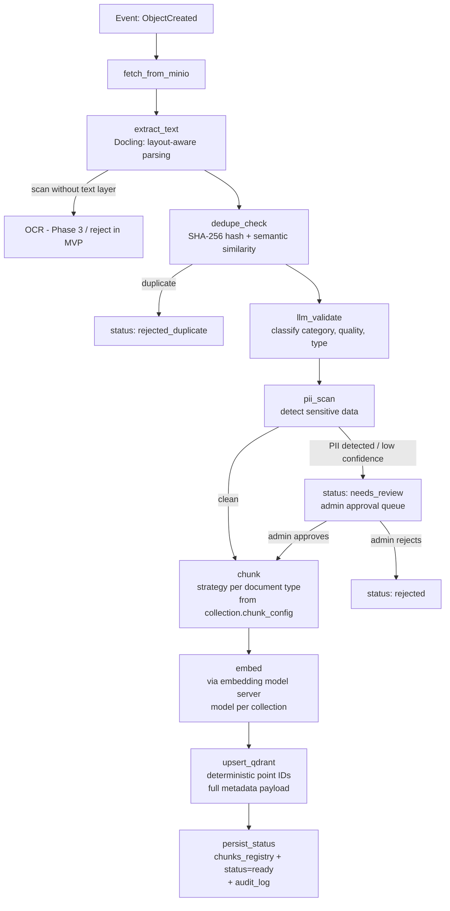
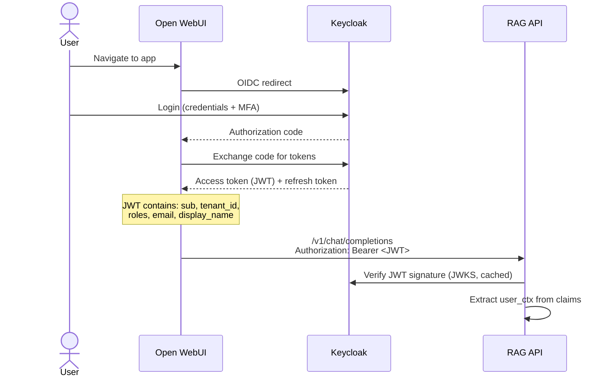

# System Architecture (HLD)

**Project:** Universal RAG Platform
**Version:** 0.2
**Date:** 2026-07-13
**Related:** [PRD](prd.md) | [Data Model](data-model.md) | [API Specification](api.md) | [Security & GDPR](rodo.md)

---

## 1. Component Overview

| Component | Role | Scaling strategy |
|---|---|---|
| **Open WebUI** | Chat frontend, model selection, conversation history | Stateless replica behind reverse proxy |
| **RAG API (FastAPI)** | REST + OpenAI-compatible endpoint, RBAC middleware, graph orchestration | Stateless, N replicas; all state in external stores |
| **Ingest Worker** | Redis Streams consumer, runs ingest validation + indexing graph | Horizontal scaling by queue depth (consumer group) |
| **LangGraph runtime** | Query graph + ingest graph execution engine | Embedded in API and worker processes; checkpoint state in Postgres |
| **Qdrant** | Vector database for chunk embeddings | Single-node (MVP) to cluster (production) |
| **PostgreSQL 16** | Metadata, RBAC, conversation history, audit log, LangGraph checkpoints | Primary + read replica |
| **MinIO** | Source file storage; bucket notifications trigger ingest | Distributed mode (4+ nodes) in production |
| **Redis Streams** | Event queue for ingest pipeline (consumer groups, dead-letter after 3 failures) | Redis Sentinel in production |
| **Ollama / vLLM** | LLM and embedding model serving | Separate GPU host; vLLM for production throughput |
| **Keycloak** | OIDC identity provider, SSO, MFA | Standard HA deployment |
| **Langfuse** | LLM observability, trace recording, token tracking | Self-hosted, PII masking enabled |
| **Prometheus + Grafana** | Infrastructure metrics, alerting | Standard deployment |

---

## 2. Architectural Principles

1. **Stateless API** -- All state persisted in Postgres, Qdrant, and MinIO. Any API instance can be restarted or replaced without data loss.

2. **Event-driven ingest** -- File upload is decoupled from processing. Upload writes to MinIO; MinIO bucket notification publishes an event to Redis Streams; an Ingest Worker picks it up asynchronously. Worker failure does not block uploads.

3. **Structural tenant isolation** -- `tenant_id` is present in every business table (Postgres), in every Qdrant point payload, and in every MinIO object path. The filter is enforced in a single place: `RetrievalService` (for queries) and a FastAPI dependency (for API operations). No handler applies its own tenant filter -- it is injected centrally.

4. **Swappable models via OpenAI-compatible interface** -- All LLM and embedding calls go through an abstract client that speaks the OpenAI API protocol. Changing a model means adding or updating a `models_registry` entry, not changing application code.

5. **Idempotent ingest** -- Each document has a SHA-256 hash (unique per tenant). Reprocessing an event does not duplicate chunks: the ingest graph performs `dedupe_check` and uses deterministic `qdrant_point_id` values for upsert.

---

## 3. Component Interaction Diagram



---

## 4. Data Flow: Chat Query

The following sequence diagram shows the complete path of a user chat query, from Open WebUI through the RAG API, LangGraph query graph, retrieval, LLM generation, and response with citations.



---

## 5. Data Flow: Document Ingest

The following sequence diagram shows the event-driven ingest pipeline, from file upload through MinIO notification, Redis Streams, the Ingest Worker, and the LangGraph ingest graph.



### Error Handling and Dead-Letter



---

## 6. Data Flow: Admin Review (needs_review)

When the ingest graph detects PII or has low classification confidence, it pauses the document in `needs_review` status. An administrator reviews and either approves or rejects it.

```mermaid
sequenceDiagram
    actor Admin
    participant API as RAG API (FastAPI)
    participant PG as PostgreSQL
    participant IG as Ingest Graph (LangGraph)
    participant LLM as Ollama / vLLM
    participant QD as Qdrant

    Note over PG: Document is in status=needs_review<br/>Ingest graph checkpoint saved<br/>ingestion_job.status=awaiting_review

    Admin->>API: GET /documents/review-queue<br/>Permission: documents:approve
    API->>PG: SELECT documents<br/>WHERE status = 'needs_review'<br/>AND tenant_id = admin's tenant
    PG-->>API: List of documents with<br/>validation_result (category, confidence,<br/>pii_flags, quality_score)
    API-->>Admin: Review queue with details

    Admin->>API: GET /documents/{id}<br/>View full validation result
    API-->>Admin: Document metadata +<br/>validation_result + pii_flags

    alt Admin approves
        Admin->>API: POST /documents/{id}/review<br/>{decision: "approve", note: "PII is org name, acceptable"}
        API->>PG: Update document status=indexing<br/>Set reviewed_by, reviewed_at
        API->>PG: INSERT audit_log<br/>(action=document_approved)
        API->>PG: Update ingestion_job<br/>status=processing, current_step=chunk

        API->>IG: Resume ingest graph from checkpoint<br/>(thread_id from ingestion_job)
        activate IG

        Note over IG: Resume at Node 6: chunk
        IG->>IG: Chunk document
        IG->>LLM: Generate embeddings
        IG->>QD: Upsert vectors
        IG->>PG: Create chunks_registry,<br/>update status=ready

        deactivate IG

    else Admin rejects
        Admin->>API: POST /documents/{id}/review<br/>{decision: "reject", note: "Contains patient data"}
        API->>PG: Update document status=rejected<br/>Set reviewed_by, reviewed_at
        API->>PG: INSERT audit_log<br/>(action=document_rejected)
        API->>PG: Update ingestion_job<br/>status=completed, result=rejected

        Note over PG: Document stays in MinIO<br/>for audit trail; no vectors created
    end
```

---

## 7. Query Graph (LangGraph)

### Topology



### Graph State

```python
class QueryGraphState(TypedDict):
    question: str
    rewritten_query: str | None
    user_ctx: UserContext          # tenant_id, user_id, roles, allowed_collection_ids
    pipeline_config: PipelineConfig  # collection_ids, llm_model_id, prompt_config, guardrails
    retrieved_chunks: list[Chunk]
    graded_chunks: list[GradedChunk]
    retry_count: int
    answer: str
    citations: list[Citation]     # doc_id, chunk_id, page, section, highlight_text, score
    model_id: str
    prompt_tokens: int
    completion_tokens: int
    latency_ms: float
```

### Node Contracts

| Node | Input from state | Output to state | External calls |
|---|---|---|---|
| `classify_intent` | question | intent (enum) | LLM |
| `rewrite_query` | question, retrieved_chunks (if retry) | rewritten_query | LLM |
| `retrieve` | rewritten_query, user_ctx, pipeline_config | retrieved_chunks | RetrievalService -> Qdrant |
| `grade_documents` | question, retrieved_chunks | graded_chunks | LLM |
| `refine_query` | question, graded_chunks | rewritten_query, retry_count++ | LLM |
| `generate` | question, graded_chunks, pipeline_config | answer, citations, token counts | LLM |
| `guardrails_output` | answer, pipeline_config.guardrails | answer (sanitized) | Rule-based + optional LLM |
| `persist` | full state | -- | Postgres, Langfuse |

**Checkpointer:** PostgreSQL (LangGraph Postgres checkpointer). Each graph invocation creates a checkpoint per node for debugging and resumption.

---

## 8. Ingest Graph (LangGraph)

### Topology



### Ingest Graph State

```python
class IngestGraphState(TypedDict):
    document_id: UUID
    tenant_id: UUID
    collection_id: UUID
    minio_key: str
    raw_bytes: bytes | None
    extracted_text: str | None
    extracted_sections: list[Section] | None
    sha256: str
    validation_result: ValidationResult | None  # category, quality, type, confidence, pii_flags
    chunks: list[ChunkData] | None
    embeddings: list[list[float]] | None
    point_ids: list[UUID] | None
    status: DocumentStatus
    error: str | None
    retry_count: int
```

### Node Contracts

| Node | Input from state | Output to state | External calls |
|---|---|---|---|
| `fetch_from_minio` | minio_key | raw_bytes | MinIO |
| `extract_text` | raw_bytes | extracted_text, extracted_sections | Docling (local) |
| `dedupe_check` | sha256, tenant_id | status (rejected_duplicate or continue) | Postgres |
| `llm_validate` | extracted_text (sample) | validation_result | LLM |
| `pii_scan` | extracted_text | validation_result.pii_flags, status | Rule-based + optional LLM |
| `chunk` | extracted_text, extracted_sections, collection.chunk_config | chunks | LangChain splitters |
| `embed` | chunks, collection.embedding_model_id | embeddings | Embedding model server |
| `upsert_qdrant` | chunks, embeddings, metadata | point_ids | Qdrant |
| `persist_status` | point_ids, document_id | status=ready | Postgres |

Each node updates `ingestion_jobs.status` and `ingestion_jobs.steps` JSONB. On failure: retry with exponential backoff (max 3 attempts), then `status=failed` + alert.

---

## 9. Retrieval Architecture

### RetrievalService -- The Single Access Point to Qdrant

**Hard rule:** No module outside `src/retrieval/` may instantiate a Qdrant client or execute vector queries. This is enforced by code review, import linter tests, and architectural tests in CI.

```
src/retrieval/
    service.py          # RetrievalService class
    filters.py          # Qdrant filter builder
    reranker.py         # Phase 3: cross-encoder reranking
```

### Filter Construction

Every query to Qdrant includes a mandatory filter:

```python
# Pseudocode -- always applied, never optional
filter = Must([
    FieldCondition("tenant_id", Match(user_ctx.tenant_id)),    # ISOLATION
    FieldCondition("collection_id", MatchAny(allowed_ids)),     # RBAC
])

# Optional additions from pipeline config:
if category_filter:
    filter.must.append(FieldCondition("category", MatchAny(categories)))
if language_filter:
    filter.must.append(FieldCondition("language", Match(language)))
```

### Retrieval Parameters

| Parameter | Default | Source | Configurable per |
|---|---|---|---|
| `top_k` | 8 | `rag_pipelines.prompt_config` | Pipeline |
| `score_threshold` | 0.35 | `rag_pipelines.prompt_config` | Pipeline |
| `embedding_model` | per collection | `collections.embedding_model_id` | Collection |
| `reranker` | none (Phase 3) | `rag_pipelines.prompt_config` | Pipeline |

---

## 10. Open WebUI Integration

### Connection Model

RAG API exposes two OpenAI-compatible endpoints:

| Endpoint | Purpose |
|---|---|
| `GET /v1/models` | Returns RAG pipelines as "models" (e.g., `rag-procedures`, `rag-hr`) plus raw LLM models per role policy |
| `POST /v1/chat/completions` | Chat completion with `stream: true` for SSE; `model` = pipeline ID |

Open WebUI registers RAG API as an **OpenAI-compatible connection**. Each RAG pipeline appears as a selectable "model" in the UI.

### Authentication Flow



### History Ownership

- **Open WebUI** maintains its own conversation history in its Postgres database (user-facing display).
- **RAG API** independently persists conversations, messages, message_sources, and token usage to its own Postgres tables. RAG API is the **source of truth for audit purposes**.
- Both stores are linked by `user_id` (Keycloak `sub`).

---

## 11. Deployment Topology

### MVP (Docker Compose)

```
Host 1 (CPU, 16+ GB RAM):
  - openwebui
  - rag-api (FastAPI, uvicorn)
  - ingest-worker (1-2 instances)
  - postgres (with LangGraph checkpoints)
  - redis (Streams)
  - minio
  - qdrant
  - keycloak
  - langfuse

Host 2 (GPU, 24+ GB VRAM):
  - ollama (or vLLM)
  - Serves: LLM (e.g., Llama 3.x, Qwen, Bielik)
  - Serves: Embeddings (BGE-M3, dim 1024)

Network:
  - Reverse proxy (Traefik or Caddy) with TLS
  - Only the proxy is exposed externally
  - GPU host in private VLAN, no internet access
```

### Production (Phase 3 -- Kubernetes)

```
Namespace: rag-platform

Node pool "cpu":
  - rag-api (Deployment, HPA by CPU/request rate)
  - ingest-worker (Deployment, HPA by queue depth)
  - openwebui (Deployment)
  - keycloak (StatefulSet)
  - langfuse (Deployment)

Node pool "data":
  - postgres (StatefulSet, primary + replica)
  - qdrant (StatefulSet, clustered)
  - minio (StatefulSet, distributed 4+ nodes)
  - redis (StatefulSet, Sentinel)

Node pool "gpu":
  - vllm (Deployment, GPU resource limits)

Ingress: NGINX Ingress Controller + cert-manager
Monitoring: Prometheus Operator + Grafana
Backup: pg_basebackup daily, Qdrant snapshots, MinIO versioning
Per-client isolation: Helm chart with values override per tenant
```

---

## 12. Architectural Decision Records (ADR)

### ADR-1: Qdrant Isolation Strategy -- Collection-per-Embedding-Model with Payload Filter

**Status:** Accepted

**Context:**
Multi-tenant vector isolation can be achieved through three strategies:
1. Collection-per-tenant -- strongest isolation, highest resource cost (N collections for N tenants).
2. Partition-per-tenant -- moderate isolation, shared index.
3. Collection-per-embedding-model with payload filter -- shared collection, tenant isolation via indexed `tenant_id` payload field.

**Decision:**
We use **one physical Qdrant collection per embedding model** (e.g., `chunks__bge_m3`). Tenant isolation is enforced by a mandatory `tenant_id` payload filter applied by `RetrievalService` on every query. This filter is always present -- there is no code path that queries Qdrant without it.

**Why not collection-per-tenant:**
- Operational cost: hundreds of collections for a multi-tenant SaaS deployment.
- Qdrant's payload index on keyword fields is efficient; filtered search on `tenant_id` adds negligible latency.
- No cross-tenant data leakage risk as long as the filter is centrally enforced (which it is, in `RetrievalService`).

**Why not partition-per-tenant:**
- Qdrant does not natively support partitions. Custom sharding would add complexity without clear benefit over payload filtering.

**Consequences:**
- `RetrievalService` is the **only** module allowed to query Qdrant. This is a hard rule enforced by import linter and CI tests.
- Embedding model changes require creating a new collection and reindexing -- never mix vectors from different models in one collection.
- Large tenants can be moved to a dedicated collection in the future if needed (manual migration, transparent to the application via config).

**Note:** The `reference-repos.md` document references "collection-per-tenant" in several places. This is an error in that document -- the authoritative decision is collection-per-embedding-model as described here and in the data model documentation.

---

### ADR-2: Redis Streams for Ingest Queue (MVP)

**Status:** Accepted

**Context:**
The ingest pipeline needs an event queue to decouple file upload from processing. Options: Redis Streams, RabbitMQ, Kafka.

**Decision:**
Redis Streams with consumer groups for MVP. Producer and consumer interfaces are abstracted behind an internal contract, allowing migration to RabbitMQ or Kafka without application code changes.

**Why Redis Streams:**
- Minimal infrastructure: Redis is already needed for rate limiting and caching.
- Consumer groups provide at-least-once delivery and dead-letter semantics.
- Sufficient throughput for on-prem deployments (tens of documents per minute, not thousands).

**Why not RabbitMQ/Kafka:**
- Additional infrastructure component to operate on-prem.
- Kafka is oversized for the expected throughput.
- Migration path exists when needed.

**Consequences:**
- Dead-letter handling: after 3 failed processing attempts, events move to a dead-letter stream; document status set to `failed`; alert raised.
- Consumer groups allow horizontal scaling of Ingest Workers.
- Producer/consumer abstraction must be maintained -- no direct Redis Streams API calls outside `src/core/`.

---

### ADR-3: OpenAI-Compatible API as Frontend-Backend Contract

**Status:** Accepted

**Context:**
Open WebUI requires an OpenAI-compatible API to display models and handle chat. Building a custom frontend is expensive and unnecessary.

**Decision:**
RAG API exposes `GET /v1/models` and `POST /v1/chat/completions` (with SSE streaming). Open WebUI connects to RAG API as an "OpenAI-compatible" provider. Each RAG pipeline is presented as a selectable "model."

**Consequences:**
- Zero frontend development effort for the chat interface.
- RAG pipelines must be named in a user-friendly way (e.g., "Medical Procedures", not "rag-proc-v2").
- Custom metadata (citations) is appended in the final SSE chunk or via message metadata extension.
- Admin panel for document management is separate (ADR-5).

---

### ADR-4: Ollama (MVP) to vLLM (Production)

**Status:** Accepted

**Context:**
Local LLM serving for on-prem deployment. Ollama is simple to set up; vLLM provides higher throughput with continuous batching on GPUs.

**Decision:**
Ollama for development and MVP. vLLM for production GPU deployments. Both expose OpenAI-compatible APIs, so the switch is transparent to the application.

**Consequences:**
- Application code never imports Ollama or vLLM directly -- all calls go through the OpenAI-compatible abstract client.
- `models_registry.provider` distinguishes between `ollama` and `vllm` for endpoint routing.

---

### ADR-5: Separate Admin Panel for Document Management

**Status:** Accepted

**Context:**
Open WebUI covers chat but does not support the document review/approval workflow (`needs_review` queue, validation results, bulk operations).

**Decision:**
Build a lightweight admin panel (FastAPI + HTMX or React SPA) for document lifecycle management: upload queue, review queue, validation results, reindexing, user/role management.

**Consequences:**
- Admin panel shares the same RAG API backend -- no separate backend needed.
- Authentication through the same Keycloak OIDC flow.
- Scope: MVP admin panel is minimal (review queue + document list + user management).

---

### ADR-6: BGE-M3 as Default Embedding Model

**Status:** Accepted

**Context:**
The platform must support Polish and English documents. Embedding model must run on-prem.

**Decision:**
BGE-M3 (BAAI) as the default embedding model. Dimension: 1024, distance: cosine. Multilingual (supports Polish), strong MTEB performance, open-source, runs locally.

**Consequences:**
- Qdrant collection named `emb_bge_m3` (see ADR-7 for naming convention).
- Changing the embedding model requires creating a new collection and reindexing all documents in affected collections.
- Model is registered in `models_registry` with `type=embedding`; collections reference it via `embedding_model_id` FK.
- Phase 3: consider adding sparse vectors (BM25/SPLADE) for hybrid retrieval in the same collection.

---

### ADR-7: Qdrant Collection Naming Convention

**Status:** Accepted
**Date:** 2026-07-13

**Context:**
Two naming patterns for Qdrant collections appeared in task files:
- `emb_{embedding_model_slug}` -- specified in `rag-conventions.md`
- `chunks__{model_slug}` -- used in early task drafts (TASK-005, TASK-009, TASK-010)

The conflict must be resolved before implementation begins.

**Decision:**
**`emb_{embedding_model_slug}`** is the canonical convention.

- Prefix `emb_` clearly indicates the collection's purpose (embedding storage).
- `embedding_model_slug` is derived from `models_registry.name`, lowercased, spaces replaced by underscores (e.g., `bge-m3` -> `emb_bge_m3`, `nomic-embed-text` -> `emb_nomic_embed_text`).
- `rag-conventions.md` is authoritative; task files that used `chunks__` were incorrect and have been updated.

**Consequences:**
- All task files (TASK-005, TASK-009, TASK-010) use `emb_{slug}`.
- `rag-conventions.md` already reflects this; no change needed there.
- Collection name is computed in `RetrievalService` from `models_registry.name`: `f"emb_{model.name.lower().replace('-', '_').replace(' ', '_')}"`.

---

### ADR-8: Qdrant Client Placement -- RetrievalService Boundary

**Status:** Accepted
**Date:** 2026-07-13

**Context:**
`AsyncQdrantClient` must live only in `src/retrieval/` per `security.md`. However, creating a Qdrant collection (during `POST /collections`) requires calling the Qdrant API. TASK-005 initially placed this in `src/core/clients/qdrant_client.py`, which would expose the client to the entire codebase and fail the TASK-016 import linter test.

**Decision:**
**`RetrievalService` gains a new method `ensure_collection()`** that handles collection provisioning.

```python
class RetrievalService:
    async def ensure_collection(
        self,
        embedding_model_slug: str,
        vector_size: int,
        distance: str = "Cosine",
    ) -> None:
        """
        Create Qdrant collection emb_{slug} if it does not exist.
        Idempotent. Called by CollectionService on collection creation.
        """
        collection_name = f"emb_{embedding_model_slug}"
        existing = await self._client.get_collections()
        if collection_name not in [c.name for c in existing.collections]:
            await self._client.create_collection(
                collection_name=collection_name,
                vectors_config=VectorParams(size=vector_size, distance=Distance.COSINE),
            )
            await self._client.create_payload_index(
                collection_name, "tenant_id", PayloadSchemaType.KEYWORD,
            )
            await self._client.create_payload_index(
                collection_name, "collection_id", PayloadSchemaType.KEYWORD,
            )
```

`CollectionService` (in `src/domain/`) depends on `RetrievalService` and calls `ensure_collection()` during collection creation. `AsyncQdrantClient` remains entirely inside `src/retrieval/`.

**Alternatives considered:**
- **`src/core/clients/qdrant_client.py`**: Rejected -- exposes `AsyncQdrantClient` to the entire codebase; fails import linter; contradicts `security.md`.
- **Separate `CollectionProvisioningService` in `src/retrieval/`**: Unnecessary complexity -- `RetrievalService` already owns the client and can handle provisioning.

**Consequences:**
- `src/core/clients/qdrant_client.py` does NOT contain `AsyncQdrantClient`. The file either does not exist or only contains configuration helpers (URL string construction, etc.) without importing `qdrant_client`.
- `TASK-016` import linter `test_no_direct_qdrant_import_outside_retrieval` passes.
- `CollectionService` has `RetrievalService` as a constructor dependency (injected via FastAPI `Depends`).

---

## 13. Security Architecture Summary

Full details in [Security & GDPR document](rodo.md). Key architectural security controls:

| Control | Implementation |
|---|---|
| Tenant isolation | `tenant_id` filter in RetrievalService (Qdrant), SQL queries (Postgres), MinIO paths (bucket-per-tenant) |
| Authentication | Keycloak OIDC, JWT with JWKS verification, `exp` + `aud` validation |
| Authorization | RBAC: roles -> permissions; enforced at API middleware + resource level |
| Retrieval RBAC | `allowed_collections` derived from `collection_access` table; cached 60s |
| Secrets | Environment variables via `pydantic-settings`; `.env` file not committed; Vault in production |
| Logging | Structured logs; NO prompt content, response text, or PII in application logs |
| File upload | MIME + size validation (100 MB), filename sanitization, presigned URL TTL <= 5 min |
| Data deletion (GDPR Art. 17) | Cascading: Postgres (status=deleted) -> async Qdrant point removal -> MinIO object removal -> audit confirmation |
| Prompt injection defense | Chunk text treated as untrusted data in prompts (delimiters, no instruction execution); guardrails output node |

---

## 14. Observability

| Layer | Tool | What it captures |
|---|---|---|
| LLM traces | Langfuse (self-hosted) | Pipeline execution, token counts, latency per node, model parameters. PII masked. |
| Application metrics | Prometheus | Request rate, error rate, latency histograms, queue depth, active ingest jobs |
| Dashboards | Grafana | Pre-built dashboards for API health, ingest pipeline status, LLM usage per tenant |
| Alerting | Grafana Alerting | Queue depth > threshold, failed ingest jobs, LLM endpoint down, disk usage |

---

## 15. Stream and Event Definitions

This section is the authoritative reference for all Redis Streams names, consumer groups, and event schemas. Application code, workers, and alerting rules MUST use the names defined here.

### Stream Names

| Stream name | Purpose |
|---|---|
| `ingest_events` | Primary ingest queue. MinIO publishes here on `ObjectCreated:Put` on the `raw/` prefix. |
| `ingest_events_dlq` | Dead-letter queue. Events are moved here after 3 consecutive processing failures. Worker does NOT auto-consume from this stream; requires manual intervention or `POST /documents/{id}/reindex`. |

### Consumer Groups

| Stream | Consumer group name | Members |
|---|---|---|
| `ingest_events` | `ingest_workers` | One consumer per worker process; consumer name = `worker-{hostname}-{pid}` |
| `ingest_events_dlq` | `dlq_reviewers` | Consumed only by the operations/alert handler, not the ingest worker |

### Event Schema: `document.uploaded`

This is the canonical event published to `ingest_events`. It is published by the MinIO bucket notification webhook handler inside `src/core/events/minio_webhook.py`, which receives the raw MinIO notification and enriches it with `tenant_id` and `document_id` by parsing the object key.

**Key path format:** `raw/{collection_id}/{document_id}/{sanitized_filename}`

The webhook handler derives `tenant_id` by looking up the bucket name (`tenant-{slug}`) in Postgres (`tenants.slug`). It derives `document_id` from the key path segment at position 2 (0-indexed after `raw/`).

```json
{
  "schema_version": "1",
  "event_type": "document.uploaded",
  "tenant_id": "<uuid>",
  "document_id": "<uuid>",
  "collection_id": "<uuid>",
  "minio_bucket": "tenant-{slug}",
  "minio_key": "raw/{collection_id}/{document_id}/{filename}",
  "size_bytes": 102400,
  "content_type": "application/pdf",
  "published_at": "2026-07-13T10:00:00Z"
}
```

**Important:** The `schema_version` field MUST be present and checked by consumers. If a consumer receives an unknown schema version it must NACK (not XACK) and route the event to `ingest_events_dlq` with a `schema_mismatch` error code.

### Dead-Letter Event Schema

When an event moves to `ingest_events_dlq`, the original payload is preserved and the following fields are added:

```json
{
  "original_event": { "<original document.uploaded fields>" },
  "failure_reason": "timeout on embed node",
  "failure_count": 3,
  "last_failed_at": "2026-07-13T10:05:00Z",
  "document_id": "<uuid>",
  "tenant_id": "<uuid>"
}
```

---

## 16. Resilience Patterns

All network calls in this system MUST apply the timeout and retry policy defined here. There are no exceptions. Callers that omit timeouts will fail CI (checked via import linter rules on `httpx.AsyncClient` and `asyncpg` instantiation patterns).

### Timeout and Retry Matrix

| Dependency | Call type | Connect timeout | Read/total timeout | Retry attempts | Backoff |
|---|---|---|---|---|---|
| LLM (Ollama/vLLM) — classification, rewrite, grade, generate | HTTP POST | 5 s | 120 s | 2 | Exponential, base 2 s, max 16 s, ±20% jitter |
| LLM (Ollama/vLLM) — embeddings | HTTP POST | 5 s | 60 s | 3 | Exponential, base 1 s, max 8 s, ±20% jitter |
| Qdrant — vector search | gRPC / HTTP | 3 s | 10 s | 2 | Fixed 1 s delay, ±10% jitter |
| Qdrant — upsert | gRPC / HTTP | 3 s | 30 s | 3 | Exponential, base 1 s, max 10 s, ±20% jitter |
| MinIO — PUT object | HTTP | 5 s | 60 s | 3 | Exponential, base 2 s, max 20 s, ±20% jitter |
| MinIO — GET object | HTTP | 5 s | 120 s | 3 | Exponential, base 2 s, max 20 s, ±20% jitter |
| PostgreSQL — read query | TCP | 3 s | 5 s | 2 | Fixed 500 ms |
| PostgreSQL — write query | TCP | 3 s | 10 s | 1 | No retry (writes must be idempotent at the call site) |
| Redis Streams — XREADGROUP | TCP | 2 s | 6 s (BLOCK 5000) | 3 | Fixed 1 s |
| Keycloak — JWKS | HTTP | 3 s | 5 s | 2 | Fixed 1 s; cached 5 min, served stale on failure |

**Jitter formula:** `delay = base * (2 ** attempt) * (1 + random.uniform(-jitter_pct, jitter_pct))`

### Graceful Degradation: LLM Unavailable

When all retry attempts to the LLM are exhausted:

| Scenario | Behavior |
|---|---|
| Query graph — LLM unavailable at `classify_intent` or `generate` | Return HTTP 503 with `{"error": "llm_unavailable", "message": "The AI service is temporarily unavailable. Please try again in a few minutes."}`. Do NOT return HTTP 500. |
| Query graph — LLM unavailable at `grade_documents` | Skip grading; treat all retrieved chunks as relevant; proceed to `generate` if LLM recovers, otherwise 503. |
| Ingest graph — LLM unavailable at `llm_validate` or `embed` | Mark node as failed; increment `retry_count`; backoff and retry. After 3 failures: set `document.status = failed`, publish to `ingest_events_dlq`, raise alert. |
| Ingest graph — LLM unavailable at `embed` | Same as above; do NOT persist partial embeddings to Qdrant. |

The API MUST include a `Retry-After: 60` header in the 503 response when LLM is the root cause.

### Ingest Graph Node Retry Policy

Each node in the ingest graph that makes an external call is individually retried:

- **Max attempts:** 3 (configurable via `INGEST_NODE_MAX_RETRIES` env variable)
- **Base delay:** 2 seconds
- **Max delay:** 30 seconds
- **Backoff formula:** `min(base * 2 ** attempt, max_delay) * (1 + random.uniform(-0.2, 0.2))`
- **After 3 failures:** node raises `IngestNodeMaxRetriesExceeded`; worker catches this, moves event to `ingest_events_dlq`, sets `document.status = failed`, `ingestion_jobs.status = failed`, and triggers a Prometheus alert.

---

## 17. Observability Specification

### Metrics Endpoints

Every service MUST expose a `/metrics` endpoint in Prometheus text format (exposition format 0.0.4). The endpoint is not authenticated (it is only reachable on the internal Docker network, not through the reverse proxy).

| Service | Port | Metrics path |
|---|---|---|
| `rag-api` | 8000 | `/metrics` |
| `ingest-worker` | 9090 | `/metrics` |
| `openwebui` | 3000 | `/metrics` (built-in) |
| `postgres` | 9187 | `/metrics` (postgres_exporter sidecar) |
| `redis` | 9121 | `/metrics` (redis_exporter sidecar) |
| `minio` | 9000 | `/minio/health/live` + `/metrics` (MinIO built-in) |
| `qdrant` | 6333 | `/metrics` (Qdrant built-in) |
| `keycloak` | 8080 | `/metrics` (Keycloak built-in, enable via config) |
| `langfuse` | 3030 | `/metrics` (built-in) |

Prometheus scrapes all services on the internal `monitoring` network. No service metrics port is exposed on the host.

### Alert Rules (Grafana Alerting)

| Alert name | Expression | Threshold | Severity | Action |
|---|---|---|---|---|
| `IngestQueueDepth` | `redis_stream_length{stream="ingest_events"}` | > 100 | Warning | Slack #ops-alerts |
| `IngestQueueDepthCritical` | `redis_stream_length{stream="ingest_events"}` | > 500 | Critical | PagerDuty |
| `IngestFailedRate` | `rate(ingest_job_failed_total[5m])` | > 0.1 (10% of jobs fail in 5 min) | Warning | Slack #ops-alerts |
| `WorkerHeartbeatMissing` | `time() - ingest_worker_last_heartbeat_timestamp > 120` | Per worker instance | Critical | PagerDuty |
| `ApiP95Latency` | `histogram_quantile(0.95, rate(http_request_duration_seconds_bucket{job="rag-api"}[5m]))` | > 5 s | Warning | Slack #ops-alerts |
| `GpuUtilisationLow` | `nvidia_gpu_utilization_gpu < 10` during business hours | < 10% for > 15 min | Info | Slack #ops-alerts |
| `DlqNotEmpty` | `redis_stream_length{stream="ingest_events_dlq"}` | > 0 | Warning | Slack #ops-alerts + email to admin |
| `LlmEndpointDown` | `up{job="ollama"} == 0` | Any instance down | Critical | PagerDuty |

### Worker Heartbeat Mechanism

The Ingest Worker publishes a heartbeat every 30 seconds. Mechanism:

1. Worker writes a Redis key: `SET worker:heartbeat:{worker_id} {timestamp} EX 120`
2. Worker increments Prometheus gauge: `ingest_worker_last_heartbeat_timestamp{worker_id="..."} = unix_timestamp()`
3. The `WorkerHeartbeatMissing` alert fires when the Prometheus metric is not updated for more than 120 seconds (two missed heartbeats).

If Redis is unreachable, the worker logs the failure but does NOT stop processing. The Prometheus metric update is independent of the Redis write.

### Langfuse Tracing

Each query graph invocation creates one Langfuse trace with the following span structure:

```
Trace: query_graph (trace_id = conversation message id)
  Span: classify_intent     (model, tokens_in, tokens_out, latency_ms)
  Span: rewrite_query       (model, tokens_in, tokens_out, latency_ms)
  Span: retrieve            (collection_ids, top_k, score_threshold, chunks_returned)
  Span: grade_documents     (model, tokens_in, tokens_out, chunks_relevant, chunks_total)
  [Optional] Span: refine_query  (model, tokens_in, tokens_out, latency_ms)
  Span: generate            (model, tokens_in, tokens_out, latency_ms)
  Span: guardrails_output   (pii_found: bool, disclaimer_added: bool)
  Span: persist             (latency_ms)
```

Each ingest graph invocation creates one Langfuse trace per document:

```
Trace: ingest_graph (trace_id = ingestion_job_id)
  Span: fetch_from_minio    (size_bytes, latency_ms)
  Span: extract_text        (page_count, word_count, latency_ms)
  Span: dedupe_check        (result: unique|duplicate, latency_ms)
  Span: llm_validate        (model, category, confidence, latency_ms)
  Span: pii_scan            (pii_found: bool, flags_count, latency_ms)
  Span: chunk               (strategy, chunk_count, latency_ms)
  Span: embed               (model, batch_count, latency_ms)
  Span: upsert_qdrant       (points_upserted, latency_ms)
  Span: persist_status      (latency_ms)
```

**PII masking rule:** Span attributes MUST NOT contain document text, chunk text, prompt content, or any value from `pii_flags`. Only counts, scores, booleans, model names, and IDs are recorded. The `text` field of chunks is never forwarded to Langfuse.

### Grafana Dashboard Inventory

| Dashboard name | Key panels |
|---|---|
| `RAG API Health` | Request rate, error rate (4xx/5xx), p50/p95/p99 latency, active connections |
| `Ingest Pipeline` | Queue depth (`ingest_events`), DLQ depth, jobs/min, failed jobs, per-step latency breakdown, current active workers |
| `LLM Usage` | Tokens per minute per tenant, model request rate, LLM latency p50/p95, GPU utilisation |
| `Tenant Overview` | Documents per tenant, storage usage, chat queries per tenant/day, active users |
| `System Health` | Postgres connections, replication lag, Redis memory, MinIO disk usage, Qdrant collection sizes |

---

## 18. Docker Compose MVP Specification

This section defines the constraints that the `docker-compose.yml` file MUST satisfy. The file itself is at the repository root. This section is the authoritative reference for service dependencies, health checks, and resource limits.

### Internal Network Layout

```
Networks:
  proxy_net:      # Exposed to reverse proxy (Traefik/Caddy) only
    Members: openwebui, rag-api, langfuse, keycloak (admin UI optional)
  internal_net:   # Service-to-service communication; never exposed
    Members: rag-api, ingest-worker, postgres, redis, minio, qdrant, keycloak, langfuse
  monitoring_net: # Prometheus scraping; never exposed
    Members: all services + prometheus + grafana
```

Only the reverse proxy container has ports bound to the host (`80:80`, `443:443`). No other container binds a host port in production mode. In development mode, individual service ports may be bound for local debugging.

### Reverse Proxy Routing (Traefik)

| Hostname | Upstream service | Port |
|---|---|---|
| `app.{domain}` | `openwebui:3000` | |
| `api.{domain}` | `rag-api:8000` | |
| `auth.{domain}` | `keycloak:8080` | |
| `trace.{domain}` | `langfuse:3030` | |
| `monitor.{domain}` | `grafana:3000` | |

TLS is terminated at Traefik using Let's Encrypt ACME (production) or a self-signed certificate (development, via `TRAEFIK_TLS_SELFSIGNED=true` env variable).

### GPU Host Connection

The GPU host (Ollama or vLLM) is NOT a Compose service on the CPU host. It is a separate machine reachable over the private VLAN. The connection is configured via environment variables injected into `rag-api` and `ingest-worker`:

| Variable | Example value | Description |
|---|---|---|
| `LLM_BASE_URL` | `http://192.168.1.10:11434/v1` | Base URL for LLM calls (Ollama: port 11434, vLLM: port 8000) |
| `EMBEDDING_BASE_URL` | `http://192.168.1.10:11434/v1` | Base URL for embedding calls (may differ from LLM if separate server) |
| `LLM_API_KEY` | `ollama` | API key (Ollama ignores it; vLLM uses it if `--api-key` is set) |

No CPU-host service contacts the GPU host directly except `rag-api` and `ingest-worker`. Network ACLs on the VLAN MUST block all other services from reaching port 11434/8000 on the GPU host.

### Service Health Checks and Dependency Order

| Service | Health check command | Interval | Timeout | Retries | Start period |
|---|---|---|---|---|---|
| `postgres` | `pg_isready -U ${POSTGRES_USER} -d ${POSTGRES_DB}` | 10 s | 5 s | 5 | 30 s |
| `redis` | `redis-cli ping` | 5 s | 3 s | 5 | 10 s |
| `minio` | `curl -f http://localhost:9000/minio/health/live` | 10 s | 5 s | 5 | 30 s |
| `qdrant` | `curl -f http://localhost:6333/readyz` | 10 s | 5 s | 5 | 20 s |
| `keycloak` | `curl -f http://localhost:8080/health/ready` | 15 s | 5 s | 10 | 60 s |
| `langfuse` | `curl -f http://localhost:3030/api/public/health` | 10 s | 5 s | 5 | 30 s |
| `rag-api` | `curl -f http://localhost:8000/health` | 10 s | 5 s | 5 | 20 s |
| `ingest-worker` | `curl -f http://localhost:9090/health` | 15 s | 5 s | 5 | 20 s |
| `openwebui` | `curl -f http://localhost:3000/health` | 15 s | 5 s | 5 | 30 s |

**`depends_on` order (service: condition):**

```
rag-api:
  postgres: service_healthy
  redis:    service_healthy
  minio:    service_healthy
  qdrant:   service_healthy
  keycloak: service_healthy

ingest-worker:
  postgres: service_healthy
  redis:    service_healthy
  minio:    service_healthy
  qdrant:   service_healthy

openwebui:
  rag-api:  service_healthy
  keycloak: service_healthy

langfuse:
  postgres: service_healthy
```

### Resource Limits (MVP, single host)

These are starting-point limits to prevent any single service from starving others. Adjust based on observed usage.

| Service | CPUs (limit) | Memory (limit) | Memory (reservation) |
|---|---|---|---|
| `rag-api` | 2.0 | 2 GB | 512 MB |
| `ingest-worker` | 2.0 | 2 GB | 512 MB |
| `postgres` | 2.0 | 4 GB | 1 GB |
| `redis` | 0.5 | 512 MB | 128 MB |
| `minio` | 1.0 | 2 GB | 512 MB |
| `qdrant` | 2.0 | 4 GB | 1 GB |
| `keycloak` | 1.0 | 1 GB | 512 MB |
| `langfuse` | 1.0 | 1 GB | 256 MB |
| `openwebui` | 0.5 | 512 MB | 128 MB |

### Named Volumes

```yaml
volumes:
  postgres_data:      # PostgreSQL data directory
  redis_data:         # Redis AOF persistence
  minio_data:         # MinIO object storage
  qdrant_data:        # Qdrant collections and indexes
  keycloak_data:      # Keycloak realm exports / H2 (if not using Postgres)
  langfuse_data:      # Langfuse database (uses separate Postgres or shared)
  traefik_certs:      # Let's Encrypt certificates
```

All volumes use the default local driver. In production (K8s), these map to PersistentVolumeClaims on the appropriate storage class.

---

## 19. Future Architecture (Phase 3+)

| Feature | Architectural impact |
|---|---|
| Hybrid retrieval (BM25 + dense + reranker) | Add sparse vectors to existing Qdrant collection; add reranker node after `retrieve` in query graph |
| OCR for scanned documents | Add OCR node in ingest graph between `extract_text` and `dedupe_check` |
| Knowledge graph (GraphRAG) | New store (Neo4j or Postgres with Apache AGE); additional retrieval path in query graph |
| External API for integrations | New `/v1/search` and `/v1/ingest` endpoints; API key authentication alongside JWT |
| Multi-region deployment | Qdrant cluster with geo-sharding; Postgres with logical replication; MinIO site replication |

---

## 20. Microservices Review

**Reviewer:** Platform / Microservices Engineer
**Review date:** 2026-07-13
**Sections reviewed:** Architecture v0.2 + Data Model v0.2

This section records which gaps were found during the microservices review and which sections were added or changed to address them. It does not duplicate the content of those sections - it records the reasoning.

### Changes made

#### Added section 15 — Stream and Event Definitions

Reason: The stream name `ingest_events` was implied in the sequence diagrams but never formally declared. The dead-letter stream was described in the error-handling diagram but had no name. An implementer could not write a worker, configure alerts, or write an integration test without inventing these names independently, risking divergence. Additionally, the event payload was inconsistent between the two documents: data-model.md showed `{bucket, key, size, content_type}` (the raw MinIO notification payload) while architecture.md showed `{bucket, key, tenant_id, document_id}`. The architecture did not explain that `tenant_id` and `document_id` must be derived from the key path by a webhook handler, not delivered by MinIO itself. Section 15 resolves all of these gaps and adds the `schema_version` field required by the platform event rules.

#### Added section 16 — Resilience Patterns

Reason: ADR-2 mentioned exponential backoff but gave no concrete values. No timeout was specified for any network call. An implementer writing the `httpx.AsyncClient` or `asyncpg` connection pool would have to choose timeout values without guidance, and different implementers would choose different values, making the system's SLA impossible to reason about. The graceful degradation behavior for LLM unavailability was absent: it was not documented whether a failed LLM call should produce a 500, a 503, or a structured error message, nor which header to include. Section 16 provides concrete numbers for all external dependencies and specifies the exact HTTP response contract for LLM unavailability.

#### Added section 17 — Observability Specification

Reason: Section 14 stated that Prometheus collects "queue depth" and Grafana has "pre-built dashboards" but gave no specifics. Five critical alerts required by the platform rules were completely absent. The worker heartbeat was referenced in an alert condition but the heartbeat mechanism itself (what the worker writes, where, and how often) was not described — an implementer could not build a worker that passes the `WorkerHeartbeatMissing` alert. Langfuse was mentioned at the node level in sequence diagrams but the span hierarchy, attribute list, and PII masking rule were not documented. Section 17 adds all of these.

#### Added section 18 — Docker Compose MVP Specification

Reason: Section 11 described the MVP as a prose list of services. It contained no health check commands, no `depends_on` conditions, no network layout, no resource limits, and no named volume declarations. A developer could not write a correct `docker-compose.yml` from section 11 alone. The GPU host connection was described as "GPU host in private VLAN" with no specification of which environment variable the CPU-host services use to reach it. Section 18 provides all required Docker Compose specifics while keeping the implementation in the `docker-compose.yml` file itself.

### Issues not fixed (require architect decision)

- The data-model.md §4 event flow diagram still shows `{bucket, key, size, content_type}` as the MinIO notification payload. This is accurate for the raw MinIO webhook but conflicts with the enriched event schema in the new section 15. The data-model.md should be updated to reference section 15 of this document as the canonical event schema source. This is a documentation-only change; no architectural decision is needed.

- The `ingestion_jobs` table has no index on `(tenant_id)`. All operational queries on this table (queue monitoring, admin review) are filtered by document, which implicitly filters by tenant via the documents FK. However, cross-document queries by tenant (e.g., "how many jobs are running for tenant X?") would require a full scan. Whether to add `tenant_id` directly to `ingestion_jobs` is a data model decision for the architect.
