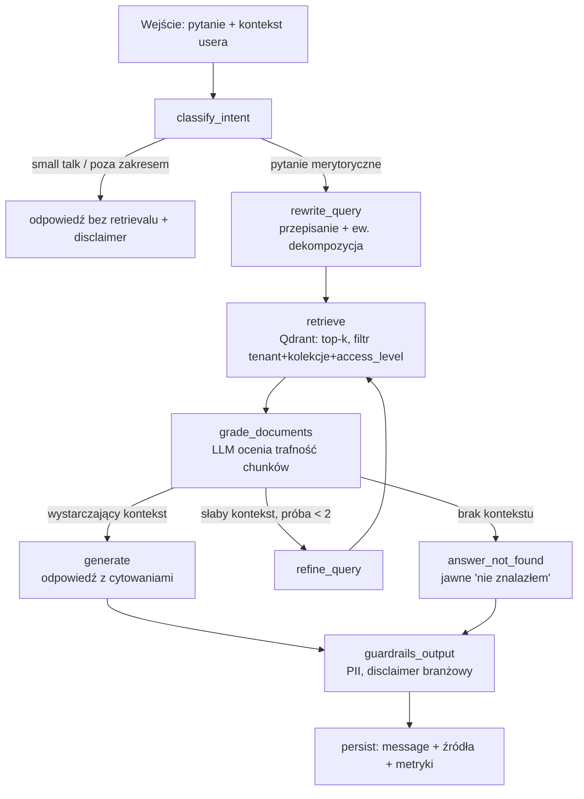
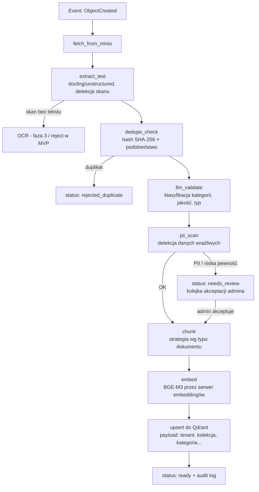

# Architektura systemu (HLD)

**Projekt:** Uniwersalna Platforma RAG · **Wersja:** 0.1 · **Powiązane:** PRD-RAG-Platform.md

## 1. Widok komponentów

| Komponent | Rola | Skalowanie |
|---|---|---|
| Open WebUI | frontend czatu, wybór modelu, historia | replika za reverse proxy |
| RAG API (FastAPI) | REST + OpenAI-compatible endpoint, RBAC, orkiestracja | stateless, N replik |
| Ingest Worker | konsument kolejki, graf walidacji + indeksacji | horyzontalnie wg głębokości kolejki |
| LangGraph runtime | grafy: query, ingest-validation | w procesach API/workera, checkpoint w Postgres |
| Qdrant | baza wektorowa | single-node → cluster |
| PostgreSQL | metadane, RBAC, historia, audit, checkpoints | primary + replica |
| MinIO | pliki źródłowe, eventy | distributed mode (4+ nody) w produkcji |
| Redis Streams | kolejka eventów ingestu | Redis Sentinel w produkcji |
| Ollama / vLLM | serwowanie LLM + embeddingów | osobny host GPU |
| Keycloak | OIDC, SSO | standardowo |
| Langfuse, Prometheus, Grafana | observability | standardowo |

## 2. Zasady architektoniczne

1. **Stateless API** — cały stan w Postgres/Qdrant/MinIO; restart bez utraty danych.
2. **Event-driven ingest** — upload odseparowany od przetwarzania; awaria workera nie blokuje uploadu.
3. **Izolacja tenantów strukturalna** — tenant_id w każdej tabeli, w payloadzie Qdrant i w ścieżce MinIO; filtr wymuszany w jednym miejscu (dependency w API), nie w każdym handlerze osobno.
4. **Modele wymienne** — wszystko przez OpenAI-compatible interface; zmiana modelu = wpis w rejestrze, nie zmiana kodu.
5. **Idempotencja ingestu** — hash dokumentu; ponowne przetworzenie eventu nie duplikuje chunków.

## 3. Graf zapytania (LangGraph — query graph)



**Stan grafu:** `{question, rewritten_query, user_ctx(tenant, kolekcje, rola), retrieved_chunks, graded_chunks, retry_count, answer, citations, model_id}`. Checkpointer: Postgres.

## 4. Graf ingestu (LangGraph — ingest graph)



Każdy węzeł aktualizuje `ingestion_jobs.status`; błąd węzła → retry z backoffem (max 3), potem `failed` + alert.

## 5. Integracja Open WebUI ↔ RAG API

- RAG API wystawia `/v1/chat/completions` (OpenAI-compatible, streaming SSE). W Open WebUI rejestrowany jako "connection" — każdy pipeline RAG per kolekcja/tryb widoczny jako osobny "model" na liście (np. `rag-procedury`, `rag-hr`, plus surowe modele Ollama).
- Tożsamość: Open WebUI (OIDC Keycloak) przekazuje token użytkownika w nagłówku do RAG API (trusted header / forwarded JWT) — API mapuje na tenant/role/kolekcje.
- Historia: Open WebUI trzyma swoją historię w Postgres; RAG API dodatkowo zapisuje własny rekord (źródła, tokeny, audit) — Open WebUI jest widokiem, API źródłem prawdy dla audytu.

## 6. Decyzje architektoniczne (ADR — skrót)

| # | Decyzja | Alternatywy | Uzasadnienie |
|---|---|---|---|
| ADR-1 | Qdrant, separacja payloadem | pgvector; kolekcja per tenant | filtrowanie payloadu szybkie i strukturalne; per-tenant kolekcje = koszt operacyjny |
| ADR-2 | Redis Streams (MVP) | RabbitMQ, Kafka | najmniejsza infrastruktura; migracja możliwa (abstrakcja producenta/konsumenta) |
| ADR-3 | OpenAI-compatible jako kontrakt frontend↔backend | własne API + custom UI | zero pracy frontendowej, Open WebUI out-of-the-box |
| ADR-4 | Ollama → vLLM | tylko vLLM | Ollama prostsze na dev/MVP; vLLM wyższy throughput na GPU |
| ADR-5 | Osobny panel admina dokumentów | rozszerzanie Open WebUI | flow needs_review nie mieści się w Open WebUI; lekki panel w FastAPI+HTMX lub React |
| ADR-6 | BGE-M3 embeddingi | OpenAI embeddings, e5 | wielojęzyczny (PL), on-prem, dobre wyniki na MTEB |

## 7. Topologia wdrożenia (MVP, Docker Compose)

```
Host 1 (CPU): openwebui, rag-api, ingest-worker, postgres, redis, minio, qdrant, keycloak, langfuse
Host 2 (GPU): ollama/vllm (LLM + embeddingi)
Sieć: reverse proxy (Traefik/Caddy) + TLS; tylko proxy wystawione na zewnątrz
```

Produkcja (faza 3): Kubernetes, osobne node-pools (GPU), Helm chart per klient, backup: pg_dump + snapshoty MinIO/Qdrant.