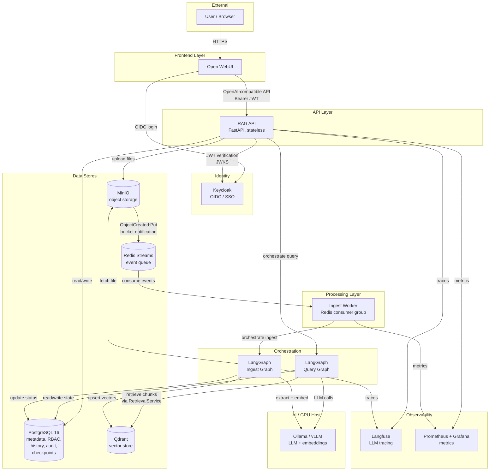
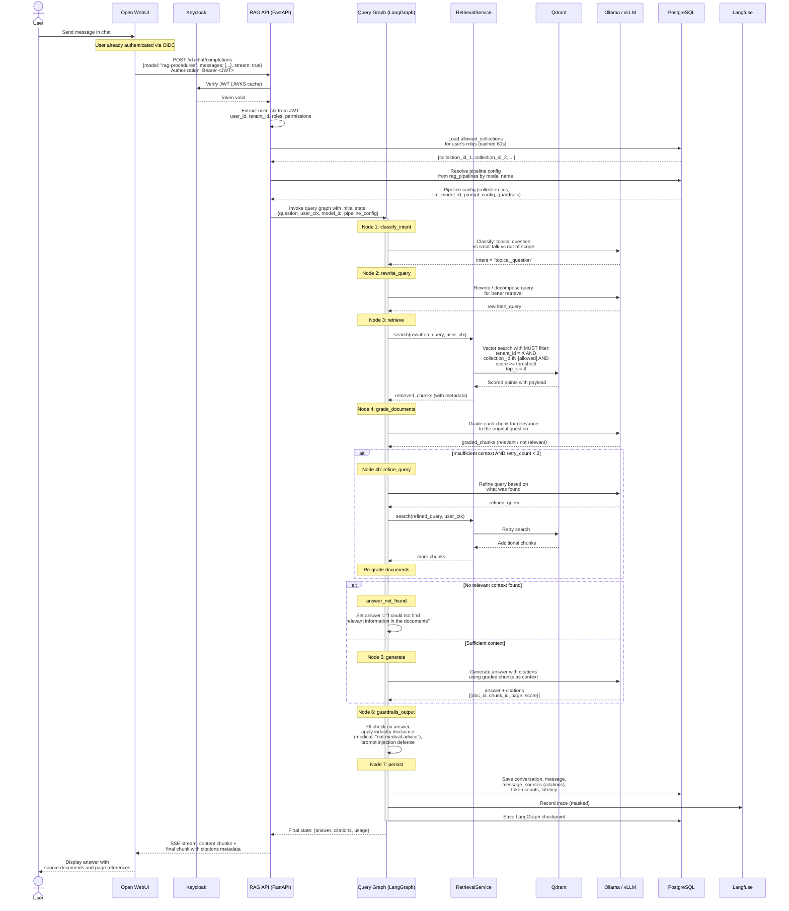
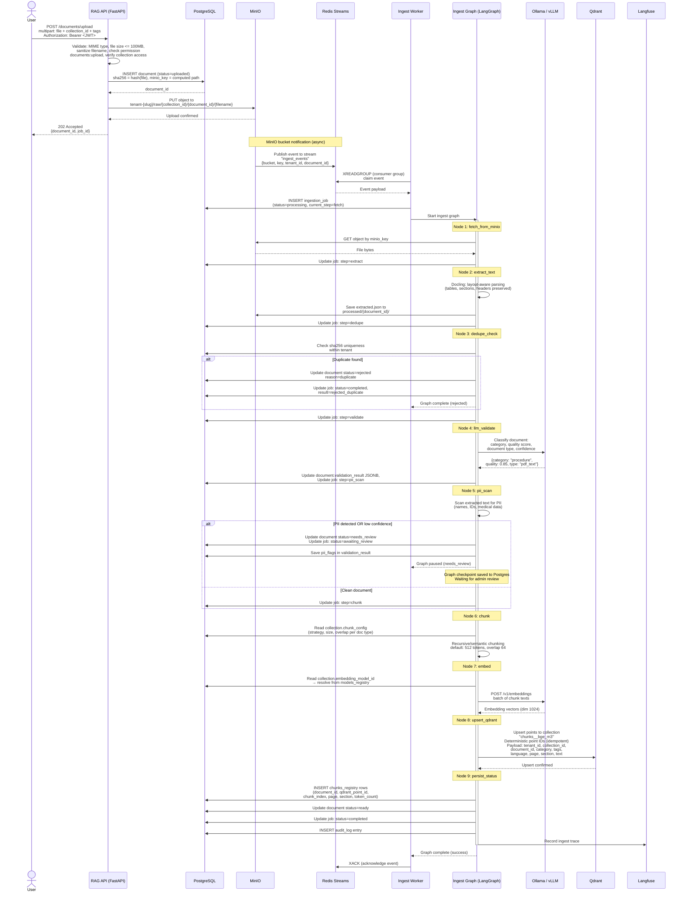
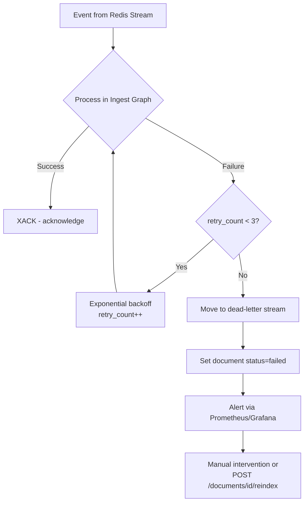
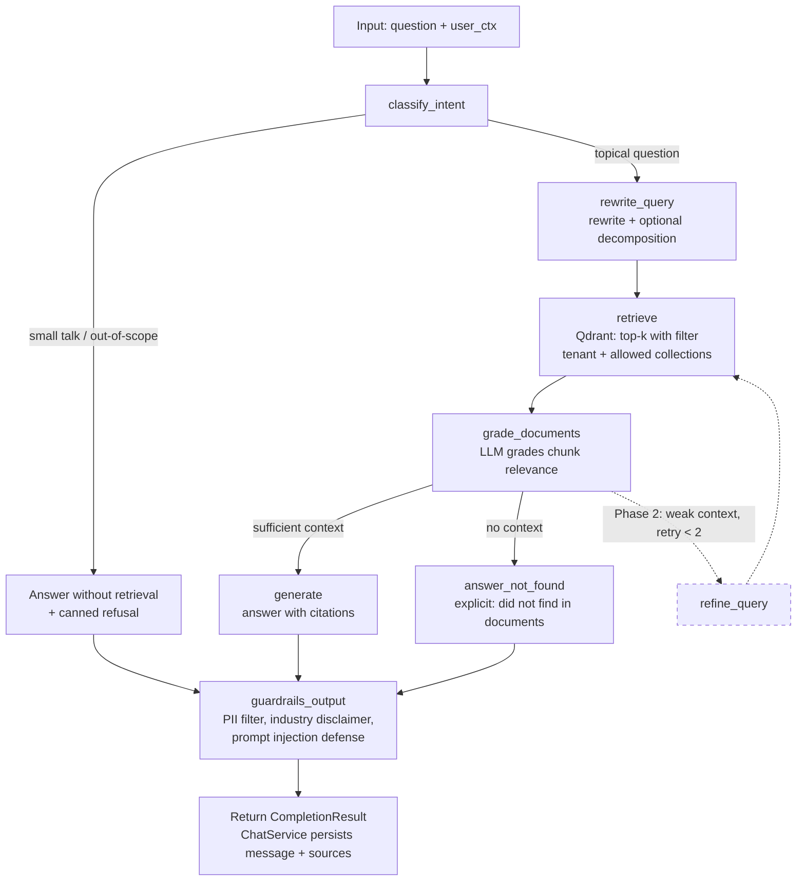
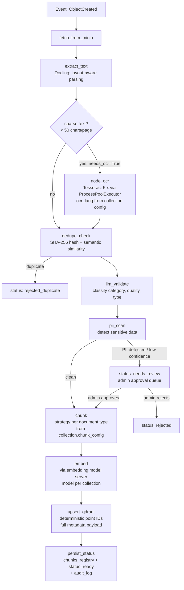
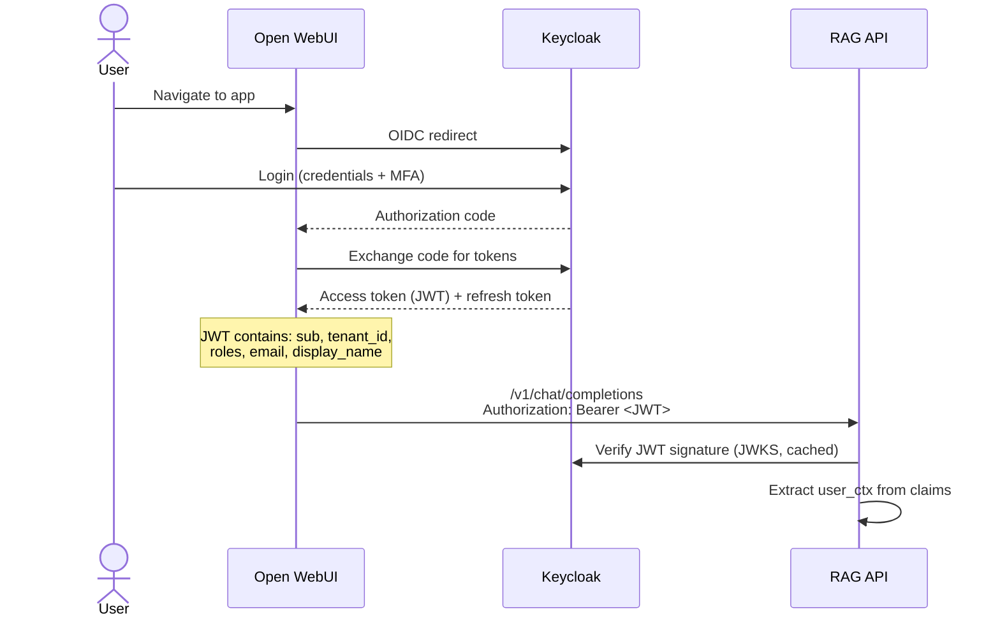

# System Architecture (HLD)

**Project:** Universal RAG Platform
**Version:** 0.2
**Date:** 2026-07-13
**Related:** [PRD](prd.md) | [Data Model](data-model.md) | [API Specification](api.md) | [Security & GDPR](rodo.md)

---

## 1. Component Overview

| Component | Role | Scaling strategy |
|---|---|---|
| **Open WebUI** | Chat frontend, model selection, conversation history | Stateless replica behind reverse proxy |
| **RAG API (FastAPI)** | REST + OpenAI-compatible endpoint, RBAC middleware, graph orchestration | Stateless, N replicas; all state in external stores |
| **Ingest Worker** | Redis Streams consumer, runs ingest validation + indexing graph | Horizontal scaling by queue depth (consumer group) |
| **LangGraph runtime** | Query graph + ingest graph execution engine | Embedded in API and worker processes; checkpoint state in Postgres |
| **Qdrant** | Vector database for chunk embeddings | Single-node (MVP) to cluster (production) |
| **PostgreSQL 16** | Metadata, RBAC, conversation history, audit log, LangGraph checkpoints | Primary + read replica |
| **MinIO** | Source file storage; bucket notifications trigger ingest | Distributed mode (4+ nodes) in production |
| **Redis Streams** | Event queue for ingest pipeline (consumer groups, dead-letter after 3 failures) | Redis Sentinel in production |
| **Ollama / vLLM** | LLM and embedding model serving | Separate GPU host; vLLM for production throughput |
| **Keycloak** | OIDC identity provider, SSO, MFA | Standard HA deployment |
| **Langfuse** | LLM observability, trace recording, token tracking | Self-hosted, PII masking enabled |
| **Prometheus + Grafana** | Infrastructure metrics, alerting | Standard deployment |

---

## 2. Architectural Principles

1. **Stateless API** -- All state persisted in Postgres, Qdrant, and MinIO. Any API instance can be restarted or replaced without data loss.

2. **Event-driven ingest** -- File upload is decoupled from processing. Upload writes to MinIO; MinIO bucket notification publishes an event to Redis Streams; an Ingest Worker picks it up asynchronously. Worker failure does not block uploads.

3. **Structural tenant isolation** -- `tenant_id` is present in every business table (Postgres), in every Qdrant point payload, and in every MinIO object path. The filter is enforced in a single place: `RetrievalService` (for queries) and a FastAPI dependency (for API operations). No handler applies its own tenant filter -- it is injected centrally.

4. **Swappable models via OpenAI-compatible interface** -- All LLM and embedding calls go through an abstract client that speaks the OpenAI API protocol. Changing a model means adding or updating a `models_registry` entry, not changing application code.

5. **Idempotent ingest** -- Each document has a SHA-256 hash (unique per tenant). Reprocessing an event does not duplicate chunks: the ingest graph performs `dedupe_check` and uses deterministic `qdrant_point_id` values for upsert.

---

## 3. Component Interaction Diagram



---

## 4. Data Flow: Chat Query

The following sequence diagram shows the complete path of a user chat query, from Open WebUI through the RAG API, LangGraph query graph, retrieval, LLM generation, and response with citations.



---

## 5. Data Flow: Document Ingest

The following sequence diagram shows the event-driven ingest pipeline, from file upload through MinIO notification, Redis Streams, the Ingest Worker, and the LangGraph ingest graph.



### Error Handling and Dead-Letter



---

## 6. Data Flow: Admin Review (needs_review)

When the ingest graph detects PII or has low classification confidence, it pauses the document in `needs_review` status. An administrator reviews and either approves or rejects it.

```mermaid
sequenceDiagram
    actor Admin
    participant API as RAG API (FastAPI)
    participant PG as PostgreSQL
    participant IG as Ingest Graph (LangGraph)
    participant LLM as Ollama / vLLM
    participant QD as Qdrant

    Note over PG: Document is in status=needs_review<br/>Ingest graph checkpoint saved<br/>ingestion_job.status=awaiting_review

    Admin->>API: GET /documents/review-queue<br/>Permission: documents:approve
    API->>PG: SELECT documents<br/>WHERE status = 'needs_review'<br/>AND tenant_id = admin's tenant
    PG-->>API: List of documents with<br/>validation_result (category, confidence,<br/>pii_flags, quality_score)
    API-->>Admin: Review queue with details

    Admin->>API: GET /documents/{id}<br/>View full validation result
    API-->>Admin: Document metadata +<br/>validation_result + pii_flags

    alt Admin approves
        Admin->>API: POST /documents/{id}/review<br/>{decision: "approve", note: "PII is org name, acceptable"}
        API->>PG: Update document status=indexing<br/>Set reviewed_by, reviewed_at
        API->>PG: INSERT audit_log<br/>(action=document_approved)
        API->>PG: Update ingestion_job<br/>status=processing, current_step=chunk

        API->>IG: Resume ingest graph from checkpoint<br/>(thread_id from ingestion_job)
        activate IG

        Note over IG: Resume at Node 6: chunk
        IG->>IG: Chunk document
        IG->>LLM: Generate embeddings
        IG->>QD: Upsert vectors
        IG->>PG: Create chunks_registry,<br/>update status=ready

        deactivate IG

    else Admin rejects
        Admin->>API: POST /documents/{id}/review<br/>{decision: "reject", note: "Contains patient data"}
        API->>PG: Update document status=rejected<br/>Set reviewed_by, reviewed_at
        API->>PG: INSERT audit_log<br/>(action=document_rejected)
        API->>PG: Update ingestion_job<br/>status=completed, result=rejected

        Note over PG: Document stays in MinIO<br/>for audit trail; no vectors created
    end
```

---

## 7. Query Graph (LangGraph)

### Topology



> **Note (ADR-9):** The `persist` node was removed -- `ChatService` owns message persistence.
> The `refine_query` loop (dashed) is deferred to Phase 2.

### Graph State (ADR-9: Pydantic BaseModel, not TypedDict)

```python
class QueryState(BaseModel):
    # Input (set by ChatService before invocation)
    question: str
    conversation_history: list[dict[str, str]] = []  # prior messages for multi-turn
    tenant_id: UUID
    user_id: UUID
    allowed_collection_ids: list[UUID]
    pipeline_config: dict[str, Any]  # snapshot of RagPipeline fields

    # Intermediate (populated by nodes)
    intent: str | None = None           # "topical" | "chitchat" | "out_of_scope"
    rewritten_query: str | None = None
    retrieved_chunks: list[dict[str, Any]] = []   # RetrievalResult dicts
    graded_chunks: list[dict[str, Any]] = []      # chunks that passed relevance grading
    retry_count: int = 0                # reserved for Phase 2 refine_query loop

    # Output (read by ChatService after invocation)
    answer: str = ""
    citations: list[dict[str, Any]] = []  # doc_id, chunk_id, page, highlight_text, score
    prompt_tokens: int = 0
    completion_tokens: int = 0
    error: str | None = None
```

### Node Contracts

| Node | Input from state | Output to state | External calls |
|---|---|---|---|
| `classify_intent` | question | intent | LLM (via configurable) |
| `rewrite_query` | question, conversation_history, intent | rewritten_query | LLM (via configurable) |
| `retrieve` | rewritten_query, tenant_id, allowed_collection_ids, pipeline_config | retrieved_chunks | RetrievalService (via configurable) + LLM embeddings |
| `grade_documents` | question, retrieved_chunks | graded_chunks | LLM (via configurable) |
| `generate` | question, graded_chunks, conversation_history, pipeline_config | answer, citations, prompt_tokens, completion_tokens | LLM (via configurable) |
| `guardrails_output` | answer, pipeline_config.guardrails | answer (sanitized) | Rule-based (no LLM in MVP) |

> **Removed nodes (ADR-9):**
> - `refine_query` -- deferred to Phase 2 (retry_count field reserved in state).
> - `persist` -- responsibility of `ChatService`, not the graph.

**Checkpointer:** None (ADR-9). Query execution is stateless per-request. Langfuse tracing provides debugging visibility.

---

## 8. Ingest Graph (LangGraph)

### Topology



### Ingest Graph State

```python
class IngestGraphState(TypedDict):
    document_id: UUID
    tenant_id: UUID
    collection_id: UUID
    minio_key: str
    raw_bytes: bytes | None
    extracted_text: str | None
    extracted_sections: list[Section] | None
    sha256: str
    validation_result: ValidationResult | None  # category, quality, type, confidence, pii_flags
    chunks: list[ChunkData] | None
    embeddings: list[list[float]] | None
    point_ids: list[UUID] | None
    status: DocumentStatus
    error: str | None
    retry_count: int
    # OCR fields (ADR-028)
    needs_ocr: bool  # True when extract_text detects < 50 chars/page
    ocr_text: str | None  # populated by node_ocr; merged into extracted_text
    ocr_engine: str | None  # e.g. "tesseract"
    ocr_page_count: int  # number of pages OCR-processed
```

### Node Contracts

| Node | Input from state | Output to state | External calls |
|---|---|---|---|
| `fetch_from_minio` | minio_key | raw_bytes | MinIO |
| `extract_text` | raw_bytes | extracted_text, extracted_sections, needs_ocr | Docling (local) |
| `node_ocr` | raw_bytes, needs_ocr, collection.ocr_lang | ocr_text, ocr_engine, ocr_page_count; merges into extracted_text | Tesseract (ProcessPoolExecutor) |
| `dedupe_check` | sha256, tenant_id | status (rejected_duplicate or continue) | Postgres |
| `llm_validate` | extracted_text (sample) | validation_result | LLM |
| `pii_scan` | extracted_text | validation_result.pii_flags, status | Rule-based + optional LLM |
| `chunk` | extracted_text, extracted_sections, collection.chunk_config | chunks | LangChain splitters |
| `embed` | chunks, collection.embedding_model_id | embeddings | Embedding model server |
| `upsert_qdrant` | chunks, embeddings, metadata | point_ids | Qdrant |
| `persist_status` | point_ids, document_id | status=ready | Postgres |

Each node updates `ingestion_jobs.status` and `ingestion_jobs.steps` JSONB. On failure: retry with exponential backoff (max 3 attempts), then `status=failed` + alert.

---

## 9. Retrieval Architecture

### RetrievalService -- The Single Access Point to Qdrant

**Hard rule:** No module outside `src/retrieval/` may instantiate a Qdrant client or execute vector queries. This is enforced by code review, import linter tests, and architectural tests in CI.

```
src/retrieval/
    service.py          # RetrievalService class
    filters.py          # Qdrant filter builder
    reranker.py         # Phase 3: cross-encoder reranking
```

### Filter Construction

Every query to Qdrant includes a mandatory filter:

```python
# Pseudocode -- always applied, never optional
filter = Must([
    FieldCondition("tenant_id", Match(user_ctx.tenant_id)),    # ISOLATION
    FieldCondition("collection_id", MatchAny(allowed_ids)),     # RBAC
])

# Optional additions from pipeline config:
if category_filter:
    filter.must.append(FieldCondition("category", MatchAny(categories)))
if language_filter:
    filter.must.append(FieldCondition("language", Match(language)))
```

### Retrieval Parameters

| Parameter | Default | Source | Configurable per |
|---|---|---|---|
| `top_k` | 8 | `rag_pipelines.prompt_config` | Pipeline |
| `score_threshold` | 0.35 | `rag_pipelines.prompt_config` | Pipeline |
| `embedding_model` | per collection | `collections.embedding_model_id` | Collection |
| `reranker` | none (Phase 3) | `rag_pipelines.prompt_config` | Pipeline |

---

## 10. Open WebUI Integration

### Connection Model

RAG API exposes two OpenAI-compatible endpoints:

| Endpoint | Purpose |
|---|---|
| `GET /v1/models` | Returns RAG pipelines as "models" (e.g., `rag-procedures`, `rag-hr`) plus raw LLM models per role policy |
| `POST /v1/chat/completions` | Chat completion with `stream: true` for SSE; `model` = pipeline ID |

Open WebUI registers RAG API as an **OpenAI-compatible connection**. Each RAG pipeline appears as a selectable "model" in the UI.

### Authentication Flow



### History Ownership

- **Open WebUI** maintains its own conversation history in its Postgres database (user-facing display).
- **RAG API** independently persists conversations, messages, message_sources, and token usage to its own Postgres tables. RAG API is the **source of truth for audit purposes**.
- Both stores are linked by `user_id` (Keycloak `sub`).

---

## 11. Deployment Topology

### MVP (Docker Compose)

```
Host 1 (CPU, 16+ GB RAM):
  - openwebui
  - rag-api (FastAPI, uvicorn)
  - ingest-worker (1-2 instances)
  - postgres (with LangGraph checkpoints)
  - redis (Streams)
  - minio
  - qdrant
  - keycloak
  - langfuse

Host 2 (GPU, 24+ GB VRAM):
  - ollama (or vLLM)
  - Serves: LLM (e.g., Llama 3.x, Qwen, Bielik)
  - Serves: Embeddings (BGE-M3, dim 1024)

Network:
  - Reverse proxy (Traefik or Caddy) with TLS
  - Only the proxy is exposed externally
  - GPU host in private VLAN, no internet access
```

### Production (Phase 3 -- Kubernetes)

```
Namespace: rag-platform

Node pool "cpu":
  - rag-api (Deployment, HPA by CPU/request rate)
  - ingest-worker (Deployment, HPA by queue depth)
  - openwebui (Deployment)
  - keycloak (StatefulSet)
  - langfuse (Deployment)

Node pool "data":
  - postgres (StatefulSet, primary + replica)
  - qdrant (StatefulSet, clustered)
  - minio (StatefulSet, distributed 4+ nodes)
  - redis (StatefulSet, Sentinel)

Node pool "gpu":
  - vllm (Deployment, GPU resource limits)

Ingress: NGINX Ingress Controller + cert-manager
Monitoring: Prometheus Operator + Grafana
Backup: pg_basebackup daily, Qdrant snapshots, MinIO versioning
Per-client isolation: Helm chart with values override per tenant
```

---

## 12. Architectural Decision Records (ADR)

### ADR-1: Qdrant Isolation Strategy -- Collection-per-Embedding-Model with Payload Filter

**Status:** Accepted

**Context:**
Multi-tenant vector isolation can be achieved through three strategies:
1. Collection-per-tenant -- strongest isolation, highest resource cost (N collections for N tenants).
2. Partition-per-tenant -- moderate isolation, shared index.
3. Collection-per-embedding-model with payload filter -- shared collection, tenant isolation via indexed `tenant_id` payload field.

**Decision:**
We use **one physical Qdrant collection per embedding model** (e.g., `chunks__bge_m3`). Tenant isolation is enforced by a mandatory `tenant_id` payload filter applied by `RetrievalService` on every query. This filter is always present -- there is no code path that queries Qdrant without it.

**Why not collection-per-tenant:**
- Operational cost: hundreds of collections for a multi-tenant SaaS deployment.
- Qdrant's payload index on keyword fields is efficient; filtered search on `tenant_id` adds negligible latency.
- No cross-tenant data leakage risk as long as the filter is centrally enforced (which it is, in `RetrievalService`).

**Why not partition-per-tenant:**
- Qdrant does not natively support partitions. Custom sharding would add complexity without clear benefit over payload filtering.

**Consequences:**
- `RetrievalService` is the **only** module allowed to query Qdrant. This is a hard rule enforced by import linter and CI tests.
- Embedding model changes require creating a new collection and reindexing -- never mix vectors from different models in one collection.
- Large tenants can be moved to a dedicated collection in the future if needed (manual migration, transparent to the application via config).

**Note:** The `reference-repos.md` document references "collection-per-tenant" in several places. This is an error in that document -- the authoritative decision is collection-per-embedding-model as described here and in the data model documentation.

---

### ADR-2: Redis Streams for Ingest Queue (MVP)

**Status:** Accepted

**Context:**
The ingest pipeline needs an event queue to decouple file upload from processing. Options: Redis Streams, RabbitMQ, Kafka.

**Decision:**
Redis Streams with consumer groups for MVP. Producer and consumer interfaces are abstracted behind an internal contract, allowing migration to RabbitMQ or Kafka without application code changes.

**Why Redis Streams:**
- Minimal infrastructure: Redis is already needed for rate limiting and caching.
- Consumer groups provide at-least-once delivery and dead-letter semantics.
- Sufficient throughput for on-prem deployments (tens of documents per minute, not thousands).

**Why not RabbitMQ/Kafka:**
- Additional infrastructure component to operate on-prem.
- Kafka is oversized for the expected throughput.
- Migration path exists when needed.

**Consequences:**
- Dead-letter handling: after 3 failed processing attempts, events move to a dead-letter stream; document status set to `failed`; alert raised.
- Consumer groups allow horizontal scaling of Ingest Workers.
- Producer/consumer abstraction must be maintained -- no direct Redis Streams API calls outside `src/core/`.

---

### ADR-3: OpenAI-Compatible API as Frontend-Backend Contract

**Status:** Accepted

**Context:**
Open WebUI requires an OpenAI-compatible API to display models and handle chat. Building a custom frontend is expensive and unnecessary.

**Decision:**
RAG API exposes `GET /v1/models` and `POST /v1/chat/completions` (with SSE streaming). Open WebUI connects to RAG API as an "OpenAI-compatible" provider. Each RAG pipeline is presented as a selectable "model."

**Consequences:**
- Zero frontend development effort for the chat interface.
- RAG pipelines must be named in a user-friendly way (e.g., "Medical Procedures", not "rag-proc-v2").
- Custom metadata (citations) is appended in the final SSE chunk or via message metadata extension.
- Admin panel for document management is separate (ADR-5).

---

### ADR-4: Ollama (MVP) to vLLM (Production)

**Status:** Accepted

**Context:**
Local LLM serving for on-prem deployment. Ollama is simple to set up; vLLM provides higher throughput with continuous batching on GPUs.

**Decision:**
Ollama for development and MVP. vLLM for production GPU deployments. Both expose OpenAI-compatible APIs, so the switch is transparent to the application.

**Consequences:**
- Application code never imports Ollama or vLLM directly -- all calls go through the OpenAI-compatible abstract client.
- `models_registry.provider` distinguishes between `ollama` and `vllm` for endpoint routing.

---

### ADR-5: Separate Admin Panel for Document Management

**Status:** Accepted

**Context:**
Open WebUI covers chat but does not support the document review/approval workflow (`needs_review` queue, validation results, bulk operations).

**Decision:**
Build a lightweight admin panel (FastAPI + HTMX or React SPA) for document lifecycle management: upload queue, review queue, validation results, reindexing, user/role management.

**Consequences:**
- Admin panel shares the same RAG API backend -- no separate backend needed.
- Authentication through the same Keycloak OIDC flow.
- Scope: MVP admin panel is minimal (review queue + document list + user management).

---

### ADR-6: BGE-M3 as Default Embedding Model

**Status:** Accepted

**Context:**
The platform must support Polish and English documents. Embedding model must run on-prem.

**Decision:**
BGE-M3 (BAAI) as the default embedding model. Dimension: 1024, distance: cosine. Multilingual (supports Polish), strong MTEB performance, open-source, runs locally.

**Consequences:**
- Qdrant collection named `emb_bge_m3` (see ADR-7 for naming convention).
- Changing the embedding model requires creating a new collection and reindexing all documents in affected collections.
- Model is registered in `models_registry` with `type=embedding`; collections reference it via `embedding_model_id` FK.
- Phase 3: consider adding sparse vectors (BM25/SPLADE) for hybrid retrieval in the same collection.

---

### ADR-7: Qdrant Collection Naming Convention

**Status:** Accepted
**Date:** 2026-07-13

**Context:**
Two naming patterns for Qdrant collections appeared in task files:
- `emb_{embedding_model_slug}` -- specified in `rag-conventions.md`
- `chunks__{model_slug}` -- used in early task drafts (TASK-005, TASK-009, TASK-010)

The conflict must be resolved before implementation begins.

**Decision:**
**`emb_{embedding_model_slug}`** is the canonical convention.

- Prefix `emb_` clearly indicates the collection's purpose (embedding storage).
- `embedding_model_slug` is derived from `models_registry.name`, lowercased, spaces replaced by underscores (e.g., `bge-m3` -> `emb_bge_m3`, `nomic-embed-text` -> `emb_nomic_embed_text`).
- `rag-conventions.md` is authoritative; task files that used `chunks__` were incorrect and have been updated.

**Consequences:**
- All task files (TASK-005, TASK-009, TASK-010) use `emb_{slug}`.
- `rag-conventions.md` already reflects this; no change needed there.
- Collection name is computed in `RetrievalService` from `models_registry.name`: `f"emb_{model.name.lower().replace('-', '_').replace(' ', '_')}"`.

---

### ADR-8: Qdrant Client Placement -- RetrievalService Boundary

**Status:** Accepted
**Date:** 2026-07-13

**Context:**
`AsyncQdrantClient` must live only in `src/retrieval/` per `security.md`. However, creating a Qdrant collection (during `POST /collections`) requires calling the Qdrant API. TASK-005 initially placed this in `src/core/clients/qdrant_client.py`, which would expose the client to the entire codebase and fail the TASK-016 import linter test.

**Decision:**
**`RetrievalService` gains a new method `ensure_collection()`** that handles collection provisioning.

```python
class RetrievalService:
    async def ensure_collection(
        self,
        embedding_model_slug: str,
        vector_size: int,
        distance: str = "Cosine",
    ) -> None:
        """
        Create Qdrant collection emb_{slug} if it does not exist.
        Idempotent. Called by CollectionService on collection creation.
        """
        collection_name = f"emb_{embedding_model_slug}"
        existing = await self._client.get_collections()
        if collection_name not in [c.name for c in existing.collections]:
            await self._client.create_collection(
                collection_name=collection_name,
                vectors_config=VectorParams(size=vector_size, distance=Distance.COSINE),
            )
            await self._client.create_payload_index(
                collection_name, "tenant_id", PayloadSchemaType.KEYWORD,
            )
            await self._client.create_payload_index(
                collection_name, "collection_id", PayloadSchemaType.KEYWORD,
            )
```

`CollectionService` (in `src/domain/`) depends on `RetrievalService` and calls `ensure_collection()` during collection creation. `AsyncQdrantClient` remains entirely inside `src/retrieval/`.

**Alternatives considered:**
- **`src/core/clients/qdrant_client.py`**: Rejected -- exposes `AsyncQdrantClient` to the entire codebase; fails import linter; contradicts `security.md`.
- **Separate `CollectionProvisioningService` in `src/retrieval/`**: Unnecessary complexity -- `RetrievalService` already owns the client and can handle provisioning.

**Consequences:**
- `src/core/clients/qdrant_client.py` does NOT contain `AsyncQdrantClient`. The file either does not exist or only contains configuration helpers (URL string construction, etc.) without importing `qdrant_client`.
- `TASK-016` import linter `test_no_direct_qdrant_import_outside_retrieval` passes.
- `CollectionService` has `RetrievalService` as a constructor dependency (injected via FastAPI `Depends`).

### ADR-9: Query Graph Implementation (TASK-010)

**Status:** Accepted
**Date:** 2026-07-23

**Context:**
`ChatService._invoke_graph()` is a stub returning a placeholder string. TASK-010 replaces it with a real LangGraph query graph that performs retrieval-augmented generation. The architecture doc section 7 already defines the target topology; this ADR records the implementation decisions that deviate from or refine the original design.

Key constraints:
- The ingest graph (`src/graphs/ingest_graph/`) sets the structural precedent: Pydantic `BaseModel` state, nodes as `node_<name>.py` files, services injected via `config["configurable"]`.
- `RetrievalService` is the sole Qdrant access point (ADR-8, `security.md`).
- `ChatService` already persists `Message` rows and owns the transaction boundary; the graph must not duplicate this.
- The platform serves medical data; conservative retrieval thresholds and output guardrails are required.

**Decision:**

**1. Module structure.** The query graph lives in `src/graphs/query_graph/` mirroring the ingest graph layout:

```
src/graphs/query_graph/
    __init__.py
    state.py          # QueryState (Pydantic BaseModel)
    graph.py          # build_query_graph(), invoke_query_graph()
    routing.py        # Conditional edge functions
    nodes/
        __init__.py
        node_classify_intent.py
        node_rewrite_query.py
        node_retrieve.py
        node_grade_documents.py
        node_generate.py
        node_guardrails_output.py
```

**2. QueryState as Pydantic BaseModel.** Following `IngestState`, the query graph state is a Pydantic `BaseModel` (not `TypedDict`). This gives runtime validation, serialization, and consistency with the ingest graph. The state includes: `question`, `conversation_history` (list of prior messages for multi-turn), `rewritten_query`, `intent`, `retrieved_chunks`, `graded_chunks`, `answer`, `citations`, `prompt_tokens`, `completion_tokens`, `retry_count`, `pipeline_config` (frozen snapshot of `RagPipeline` fields), `tenant_id`, `user_id`, `allowed_collection_ids`, `error`.

**3. No Postgres checkpointer.** The original section 7 specified a Postgres checkpointer per node. For the query graph this is unnecessary and adds latency: each query is stateless per-request, conversation history is managed by `ChatService` / `Message` table, and there is no resume/retry semantic (unlike ingest). The graph runs without a checkpointer. Langfuse tracing provides the debugging visibility that checkpoints would otherwise offer.

**4. No `persist` node.** Section 7 shows a `persist` node at the end of the graph. This responsibility already belongs to `ChatService.complete()`, which creates `Message` rows, attaches `message_sources`, and records token counts. Duplicating persistence inside the graph would violate the principle that services own transaction boundaries. The graph returns a `CompletionResult` dataclass; `ChatService` persists it.

**5. No `refine_query` node in MVP.** The section 7 topology includes a `refine_query` loop (retry < 2). For the initial implementation, this is deferred. The graph goes: `classify_intent` -> `rewrite_query` -> `retrieve` -> `grade_documents` -> `generate` -> `guardrails_output`. The `retry_count` field remains in `QueryState` to support adding the refinement loop later without a state schema change.

**6. Dependency injection via configurable.** External services are injected through `config["configurable"]`:
- `retrieval`: `RetrievalService` instance (Qdrant access)
- `llm`: `LLMClient` instance (chat completions + embeddings)
- `db`: `AsyncSession` (read-only queries: load embedding model from `models_registry`, load collection metadata)

Nodes never instantiate these clients. `ChatService` constructs the config dict and passes it to `invoke_query_graph()`.

**7. Embedding model resolution.** The query must be embedded with the same model used to index the target collection. The embedding model is derived from the first collection in `pipeline.collection_ids` by joining `collections.embedding_model_id` -> `models_registry`. All collections in a single pipeline MUST use the same embedding model (enforced at pipeline creation time by validation). The `node_retrieve` node reads the embedding model config from `config["configurable"]["db"]` and calls `config["configurable"]["llm"].embeddings()`.

**8. Qdrant collection name.** Per ADR-7, the physical Qdrant collection is `emb_{embedding_model_slug}`. The slug is derived from `models_registry.model_id` (e.g., `BAAI/bge-m3` -> `bge_m3`). This is computed once in `node_retrieve` and used for the `RetrievalService.search()` call.

**9. Out-of-scope / chitchat handling.** If `classify_intent` returns `out_of_scope` or `chitchat`, the graph skips `rewrite_query`, `retrieve`, `grade_documents`, and `generate`. It sets `answer` to a canned refusal message ("Nie znalazlem odpowiedzi w dostepnych dokumentach.") and routes directly to `guardrails_output`. The LLM is NOT called for generation in this path, preventing hallucination.

**10. Retrieval parameters.** `top_k` defaults to 8 (per `rag-conventions.md`). `score_threshold` defaults to 0.35 for the medical domain (conservative cutoff to reduce noise). Both are overridable via `pipeline.prompt_config` JSONB fields `top_k` and `score_threshold`.

**11. Guardrails node.** `node_guardrails_output` is rule-based (no LLM call in MVP). It checks `pipeline.guardrails` JSONB:
- `add_disclaimer: true` -> appends a medical disclaimer to the answer.
- Strips any content that looks like prompt injection leakage (document text echoing system instructions).
- If `answer` is empty or only whitespace, replaces with the "not found" message.

**12. Prompts in `src/graphs/prompts/`.** All prompt templates used by query graph nodes are stored as versioned Markdown files: `classify_intent_v1.md`, `rewrite_query_v1.md`, `grade_documents_v1.md`, `generate_v1.md`. Inline prompts in node code are forbidden. Each prompt file is loaded at graph build time. Changes require a changelog entry in the prompt file header.

**13. Return contract.** `invoke_query_graph()` returns a `CompletionResult` (already defined in `src/domain/chat.py`): `answer: str`, `citations: list[MessageSourceOut]`, `prompt_tokens: int`, `completion_tokens: int`, `message_id: UUID`. `ChatService._invoke_graph()` signature becomes `async def _invoke_graph(question, pipeline, ctx) -> CompletionResult`, replacing the current `-> str` stub.

**14. Conversation history.** `ChatService.complete()` loads the last N messages (default 10) from the `Message` table for the conversation and passes them to the graph as `conversation_history` in `QueryState`. The `node_rewrite_query` and `node_generate` nodes use this for multi-turn context. Message content is never logged.

**Alternatives considered:**

- **TypedDict for state**: Consistent with upstream LangGraph examples but loses Pydantic validation. Rejected for consistency with `IngestState` and runtime safety.
- **Postgres checkpointer for query graph**: Adds 6 DB writes per query (one per node). Rejected because query execution is stateless per-request, and Langfuse traces provide equivalent debugging data.
- **`persist` node inside graph**: Would duplicate `ChatService` persistence logic and violate the "services own transactions" rule. Rejected.
- **`refine_query` loop in MVP**: Adds complexity and doubles LLM calls in the worst case. Deferred to a follow-up task; `retry_count` field in state is reserved.
- **score_threshold = 0.0 (no cutoff)**: Too permissive for medical domain where irrelevant chunks could lead to harmful answers. 0.35 chosen as conservative default after benchmarking with BGE-M3 cosine similarity distributions.

**Consequences:**

- Section 7 topology diagram should be updated to remove the `persist` node and the `refine_query` loop (marked as "Phase 2").
- `ChatService._invoke_graph()` changes from `-> str` to `-> CompletionResult`; `ChatService.complete()` must be updated to use the returned `CompletionResult` directly instead of constructing one.
- `ChatService.complete()` must load conversation history before invoking the graph.
- `stream_completion()` remains a wrapper over `complete()` for MVP; true streaming (LLM token-by-token via `astream`) is a Phase 2 enhancement.
- All query graph nodes are independently testable by mocking `config["configurable"]` services.
- Evaluation tests (`tests/eval/`) must be created with 50 standard + 20 trap questions per `rag-conventions.md`.

---

### ADR-10: Langfuse Tracing -- observe decorator with PII masking (GDPR)

**Status:** Accepted
**Date:** 2026-07-28

**Context:**
The architecture (section 14, section 17) specifies Langfuse for LLM observability with PII masking. Langfuse 4.14.0 is installed (locked in `uv.lock`). Settings already declare `LANGFUSE_PUBLIC_KEY`, `LANGFUSE_SECRET_KEY`, and `LANGFUSE_HOST` as optional env vars in `src/core/config.py`. However, no implementation decision exists for how tracing is integrated into the query graph or how GDPR compliance is enforced at the code level.

The platform handles medical data. GDPR and internal security rules (`security.md`, `rag-conventions.md`) mandate that prompt content, document text, chunk content, and user responses must never appear in application logs or external observability systems. Langfuse runs self-hosted on-prem, but defense-in-depth requires that PII is not sent to it in the first place.

The query graph has 6 nodes (`classify_intent`, `rewrite_query`, `retrieve`, `grade_documents`, `generate`, `guardrails_output`) orchestrated by `invoke_query_graph()`. Each node receives and returns a `QueryState` Pydantic model containing the user question, retrieved chunks, generated answer, and conversation history -- all of which are PII or content that must not be recorded.

**Decision:**

**1. Decorator-based instrumentation with input/output capture disabled.** Each query graph node function and the root `invoke_query_graph()` function are decorated with Langfuse v4's `@observe` decorator:

```python
from langfuse.decorators import observe, langfuse_context

@observe(name="invoke_query_graph", capture_input=False, capture_output=False)
async def invoke_query_graph(...) -> CompletionResult:
    langfuse_context.update_current_trace(
        user_id=str(user_id),
        session_id=str(conversation_id),
        metadata={"tenant_id": str(tenant_id), "pipeline_id": str(pipeline_id)},
    )
    ...

@observe(name="classify_intent", capture_input=False, capture_output=False)
async def node_classify_intent(state: QueryState, config: RunnableConfig) -> dict:
    langfuse_context.update_current_observation(
        metadata={"intent": state.intent, "model": model_name},
    )
    ...
```

Setting `capture_input=False, capture_output=False` prevents Langfuse from automatically serializing function arguments (which contain `QueryState` with question, chunks, answer) and return values. This is the primary GDPR safeguard.

**2. Explicit GDPR-safe metadata only.** After disabling automatic capture, each node calls `langfuse_context.update_current_observation()` to record only safe metadata: identifiers (`tenant_id`, `user_id`, `conversation_id`, `pipeline_id`, `collection_ids`), counts (`chunk_count`, `graded_relevant_count`, `prompt_tokens`, `completion_tokens`), scores (`score_threshold`, `top_k`), model names, booleans (`pii_found`, `disclaimer_added`), and latency. Document text, chunk text, prompt content, questions, and answers are never included.

**3. Token usage reporting.** Nodes that call the LLM (`classify_intent`, `rewrite_query`, `grade_documents`, `generate`) report token counts via `langfuse_context.update_current_observation(usage={"input": prompt_tokens, "output": completion_tokens})`. This enables per-tenant cost tracking in Langfuse dashboards without exposing the actual prompt or completion text.

**4. Langfuse is optional -- noop when unconfigured.** If `LANGFUSE_PUBLIC_KEY` is not set (or is `None`), the `@observe` decorator becomes a transparent passthrough that adds no overhead. Langfuse v4 handles this natively: when the SDK is not initialized with valid credentials, decorators are noops. No conditional logic or wrapper is needed in node code.

**5. Initialization and shutdown module.** A new module `src/core/langfuse_client.py` provides three functions:
- `initialize_langfuse(settings: Settings) -> None` -- called during FastAPI lifespan startup. Configures the Langfuse SDK via environment variables (already present in `Settings`). If `LANGFUSE_PUBLIC_KEY` is `None`, logs a warning and returns without initializing (decorators remain noops).
- `shutdown_langfuse() -> None` -- called during FastAPI lifespan shutdown. Calls `langfuse_context.flush()` to ensure all buffered traces are sent before process exit.
- `get_langfuse() -> Langfuse | None` -- returns the initialized Langfuse client instance, or `None` if tracing is disabled. Used only by code that needs to create manual traces outside the decorator pattern (e.g., ingest worker in the future).

**6. Trace hierarchy matches section 17.** The root trace is created by `invoke_query_graph()` with `name="query_graph"`. Each node creates a child span (automatic via `@observe` nesting). The resulting hierarchy matches the specification in section 17 of this document, minus the `persist` and `refine_query` spans (removed per ADR-9 decisions 4 and 5). The `persist` span is not needed because persistence is handled by `ChatService` outside the graph.

**7. Ingest graph tracing deferred.** This ADR covers the query graph only. Ingest graph tracing will follow the same pattern (`@observe` with `capture_input=False, capture_output=False`) and will be added when the ingest graph implementation is complete. The span structure for ingest is already defined in section 17.

**Alternatives considered:**

- **LangChain callback handler (`CallbackHandler`)**: Langfuse provides a LangChain-specific callback handler that auto-instruments LLM calls. Rejected because (a) it captures prompt and completion text by default, requiring complex post-hoc masking; (b) our nodes call the LLM via an OpenAI-compatible client, not LangChain chains, so the callback handler would miss most calls; (c) the `@observe` decorator is more explicit and gives per-node control over what is recorded.

- **Manual `langfuse.trace()` / `langfuse.span()` API**: Creating traces and spans via the imperative API instead of decorators. Rejected because it requires explicit context passing between nodes (parent span ID), adds boilerplate, and is more error-prone (forgetting to end a span). The decorator approach handles nesting automatically via Python context variables.

- **`capture_input=True` with Langfuse server-side masking**: Sending full inputs to the self-hosted Langfuse instance and relying on Langfuse's server-side PII masking feature. Rejected because (a) defense-in-depth: PII should never leave the application process unnecessarily; (b) server-side masking is regex-based and may miss medical terminology or patient identifiers; (c) it violates the project's security rule that prompt content must not appear in observability systems.

- **OpenTelemetry (OTEL) with Jaeger/Tempo**: Using the OTEL standard instead of Langfuse-specific instrumentation. Rejected because (a) OTEL does not provide LLM-specific features (token counting, prompt versioning, cost tracking, evaluation scores); (b) Langfuse is already in the architecture and deployed; (c) Langfuse supports OTEL export if we need to bridge to a generic tracing backend later.

**Consequences:**

- `src/core/langfuse_client.py` must be created with `initialize_langfuse()`, `shutdown_langfuse()`, and `get_langfuse()`.
- `src/main.py` lifespan must call `initialize_langfuse(settings)` at startup and `shutdown_langfuse()` at shutdown.
- `src/graphs/query_graph/graph.py` (`invoke_query_graph`) and all 6 node files must add `@observe(capture_input=False, capture_output=False)` decorators with GDPR-safe metadata updates.
- Unit tests for query graph nodes must continue to work without Langfuse configured (decorators are noops when SDK is not initialized).
- Section 17 Langfuse tracing span hierarchy should be updated to remove `persist` and `refine_query` spans (consistency with ADR-9).
- The `pyproject.toml` dependency specifier should be tightened from `>=2.0` to `>=4.0` to match the actual API surface used (`langfuse.decorators`, `langfuse_context`).
- Future ingest graph tracing will follow the same pattern established here.

### ADR-11: Models Registry API and RAG Pipelines API (TASK-013)

**Status:** Accepted
**Date:** 2026-07-28

**Context:**

The query graph (`invoke_query_graph`) requires an LLM endpoint to call. The endpoint URL, model ID, and provider are stored in `models_registry`. RAG pipelines (`rag_pipelines`) combine a model, a set of collections, prompt configuration, and guardrails into a "virtual model" that Open WebUI presents in its model selector via `GET /v1/models`. Without admin CRUD for these two tables, operators must seed them manually via SQL.

The ORM models already exist (`src/db/models/models_registry.py`, `src/db/models/rag_pipeline.py`) and are included in the initial migration. The chat router (`src/api/routers/chat.py`) reads `rag_pipelines` inline with raw `select()` queries. `ModelRepository` exists but only has `get_by_id` and `get_active_embedding_model` methods -- no list, create, update, or delete. No `PipelineRepository` exists.

Tenant isolation rules differ between the two entities:
- `ModelsRegistry.tenant_id` is nullable: NULL means a system-wide model available to every tenant. Non-NULL means the model is private to that specific tenant.
- `RagPipeline.tenant_id` is always set (NOT NULL, FK to tenants).

The API spec (section 5) declares CRUD on `/models` with `admin:models` permission. No separate `/pipelines` endpoint is specified yet, but it is required -- pipelines are distinct from models and have their own lifecycle. The `/v1/models` endpoint (OpenAI-compatible, section 2) remains read-only for `chat:query` users and is already implemented.

**Decision:**

**1. Two admin routers under `/api/v1`.**

`/api/v1/models` -- CRUD for `models_registry`:

| Method | Path | Permission | Description |
|---|---|---|---|
| GET | `/api/v1/models` | `chat:query` | List models visible to the tenant: system-wide (tenant_id IS NULL) + tenant-private (tenant_id = ctx.tenant_id). Never returns another tenant's private models. Supports `?type=llm|embedding` and `?is_active=true|false` filters. Paginated. |
| GET | `/api/v1/models/{id}` | `chat:query` | Single model. Must be system-wide or belong to ctx.tenant_id. |
| POST | `/api/v1/models` | `admin:models` | Create a model. If `tenant_id` is omitted in the body, the model is system-wide (requires `platform:admin` permission). If `tenant_id` is present in the body it MUST equal `ctx.tenant_id` (enforced server-side; body value is ignored, ctx.tenant_id is used). |
| PATCH | `/api/v1/models/{id}` | `admin:models` | Update model fields (name, endpoint_url, model_id, params, allowed_roles, is_active). Cannot change `type` or `provider` after creation (would break existing collections/pipelines). System-wide models require `platform:admin`. |
| DELETE | `/api/v1/models/{id}` | `admin:models` | Soft-delete (set is_active=false). Returns 409 Conflict if any active pipeline references this model via `llm_model_id`. System-wide models require `platform:admin`. |

`/api/v1/pipelines` -- CRUD for `rag_pipelines`:

| Method | Path | Permission | Description |
|---|---|---|---|
| GET | `/api/v1/pipelines` | `chat:query` | List active pipelines for ctx.tenant_id. Admin with `admin:models` can include inactive (`?include_inactive=true`). Paginated. |
| GET | `/api/v1/pipelines/{id}` | `chat:query` | Single pipeline. Must belong to ctx.tenant_id. |
| POST | `/api/v1/pipelines` | `admin:models` | Create a pipeline. `tenant_id` is always set from ctx.tenant_id (never from body). Validates: (a) `llm_model_id` exists and is active and is type=llm; (b) the referenced model is system-wide OR belongs to ctx.tenant_id; (c) all `collection_ids` exist and belong to ctx.tenant_id; (d) name is unique within tenant (enforced by DB constraint `uq_rag_pipelines_tenant_name`). |
| PATCH | `/api/v1/pipelines/{id}` | `admin:models` | Update pipeline fields (name, collection_ids, llm_model_id, prompt_config, guardrails, is_active). Same FK validations as POST apply when changing `llm_model_id` or `collection_ids`. |
| DELETE | `/api/v1/pipelines/{id}` | `admin:models` | Hard delete. Pipeline is a configuration object, not a data container -- no cascade needed beyond removing the row. Active conversations referencing this pipeline remain intact (they store `pipeline_id` as a historical reference). |

**2. Tenant isolation rules for model visibility.**

The list query for models uses: `WHERE (tenant_id IS NULL OR tenant_id = :ctx_tenant_id)`. This returns system-wide models (available to all tenants) plus the requesting tenant's private models. A tenant can never see or reference another tenant's private models. When a model is loaded by ID (GET, PATCH, DELETE), the same visibility check applies: `WHERE id = :id AND (tenant_id IS NULL OR tenant_id = :ctx_tenant_id)`.

System-wide models (tenant_id IS NULL) can only be created, modified, or deleted by users with the `platform:admin` permission. This is checked at the service layer, not the router, because it depends on the value of `tenant_id` in the request body.

**3. FK validation on pipeline creation/update.**

When `llm_model_id` is provided in a pipeline create or update:
- Load the model with the tenant visibility filter (system-wide OR same tenant).
- Verify `model.type == "llm"` (not "embedding").
- Verify `model.is_active == True`.
- If any check fails, return 422 with a descriptive error.

When `collection_ids` is provided:
- All collection IDs must exist in the `collections` table with `tenant_id = ctx.tenant_id`.
- All must be active (`is_active = True`).
- If any check fails, return 422 listing the invalid IDs.

**4. Deletion constraint: model referenced by active pipelines.**

`DELETE /api/v1/models/{id}` checks for active pipelines that reference this model via `llm_model_id`. If any exist, the endpoint returns 409 Conflict with a body listing the pipeline names/IDs that block deletion. The operator must deactivate or reassign those pipelines first. This prevents orphaned pipeline configurations.

Collections also reference `models_registry` via `embedding_model_id`. The same 409 check applies: if any active collection uses this model as its embedding model, deletion is blocked.

**5. Schema design follows existing patterns.**

Pydantic schemas follow the established pattern from `src/api/schemas/collection.py` and `src/api/schemas/tenant.py`:
- `ModelCreate`, `ModelUpdate`, `ModelResponse`, `ModelListResponse`
- `PipelineCreate`, `PipelineUpdate`, `PipelineResponse`, `PipelineListResponse`
- `PromptConfig` and `GuardrailsConfig` as validated Pydantic models for the JSONB fields (analogous to `ChunkConfig` and `ValidationConfig` in collections).

**6. Repository layer follows existing patterns.**

`ModelRepository` is extended (not replaced) with `list_for_tenant`, `create`, `update`, `soft_delete`, `count_referencing_pipelines`, `count_referencing_collections`. A new `PipelineRepository` is created with `list_by_tenant`, `get_by_id`, `create`, `update`, `delete`, `exists_by_name_and_tenant`.

**7. Service layer.**

A new `ModelService` and `PipelineService` are created in `src/domain/`. They orchestrate repository calls, FK validation, tenant isolation checks, and audit logging. Services never call `session.commit()` -- the router owns the transaction boundary (consistent with existing pattern).

**8. Audit logging.**

All write operations (create, update, delete) are audit-logged via `AuditService.log()` with actions: `model.created`, `model.updated`, `model.deleted`, `pipeline.created`, `pipeline.updated`, `pipeline.deleted`. The `details` dict includes the resource name and changed fields but never endpoint URLs or model parameters (defense-in-depth: endpoint URLs are infrastructure secrets).

**Alternatives considered:**

- **Single `/models` endpoint for both registry models and pipelines.** Rejected because models and pipelines have different lifecycles, different tenant isolation rules (nullable vs. required tenant_id), and different FK relationships. Merging them would complicate the API contract and violate single-responsibility.

- **Hard delete for models instead of soft-delete.** Rejected because hard-deleting a model row would violate the FK constraint from `rag_pipelines.llm_model_id` and `collections.embedding_model_id`. Soft-delete (is_active=false) preserves referential integrity while making the model unavailable for new usage.

- **Auto-deactivate pipelines when their model is deleted.** Rejected because it is a surprising side effect. The operator should explicitly decide what to do with affected pipelines. The 409 response makes the dependency visible.

- **Separate `platform:admin` permission for system-wide models as a distinct router.** Rejected because the endpoints are identical in shape; only the authorization check differs based on whether `tenant_id` is NULL. A service-layer check is simpler and avoids route duplication.

**Consequences:**

- New files: `src/api/routers/models.py`, `src/api/routers/pipelines.py`, `src/api/schemas/model.py`, `src/api/schemas/pipeline.py`, `src/domain/model_service.py`, `src/domain/pipeline_service.py`, `src/db/repositories/pipeline_repository.py`.
- Modified files: `src/db/repositories/model_repository.py` (extended), `src/main.py` (register new routers), `docs/api.md` (add section for pipelines).
- Test files: `tests/unit/test_models_api.py`, `tests/unit/test_pipelines_api.py`, `tests/unit/test_model_service.py`, `tests/unit/test_pipeline_service.py`, `tests/security/test_models_tenant_isolation.py`, `tests/security/test_pipelines_tenant_isolation.py`.
- The existing `GET /v1/models` (OpenAI-compatible) in `src/api/routers/chat.py` is NOT changed -- it continues to serve pipelines as "models" for Open WebUI. The new `GET /api/v1/models` is the admin endpoint for the models registry, served under a different prefix.
- The `stub-rag` fallback in the chat router can be removed once pipelines are seeded via the new API.

---

## 13. Security Architecture Summary

Full details in [Security & GDPR document](rodo.md). Key architectural security controls:

| Control | Implementation |
|---|---|
| Tenant isolation | `tenant_id` filter in RetrievalService (Qdrant), SQL queries (Postgres), MinIO paths (bucket-per-tenant) |
| Authentication | Keycloak OIDC, JWT with JWKS verification, `exp` + `aud` validation |
| Authorization | RBAC: roles -> permissions; enforced at API middleware + resource level |
| Retrieval RBAC | `allowed_collections` derived from `collection_access` table; cached 60s |
| Secrets | Environment variables via `pydantic-settings`; `.env` file not committed; Vault in production |
| Logging | Structured logs; NO prompt content, response text, or PII in application logs |
| File upload | MIME + size validation (100 MB), filename sanitization, presigned URL TTL <= 5 min |
| Data deletion (GDPR Art. 17) | Cascading: Postgres (status=deleted) -> async Qdrant point removal -> MinIO object removal -> audit confirmation |
| Prompt injection defense | Chunk text treated as untrusted data in prompts (delimiters, no instruction execution); guardrails output node |

---

## 14. Observability

| Layer | Tool | What it captures |
|---|---|---|
| LLM traces | Langfuse (self-hosted) | Pipeline execution, token counts, latency per node, model parameters. PII masked. |
| Application metrics | Prometheus | Request rate, error rate, latency histograms, queue depth, active ingest jobs |
| Dashboards | Grafana | Pre-built dashboards for API health, ingest pipeline status, LLM usage per tenant |
| Alerting | Grafana Alerting | Queue depth > threshold, failed ingest jobs, LLM endpoint down, disk usage |

---

## 15. Stream and Event Definitions

This section is the authoritative reference for all Redis Streams names, consumer groups, and event schemas. Application code, workers, and alerting rules MUST use the names defined here.

### Stream Names

| Stream name | Purpose |
|---|---|
| `ingest_events` | Primary ingest queue. MinIO publishes here on `ObjectCreated:Put` on the `raw/` prefix. |
| `ingest_events_dlq` | Dead-letter queue. Events are moved here after 3 consecutive processing failures. Worker does NOT auto-consume from this stream; requires manual intervention or `POST /documents/{id}/reindex`. |

### Consumer Groups

| Stream | Consumer group name | Members |
|---|---|---|
| `ingest_events` | `ingest_workers` | One consumer per worker process; consumer name = `worker-{hostname}-{pid}` |
| `ingest_events_dlq` | `dlq_reviewers` | Consumed only by the operations/alert handler, not the ingest worker |

### Event Schema: `document.uploaded`

This is the canonical event published to `ingest_events`. It is published by the MinIO bucket notification webhook handler inside `src/core/events/minio_webhook.py`, which receives the raw MinIO notification and enriches it with `tenant_id` and `document_id` by parsing the object key.

**Key path format:** `raw/{collection_id}/{document_id}/{sanitized_filename}`

The webhook handler derives `tenant_id` by looking up the bucket name (`tenant-{slug}`) in Postgres (`tenants.slug`). It derives `document_id` from the key path segment at position 2 (0-indexed after `raw/`).

```json
{
  "schema_version": "1",
  "event_type": "document.uploaded",
  "tenant_id": "<uuid>",
  "document_id": "<uuid>",
  "collection_id": "<uuid>",
  "minio_bucket": "tenant-{slug}",
  "minio_key": "raw/{collection_id}/{document_id}/{filename}",
  "size_bytes": 102400,
  "content_type": "application/pdf",
  "published_at": "2026-07-13T10:00:00Z"
}
```

**Important:** The `schema_version` field MUST be present and checked by consumers. If a consumer receives an unknown schema version it must NACK (not XACK) and route the event to `ingest_events_dlq` with a `schema_mismatch` error code.

### Dead-Letter Event Schema

When an event moves to `ingest_events_dlq`, the original payload is preserved and the following fields are added:

```json
{
  "original_event": { "<original document.uploaded fields>" },
  "failure_reason": "timeout on embed node",
  "failure_count": 3,
  "last_failed_at": "2026-07-13T10:05:00Z",
  "document_id": "<uuid>",
  "tenant_id": "<uuid>"
}
```

---

## 16. Resilience Patterns

All network calls in this system MUST apply the timeout and retry policy defined here. There are no exceptions. Callers that omit timeouts will fail CI (checked via import linter rules on `httpx.AsyncClient` and `asyncpg` instantiation patterns).

### Timeout and Retry Matrix

| Dependency | Call type | Connect timeout | Read/total timeout | Retry attempts | Backoff |
|---|---|---|---|---|---|
| LLM (Ollama/vLLM) — classification, rewrite, grade, generate | HTTP POST | 5 s | 120 s | 2 | Exponential, base 2 s, max 16 s, ±20% jitter |
| LLM (Ollama/vLLM) — embeddings | HTTP POST | 5 s | 60 s | 3 | Exponential, base 1 s, max 8 s, ±20% jitter |
| Qdrant — vector search | gRPC / HTTP | 3 s | 10 s | 2 | Fixed 1 s delay, ±10% jitter |
| Qdrant — upsert | gRPC / HTTP | 3 s | 30 s | 3 | Exponential, base 1 s, max 10 s, ±20% jitter |
| MinIO — PUT object | HTTP | 5 s | 60 s | 3 | Exponential, base 2 s, max 20 s, ±20% jitter |
| MinIO — GET object | HTTP | 5 s | 120 s | 3 | Exponential, base 2 s, max 20 s, ±20% jitter |
| PostgreSQL — read query | TCP | 3 s | 5 s | 2 | Fixed 500 ms |
| PostgreSQL — write query | TCP | 3 s | 10 s | 1 | No retry (writes must be idempotent at the call site) |
| Redis Streams — XREADGROUP | TCP | 2 s | 6 s (BLOCK 5000) | 3 | Fixed 1 s |
| Keycloak — JWKS | HTTP | 3 s | 5 s | 2 | Fixed 1 s; cached 5 min, served stale on failure |

**Jitter formula:** `delay = base * (2 ** attempt) * (1 + random.uniform(-jitter_pct, jitter_pct))`

### Graceful Degradation: LLM Unavailable

When all retry attempts to the LLM are exhausted:

| Scenario | Behavior |
|---|---|
| Query graph — LLM unavailable at `classify_intent` or `generate` | Return HTTP 503 with `{"error": "llm_unavailable", "message": "The AI service is temporarily unavailable. Please try again in a few minutes."}`. Do NOT return HTTP 500. |
| Query graph — LLM unavailable at `grade_documents` | Skip grading; treat all retrieved chunks as relevant; proceed to `generate` if LLM recovers, otherwise 503. |
| Ingest graph — LLM unavailable at `llm_validate` or `embed` | Mark node as failed; increment `retry_count`; backoff and retry. After 3 failures: set `document.status = failed`, publish to `ingest_events_dlq`, raise alert. |
| Ingest graph — LLM unavailable at `embed` | Same as above; do NOT persist partial embeddings to Qdrant. |

The API MUST include a `Retry-After: 60` header in the 503 response when LLM is the root cause.

### Ingest Graph Node Retry Policy

Each node in the ingest graph that makes an external call is individually retried:

- **Max attempts:** 3 (configurable via `INGEST_NODE_MAX_RETRIES` env variable)
- **Base delay:** 2 seconds
- **Max delay:** 30 seconds
- **Backoff formula:** `min(base * 2 ** attempt, max_delay) * (1 + random.uniform(-0.2, 0.2))`
- **After 3 failures:** node raises `IngestNodeMaxRetriesExceeded`; worker catches this, moves event to `ingest_events_dlq`, sets `document.status = failed`, `ingestion_jobs.status = failed`, and triggers a Prometheus alert.

---

## 17. Observability Specification

### Metrics Endpoints

Every service MUST expose a `/metrics` endpoint in Prometheus text format (exposition format 0.0.4). The endpoint is not authenticated (it is only reachable on the internal Docker network, not through the reverse proxy).

| Service | Port | Metrics path |
|---|---|---|
| `rag-api` | 8000 | `/metrics` |
| `ingest-worker` | 9090 | `/metrics` |
| `openwebui` | 3000 | `/metrics` (built-in) |
| `postgres` | 9187 | `/metrics` (postgres_exporter sidecar) |
| `redis` | 9121 | `/metrics` (redis_exporter sidecar) |
| `minio` | 9000 | `/minio/health/live` + `/metrics` (MinIO built-in) |
| `qdrant` | 6333 | `/metrics` (Qdrant built-in) |
| `keycloak` | 8080 | `/metrics` (Keycloak built-in, enable via config) |
| `langfuse` | 3030 | `/metrics` (built-in) |

Prometheus scrapes all services on the internal `monitoring` network. No service metrics port is exposed on the host.

### Alert Rules (Grafana Alerting)

| Alert name | Expression | Threshold | Severity | Action |
|---|---|---|---|---|
| `IngestQueueDepth` | `redis_stream_length{stream="ingest_events"}` | > 100 | Warning | Slack #ops-alerts |
| `IngestQueueDepthCritical` | `redis_stream_length{stream="ingest_events"}` | > 500 | Critical | PagerDuty |
| `IngestFailedRate` | `rate(ingest_job_failed_total[5m])` | > 0.1 (10% of jobs fail in 5 min) | Warning | Slack #ops-alerts |
| `WorkerHeartbeatMissing` | `time() - ingest_worker_last_heartbeat_timestamp > 120` | Per worker instance | Critical | PagerDuty |
| `ApiP95Latency` | `histogram_quantile(0.95, rate(http_request_duration_seconds_bucket{job="rag-api"}[5m]))` | > 5 s | Warning | Slack #ops-alerts |
| `GpuUtilisationLow` | `nvidia_gpu_utilization_gpu < 10` during business hours | < 10% for > 15 min | Info | Slack #ops-alerts |
| `DlqNotEmpty` | `redis_stream_length{stream="ingest_events_dlq"}` | > 0 | Warning | Slack #ops-alerts + email to admin |
| `LlmEndpointDown` | `up{job="ollama"} == 0` | Any instance down | Critical | PagerDuty |

### Worker Heartbeat Mechanism

The Ingest Worker publishes a heartbeat every 30 seconds. Mechanism:

1. Worker writes a Redis key: `SET worker:heartbeat:{worker_id} {timestamp} EX 120`
2. Worker increments Prometheus gauge: `ingest_worker_last_heartbeat_timestamp{worker_id="..."} = unix_timestamp()`
3. The `WorkerHeartbeatMissing` alert fires when the Prometheus metric is not updated for more than 120 seconds (two missed heartbeats).

If Redis is unreachable, the worker logs the failure but does NOT stop processing. The Prometheus metric update is independent of the Redis write.

### Langfuse Tracing

Each query graph invocation creates one Langfuse trace with the following span structure:

```
Trace: query_graph (trace_id = conversation message id)
  Span: classify_intent     (model, tokens_in, tokens_out, latency_ms)
  Span: rewrite_query       (model, tokens_in, tokens_out, latency_ms)
  Span: retrieve            (collection_ids, top_k, score_threshold, chunks_returned)
  Span: grade_documents     (model, tokens_in, tokens_out, chunks_relevant, chunks_total)
  [Optional] Span: refine_query  (model, tokens_in, tokens_out, latency_ms)
  Span: generate            (model, tokens_in, tokens_out, latency_ms)
  Span: guardrails_output   (pii_found: bool, disclaimer_added: bool)
  Span: persist             (latency_ms)
```

Each ingest graph invocation creates one Langfuse trace per document:

```
Trace: ingest_graph (trace_id = ingestion_job_id)
  Span: fetch_from_minio    (size_bytes, latency_ms)
  Span: extract_text        (page_count, word_count, latency_ms)
  Span: dedupe_check        (result: unique|duplicate, latency_ms)
  Span: llm_validate        (model, category, confidence, latency_ms)
  Span: pii_scan            (pii_found: bool, flags_count, latency_ms)
  Span: chunk               (strategy, chunk_count, latency_ms)
  Span: embed               (model, batch_count, latency_ms)
  Span: upsert_qdrant       (points_upserted, latency_ms)
  Span: persist_status      (latency_ms)
```

**PII masking rule:** Span attributes MUST NOT contain document text, chunk text, prompt content, or any value from `pii_flags`. Only counts, scores, booleans, model names, and IDs are recorded. The `text` field of chunks is never forwarded to Langfuse.

### Grafana Dashboard Inventory

| Dashboard name | Key panels |
|---|---|
| `RAG API Health` | Request rate, error rate (4xx/5xx), p50/p95/p99 latency, active connections |
| `Ingest Pipeline` | Queue depth (`ingest_events`), DLQ depth, jobs/min, failed jobs, per-step latency breakdown, current active workers |
| `LLM Usage` | Tokens per minute per tenant, model request rate, LLM latency p50/p95, GPU utilisation |
| `Tenant Overview` | Documents per tenant, storage usage, chat queries per tenant/day, active users |
| `System Health` | Postgres connections, replication lag, Redis memory, MinIO disk usage, Qdrant collection sizes |

---

## 18. Docker Compose MVP Specification

This section defines the constraints that the `docker-compose.yml` file MUST satisfy. The file itself is at the repository root. This section is the authoritative reference for service dependencies, health checks, and resource limits.

### Internal Network Layout

```
Networks:
  proxy_net:      # Exposed to reverse proxy (Traefik/Caddy) only
    Members: openwebui, rag-api, langfuse, keycloak (admin UI optional)
  internal_net:   # Service-to-service communication; never exposed
    Members: rag-api, ingest-worker, postgres, redis, minio, qdrant, keycloak, langfuse
  monitoring_net: # Prometheus scraping; never exposed
    Members: all services + prometheus + grafana
```

Only the reverse proxy container has ports bound to the host (`80:80`, `443:443`). No other container binds a host port in production mode. In development mode, individual service ports may be bound for local debugging.

### Reverse Proxy Routing (Traefik)

| Hostname | Upstream service | Port |
|---|---|---|
| `app.{domain}` | `openwebui:3000` | |
| `api.{domain}` | `rag-api:8000` | |
| `auth.{domain}` | `keycloak:8080` | |
| `trace.{domain}` | `langfuse:3030` | |
| `monitor.{domain}` | `grafana:3000` | |

TLS is terminated at Traefik using Let's Encrypt ACME (production) or a self-signed certificate (development, via `TRAEFIK_TLS_SELFSIGNED=true` env variable).

### GPU Host Connection

The GPU host (Ollama or vLLM) is NOT a Compose service on the CPU host. It is a separate machine reachable over the private VLAN. The connection is configured via environment variables injected into `rag-api` and `ingest-worker`:

| Variable | Example value | Description |
|---|---|---|
| `LLM_BASE_URL` | `http://192.168.1.10:11434/v1` | Base URL for LLM calls (Ollama: port 11434, vLLM: port 8000) |
| `EMBEDDING_BASE_URL` | `http://192.168.1.10:11434/v1` | Base URL for embedding calls (may differ from LLM if separate server) |
| `LLM_API_KEY` | `ollama` | API key (Ollama ignores it; vLLM uses it if `--api-key` is set) |

No CPU-host service contacts the GPU host directly except `rag-api` and `ingest-worker`. Network ACLs on the VLAN MUST block all other services from reaching port 11434/8000 on the GPU host.

### Service Health Checks and Dependency Order

| Service | Health check command | Interval | Timeout | Retries | Start period |
|---|---|---|---|---|---|
| `postgres` | `pg_isready -U ${POSTGRES_USER} -d ${POSTGRES_DB}` | 10 s | 5 s | 5 | 30 s |
| `redis` | `redis-cli ping` | 5 s | 3 s | 5 | 10 s |
| `minio` | `curl -f http://localhost:9000/minio/health/live` | 10 s | 5 s | 5 | 30 s |
| `qdrant` | `curl -f http://localhost:6333/readyz` | 10 s | 5 s | 5 | 20 s |
| `keycloak` | `curl -f http://localhost:8080/health/ready` | 15 s | 5 s | 10 | 60 s |
| `langfuse` | `curl -f http://localhost:3030/api/public/health` | 10 s | 5 s | 5 | 30 s |
| `rag-api` | `curl -f http://localhost:8000/health` | 10 s | 5 s | 5 | 20 s |
| `ingest-worker` | `curl -f http://localhost:9090/health` | 15 s | 5 s | 5 | 20 s |
| `openwebui` | `curl -f http://localhost:3000/health` | 15 s | 5 s | 5 | 30 s |

**`depends_on` order (service: condition):**

```
rag-api:
  postgres: service_healthy
  redis:    service_healthy
  minio:    service_healthy
  qdrant:   service_healthy
  keycloak: service_healthy

ingest-worker:
  postgres: service_healthy
  redis:    service_healthy
  minio:    service_healthy
  qdrant:   service_healthy

openwebui:
  rag-api:  service_healthy
  keycloak: service_healthy

langfuse:
  postgres: service_healthy
```

### Resource Limits (MVP, single host)

These are starting-point limits to prevent any single service from starving others. Adjust based on observed usage.

| Service | CPUs (limit) | Memory (limit) | Memory (reservation) |
|---|---|---|---|
| `rag-api` | 2.0 | 2 GB | 512 MB |
| `ingest-worker` | 2.0 | 2 GB | 512 MB |
| `postgres` | 2.0 | 4 GB | 1 GB |
| `redis` | 0.5 | 512 MB | 128 MB |
| `minio` | 1.0 | 2 GB | 512 MB |
| `qdrant` | 2.0 | 4 GB | 1 GB |
| `keycloak` | 1.0 | 1 GB | 512 MB |
| `langfuse` | 1.0 | 1 GB | 256 MB |
| `openwebui` | 0.5 | 512 MB | 128 MB |

### Named Volumes

```yaml
volumes:
  postgres_data:      # PostgreSQL data directory
  redis_data:         # Redis AOF persistence
  minio_data:         # MinIO object storage
  qdrant_data:        # Qdrant collections and indexes
  keycloak_data:      # Keycloak realm exports / H2 (if not using Postgres)
  langfuse_data:      # Langfuse database (uses separate Postgres or shared)
  traefik_certs:      # Let's Encrypt certificates
```

All volumes use the default local driver. In production (K8s), these map to PersistentVolumeClaims on the appropriate storage class.

---

## 19. Future Architecture (Phase 3+)

| Feature | Architectural impact |
|---|---|
| Hybrid retrieval (BM25 + dense + reranker) | Add sparse vectors to existing Qdrant collection; add reranker node after `retrieve` in query graph |
| OCR for scanned documents | Add OCR node in ingest graph between `extract_text` and `dedupe_check` |
| Knowledge graph (GraphRAG) | New store (Neo4j or Postgres with Apache AGE); additional retrieval path in query graph |
| External API for integrations | New `/v1/search` and `/v1/ingest` endpoints; API key authentication alongside JWT |
| Multi-region deployment | Qdrant cluster with geo-sharding; Postgres with logical replication; MinIO site replication |

---

## 20. Microservices Review

**Reviewer:** Platform / Microservices Engineer
**Review date:** 2026-07-13
**Sections reviewed:** Architecture v0.2 + Data Model v0.2

This section records which gaps were found during the microservices review and which sections were added or changed to address them. It does not duplicate the content of those sections - it records the reasoning.

### Changes made

#### Added section 15 — Stream and Event Definitions

Reason: The stream name `ingest_events` was implied in the sequence diagrams but never formally declared. The dead-letter stream was described in the error-handling diagram but had no name. An implementer could not write a worker, configure alerts, or write an integration test without inventing these names independently, risking divergence. Additionally, the event payload was inconsistent between the two documents: data-model.md showed `{bucket, key, size, content_type}` (the raw MinIO notification payload) while architecture.md showed `{bucket, key, tenant_id, document_id}`. The architecture did not explain that `tenant_id` and `document_id` must be derived from the key path by a webhook handler, not delivered by MinIO itself. Section 15 resolves all of these gaps and adds the `schema_version` field required by the platform event rules.

#### Added section 16 — Resilience Patterns

Reason: ADR-2 mentioned exponential backoff but gave no concrete values. No timeout was specified for any network call. An implementer writing the `httpx.AsyncClient` or `asyncpg` connection pool would have to choose timeout values without guidance, and different implementers would choose different values, making the system's SLA impossible to reason about. The graceful degradation behavior for LLM unavailability was absent: it was not documented whether a failed LLM call should produce a 500, a 503, or a structured error message, nor which header to include. Section 16 provides concrete numbers for all external dependencies and specifies the exact HTTP response contract for LLM unavailability.

#### Added section 17 — Observability Specification

Reason: Section 14 stated that Prometheus collects "queue depth" and Grafana has "pre-built dashboards" but gave no specifics. Five critical alerts required by the platform rules were completely absent. The worker heartbeat was referenced in an alert condition but the heartbeat mechanism itself (what the worker writes, where, and how often) was not described — an implementer could not build a worker that passes the `WorkerHeartbeatMissing` alert. Langfuse was mentioned at the node level in sequence diagrams but the span hierarchy, attribute list, and PII masking rule were not documented. Section 17 adds all of these.

#### Added section 18 — Docker Compose MVP Specification

Reason: Section 11 described the MVP as a prose list of services. It contained no health check commands, no `depends_on` conditions, no network layout, no resource limits, and no named volume declarations. A developer could not write a correct `docker-compose.yml` from section 11 alone. The GPU host connection was described as "GPU host in private VLAN" with no specification of which environment variable the CPU-host services use to reach it. Section 18 provides all required Docker Compose specifics while keeping the implementation in the `docker-compose.yml` file itself.

### Issues not fixed (require architect decision)

- The data-model.md §4 event flow diagram still shows `{bucket, key, size, content_type}` as the MinIO notification payload. This is accurate for the raw MinIO webhook but conflicts with the enriched event schema in the new section 15. The data-model.md should be updated to reference section 15 of this document as the canonical event schema source. This is a documentation-only change; no architectural decision is needed.

- The `ingestion_jobs` table has no index on `(tenant_id)`. All operational queries on this table (queue monitoring, admin review) are filtered by document, which implicitly filters by tenant via the documents FK. However, cross-document queries by tenant (e.g., "how many jobs are running for tenant X?") would require a full scan. Whether to add `tenant_id` directly to `ingestion_jobs` is a data model decision for the architect.

---

### ADR-12: DeletionService and Admin Review Queue (TASK-014)

**Status:** Accepted
**Date:** 2026-07-29

**Context:**

The platform handles medical data under GDPR. Article 17 (right to erasure) requires that when a user or admin requests deletion, data must be removed from all stores -- not just soft-deleted in Postgres. Currently, delete endpoints (documents, conversations) perform soft-deletes (setting `status = 'deleted'` or `is_deleted = true`) but never actually remove vectors from Qdrant or objects from MinIO. This means the platform is non-compliant with GDPR Art. 17 for any delete request.

Separately, the ingest graph already supports a `needs_review` checkpoint: when `node_validate` or `node_pii_scan` determines a document requires human review, the graph halts with `status = 'needs_review'` and the LangGraph checkpoint is preserved (via `langgraph_thread_id` in `ingestion_jobs`). Two endpoints are documented in `docs/api.md` (section 3) for the review queue but are not implemented: `GET /documents/review-queue` and `POST /documents/{id}/review`.

These two features share a common dependency on document lifecycle management and are grouped in this ADR.

Existing infrastructure:
- `RetrievalService.delete_by_document(ctx, qdrant_collection, document_id)` -- deletes Qdrant points filtered by tenant_id and document_id.
- `RetrievalService.delete_by_tenant(ctx, qdrant_collection)` -- deletes all points for a tenant.
- `src/core/clients/minio_client.py` -- synchronous minio-py client; must run in `asyncio.to_thread()`.
- `chunks_registry` -- maps `document_id` to `qdrant_point_id` but does NOT have a `collection_id` column.
- `documents.collection_id` FK to `collections` table; `collections.embedding_model_id` FK to `models_registry`.
- `models_registry.model_id` -- the model slug used in the Qdrant collection name convention `emb_{slug}` (ADR-7).
- `documents.minio_key` -- the full key path in MinIO; bucket is `tenant-{tenant.slug}`.
- `ingestion_jobs.langgraph_thread_id` -- UUID of the LangGraph thread for checkpoint resumption.
- `build_ingest_graph(checkpointer)` -- compiles the ingest graph with optional Postgres checkpointer.
- `AuditService` -- append-only audit log.

**Decision:**

**1. DeletionService scope (MVP).**

`DeletionService` supports three deletion scopes, implemented in priority order:

- **Document deletion** (`delete_document`) -- cascades: Postgres (hard-delete `chunks_registry` rows for the document, hard-delete `ingestion_jobs` for the document, hard-delete the `documents` row) then Qdrant (via `RetrievalService.delete_by_document`) then MinIO (remove the object at `document.minio_key` from bucket `tenant-{tenant.slug}`). The `messages_sources.document_id` FK is `ON DELETE SET NULL`, so citations are preserved as orphaned references (the citation text remains but the document link becomes null). This is the correct GDPR behavior: the source document is erased but the conversation history (which the user owns) is retained with broken links.

- **Conversation deletion** (`delete_conversation`) -- hard-deletes the `conversations` row. Because `messages.conversation_id` is `ON DELETE CASCADE` and `message_sources.message_id` is `ON DELETE CASCADE`, Postgres handles the full cascade. No Qdrant or MinIO work needed (conversations do not produce vectors or files).

- **Tenant deletion** (`delete_tenant`) -- cascades: for each Qdrant collection that contains the tenant's data, call `RetrievalService.delete_by_tenant`. Remove all objects from the MinIO bucket `tenant-{tenant.slug}`, then remove the bucket. Finally hard-delete the `tenants` row (all child tables cascade via `ON DELETE CASCADE`). This is a destructive operation limited to `platform:admin` permission.

**2. Synchronous deletion (inline in the HTTP request).**

Deletion runs synchronously within the request handler's transaction. Rationale:
- Document deletion touches at most one Qdrant collection and one MinIO object. With the retry policies from section 16 (Qdrant delete: 3 attempts, max 30s; MinIO: 3 attempts, max 60s), the worst-case latency is under 90 seconds, well within typical HTTP timeout budgets.
- Synchronous execution avoids the complexity of a background task system (Celery, ARQ, or a custom Redis-based worker) for an operation that happens infrequently.
- If Qdrant or MinIO is unreachable after retries, the entire transaction rolls back (Postgres changes are not committed) and the client receives a 503 with `Retry-After: 60`. This guarantees atomicity: either all three stores are cleaned or none are.
- Tenant deletion may be slow for tenants with many documents. For MVP this is acceptable because tenant deletion is an extremely rare admin operation. If it becomes a problem, tenant deletion specifically can be moved to a background task in a future ADR without changing the document/conversation deletion flow.

The order of operations within a single `delete_document` call is: (a) query Postgres for the document and related metadata (collection, embedding model slug, tenant slug), (b) delete Qdrant points via `RetrievalService`, (c) delete MinIO object via `asyncio.to_thread()`, (d) hard-delete Postgres rows, (e) write audit log entry, (f) router commits the transaction. If step (b) or (c) fails, the exception propagates and the router does not commit, so Postgres remains unchanged. Qdrant and MinIO deletions are idempotent (deleting a non-existent point or object is a no-op), so retrying the entire operation after a partial failure is safe.

**3. MinIO bucket and key derivation.**

The MinIO bucket name is `tenant-{tenant.slug}`. The object key is `document.minio_key` (already stored in the `documents` table, e.g., `raw/{collection_id}/{document_id}/{filename}`). `DeletionService` receives the tenant slug and minio_key as parameters resolved by the caller (service or router) from the loaded `Document` and `Tenant` models. It does not query for them itself -- this keeps the service focused on orchestrating the three-store cascade.

For tenant deletion, the entire bucket is emptied and removed. The minio-py client provides `list_objects(bucket, recursive=True)` + `remove_objects(bucket, objects)` for bulk deletion, followed by `remove_bucket(bucket)`. All calls run in `asyncio.to_thread()`.

**4. Qdrant collection name derivation.**

The join path is: `documents.collection_id` -> `collections.embedding_model_id` -> `models_registry.model_id`. The Qdrant collection name is `emb_{model_id}` per ADR-7 (where `model_id` is the slug-like identifier from `models_registry.model_id`, e.g., `BAAI/bge-m3` becomes `emb_BAAI/bge-m3` -- but per the existing `ensure_collection` code, it uses `embedding_model_slug` which is a sanitized form).

Rather than adding a `collection_id` or `qdrant_collection_name` column to `chunks_registry` (which would require a migration and could become stale if the embedding model changes), `DeletionService` resolves the Qdrant collection name at call time by joining `collections` and `models_registry`. This is a single read query executed before the delete operations. The join is cheap (both tables are small, indexed by PK) and avoids schema changes.

The caller (document service or router) performs this join and passes the resolved `qdrant_collection_name: str` to `DeletionService.delete_document()`. This keeps `DeletionService` free of repository/ORM concerns.

**5. Review queue resume mechanism.**

When an admin approves a document via `POST /documents/{id}/review`:

1. The router loads the `Document` and verifies `document.status == 'needs_review'` and `document.tenant_id == ctx.tenant_id`. If the document is not in `needs_review` status, return 409 Conflict.
2. The router loads the `IngestionJob` for the document where `status == 'awaiting_review'` and retrieves `langgraph_thread_id`.
3. If `decision == 'approve'`:
   a. Update `ingestion_jobs.status = 'processing'` and `documents.status = 'validating'` (the graph will set the correct status as it proceeds).
   b. Flush (to persist status before graph invocation).
   c. Build the ingest graph with `AsyncPostgresSaver` as checkpointer.
   d. Load the checkpoint via the checkpointer using the saved `thread_id`.
   e. Resume the graph with `graph.ainvoke(None, config={"configurable": {"thread_id": str(thread_id)}})`. LangGraph resumes from the last checkpoint (the node after `node_validate` or `node_pii_scan`, whichever halted).
   f. On success, the graph's `node_persist` sets `documents.status = 'ready'` and `ingestion_jobs.status = 'completed'`.
   g. Update `documents.reviewed_by = ctx.user_id` and `documents.reviewed_at = now()`.
4. If `decision == 'reject'`:
   a. Set `documents.status = 'rejected'`, `ingestion_jobs.status = 'rejected'`.
   b. Update `documents.reviewed_by = ctx.user_id` and `documents.reviewed_at = now()`.
   c. Do NOT delete the MinIO file (the admin may want to re-review later; manual cleanup is via `DELETE /documents/{id}`).
5. Write an audit log entry: `document.reviewed` with `{decision, document_id, note}`.

The resume is synchronous (within the request). The remaining ingest steps (chunk, embed, upsert, persist) typically complete in under 30 seconds for a single document. If the LLM or Qdrant is unavailable, the graph node retry policy (section 16) applies, and on failure the document returns to `failed` status with an appropriate error.

**6. Permission model.**

| Action | Required permission | Notes |
|---|---|---|
| `DELETE /documents/{id}` (own document) | `documents:delete_own` | Author can delete their own uploads. Checked: `document.uploaded_by == ctx.user_id`. |
| `DELETE /documents/{id}` (any document in tenant) | `documents:delete` | Admin-level. Implies `documents:delete_own`. |
| `DELETE /conversations/{id}` | `chat:query` | Users can only delete their own conversations (enforced by `conversation.user_id == ctx.user_id`). |
| `GET /documents/review-queue` | `documents:approve` | Lists `needs_review` documents for ctx.tenant_id. |
| `POST /documents/{id}/review` | `documents:approve` | Approve or reject. |
| `DELETE /tenants/{id}` (full erasure) | `platform:admin` | Cascading tenant deletion. |

The `documents:delete` permission is a superset of `documents:delete_own`. The router checks: if user has `documents:delete`, allow; else if user has `documents:delete_own` AND `document.uploaded_by == ctx.user_id`, allow; else 403.

**Alternatives considered:**

- **Background deletion via Redis Streams.** Rejected for MVP. Adds operational complexity (new consumer group, DLQ handling, status polling endpoint). Synchronous deletion is simpler, atomic with the Postgres transaction, and fast enough for single-document deletes. Can be revisited if tenant deletion latency becomes a problem.

- **Storing `qdrant_collection_name` in `chunks_registry`.** Rejected because it duplicates data derivable from the existing FK chain and introduces a risk of staleness if the embedding model is changed (reindex scenario). The two-table join at deletion time is negligible overhead.

- **Soft-delete in Qdrant (set a `deleted=true` payload field) instead of hard delete.** Rejected because it does not satisfy GDPR Art. 17 -- the vector and associated payload (which may contain chunk text) would remain in Qdrant's storage. Hard deletion via `RetrievalService.delete_by_document` with a filter-based delete is the correct approach.

- **Async resume of ingest graph (fire-and-forget from the review endpoint).** Rejected because the admin needs immediate feedback on whether the resume succeeded. Synchronous execution with proper error handling (409 if already processed, 503 if LLM/Qdrant unavailable) provides a better UX and simpler error handling.

- **Separate `DeletionWorker` process.** Rejected for MVP. A dedicated worker would be warranted if deletion volume is high or if deletion needs to be scheduled (e.g., retention-based TTL expiry). For user-initiated GDPR requests, synchronous inline deletion is sufficient.

**Consequences:**

New files:
- `src/domain/deletion_service.py` -- `DeletionService` with methods `delete_document()`, `delete_conversation()`, `delete_tenant()`. Depends on `RetrievalService` (injected), MinIO client (via `asyncio.to_thread`), `AuditService`. Never calls `session.commit()`.
- `src/api/routers/documents.py` -- new router (or extend existing) with `DELETE /documents/{id}`, `GET /documents/review-queue`, `POST /documents/{id}/review`.
- `src/api/schemas/document.py` -- `ReviewRequest` (decision: Literal["approve", "reject"], note: str | None), `ReviewQueueItem`, `ReviewQueueResponse`.
- `src/domain/document_service.py` -- `DocumentService` with `get_review_queue()`, `review_document()`, `delete_document()`. Orchestrates `DeletionService` for delete, ingest graph resume for approve.
- `src/db/repositories/document_repository.py` -- `DocumentRepository` with `get_by_id_for_tenant()`, `list_needs_review()`, `get_with_collection_and_model()` (join query returning document + qdrant_collection_name).
- `tests/unit/test_deletion_service.py` -- unit tests for all three deletion scopes, mocking RetrievalService and MinIO.
- `tests/unit/test_document_review.py` -- unit tests for review queue listing and approve/reject flows.
- `tests/security/test_deletion_tenant_isolation.py` -- verify cross-tenant deletion is blocked; verify permission checks.
- `tests/integration/test_deletion_cascade.py` -- integration test (testcontainers) verifying Postgres + Qdrant + MinIO cascade.

Modified files:
- `src/main.py` -- register the documents router.
- `src/api/routers/chat.py` -- `DELETE /conversations/{id}` handler updated to call `DeletionService.delete_conversation()` for hard-delete instead of soft-delete.
- `docs/api.md` -- update `DELETE /documents/{id}` description to reflect hard-delete cascade; no new endpoints needed (review queue endpoints already documented).

Not changed:
- `src/retrieval/service.py` -- already has the required `delete_by_document` and `delete_by_tenant` methods.
- `src/db/models/chunks_registry.py` -- no schema change; no `collection_id` column added.
- `src/graphs/ingest_graph/graph.py` -- the existing `build_ingest_graph(checkpointer)` is reused as-is for resume; a new `resume_ingest_graph()` helper function is added alongside `run_ingest_graph()` to encapsulate the checkpoint-loading and re-invocation logic.

---

## ADRs -- Batch Improvements 2026-07

The following ADRs (013--027) cover planned improvements and new features for the platform. They were evaluated as a batch to ensure cross-cutting concerns (tenant isolation, GDPR, operational cost) are addressed consistently.

---

### ADR-013: Hybrid Search -- BM25 + Dense Vector with Reciprocal Rank Fusion

**Status:** Accepted
**Date:** 2026-07-30
**Implemented:** 2026-10-08

**Implementation notes (deviations from original spec):**
- Feature flag is per-collection via `collections.search_config["search_mode"]` (values: `"dense"` / `"hybrid"`), not a pipeline-level `prompt_config.hybrid_search` bool. This is preferable because hybrid search is a property of the indexed data (sparse vectors present/absent), not a per-query policy.
- Sparse vector generation at ingest is in `node_upsert` (not `node_embed`). `node_embed` produces dense embeddings; `node_upsert` computes sparse BM25 vectors for each chunk in parallel via a `ThreadPoolExecutor`, then upserts both in one named-vector batch. Encoding failure is non-fatal: sparse_vector falls back to None (upsert proceeds with dense only).
- RRF implementation: `src/retrieval/fusion.py` with `rrf_fuse()` as specified. `src/retrieval/reranker.py` re-exports `reciprocal_rank_fusion = rrf_fuse` for backward compatibility.
- Qdrant-native hybrid path (Prefetch + FusionQuery(RRF)) is the primary path. Legacy in-memory BM25 fallback in `_search_hybrid_bm25_fallback()` handles collections without sparse vector config.

**Context:**
Dense vector search alone struggles with keyword-heavy medical queries (drug names, ICD codes, exact regulation numbers). Section 19 already anticipates hybrid retrieval. Qdrant natively supports sparse vectors alongside dense vectors in the same collection, enabling BM25-style lexical search without a separate index. Reciprocal Rank Fusion (RRF) is a well-understood, parameter-light fusion strategy.

**Decision:**

1. **Sparse vectors via Qdrant named vectors.** Each Qdrant collection gains a second named vector `sparse` alongside the existing dense vector. Sparse vectors are generated at ingest time using a SPLADE or BM25 encoder running on-prem (same GPU host). The encoder is registered in `models_registry` with `type=sparse_encoder`.

2. **Dual query in RetrievalService.** `RetrievalService.search()` gains an optional `sparse_vector` parameter. When provided, it executes two Qdrant queries (dense + sparse) in parallel using `asyncio.gather`, each with the same mandatory tenant+collection filter. Results are fused using RRF with `k=60` (standard constant). The fused list is truncated to `top_k`.

3. **RRF implementation in `src/retrieval/fusion.py`.** Pure function `rrf_fuse(dense_results, sparse_results, k=60) -> list[RetrievalResult]`. No external dependency. Deterministic output for deterministic input (stable sort on tied scores by point_id).

4. **Sparse vector generation at ingest.** The `node_embed` ingest graph node is extended to also compute sparse vectors using the collection's configured sparse encoder. Both vectors are upserted in the same Qdrant point. This ensures atomic presence of both vector types.

5. **Feature flag.** Hybrid search is enabled per pipeline via `rag_pipelines.prompt_config.hybrid_search: bool` (default `false`). When disabled, behavior is identical to current dense-only search.

6. **Collection migration.** Existing collections must be recreated with the named-vectors config. A migration script re-indexes affected collections. New collections created after this ADR automatically include the sparse vector config in `ensure_collection()`.

**Tenant isolation impact:** No change. Both dense and sparse queries use the same mandatory `tenant_id` + `collection_id` filter. The filter is applied identically in both queries before fusion.

**GDPR impact:** Sparse vectors encode term frequencies, not reconstructable text. No additional PII risk beyond what dense vectors already carry.

**Alternatives considered:**
- **Elasticsearch/OpenSearch for BM25:** Rejected. Adds an entire new infrastructure component to operate on-prem. Qdrant sparse vectors provide equivalent functionality within the existing stack.
- **Weighted linear combination instead of RRF:** Rejected. Requires tuning a weight parameter per domain. RRF is rank-based and works well without tuning.
- **Full-text index in Postgres (tsvector):** Rejected. Does not scale to the same chunk volumes as Qdrant and would introduce a third query path outside RetrievalService.

**Consequences:**
- New file: `src/retrieval/fusion.py`.
- Modified: `src/retrieval/service.py` (dual query path), `src/retrieval/service.py::ensure_collection` (named vectors config), `src/graphs/ingest_graph/nodes/node_embed.py` (sparse encoding), `src/core/config.py` (sparse encoder settings).
- New dependency: sparse encoding library (e.g., `fastembed` for SPLADE or custom BM25 tokenizer). Must be justified in PR.
- Re-index required for existing collections.

**Agents:** `rag-engineer` (fusion logic, node_embed changes), `backend-dev` (RetrievalService dual-query), `data-engineer` (migration script for collection recreation), `security-auditor` (tenant isolation check on dual-query path).

---

### ADR-014: Cross-Encoder Reranker Node in Query Graph

**Status:** Accepted
**Date:** 2026-07-30
**Implemented:** 2026-10-09

**Implementation notes (deviations from original spec):**
- Reranker uses the LLM-as-scorer pattern via `llm.chat_completion()` (OpenAI-compatible rerank prompt) rather than a dedicated cross-encoder via raw httpx. Any `models_registry` entry (including a dedicated cross-encoder behind an OpenAI-compatible wrapper) works as the reranker model.
- Activation: `prompt_config.reranker_model_id: UUID | None` in `PromptConfig` (as specified). `invoke_query_graph` seeds `state.rerank_enabled=True` and `state.rerank_top_k` from `prompt_config`. When `reranker_model_id` is present in `prompt_config`, `node_rerank` looks up THAT model (not `llm_model_id`) for the reranking call.
- `node_rerank` was pre-wired in the graph topology; this ADR completes the activation path that was missing.

**Context:**
The existing `src/retrieval/reranker.py` is a no-op placeholder (returns results unchanged). Cross-encoder reranking between `retrieve` and `grade_documents` significantly improves precision by rescoring (query, chunk) pairs with a more expressive model. This is especially valuable in the medical domain where subtle semantic differences matter (e.g., "dosage for children" vs. "dosage for adults").

**Decision:**

1. **New query graph node `node_rerank`.** Inserted between `retrieve` and `grade_documents` in the query graph topology. Receives `retrieved_chunks` and `rewritten_query` from state, outputs re-scored and re-ordered `retrieved_chunks`.

2. **Cross-encoder model.** A cross-encoder model (e.g., `cross-encoder/ms-marco-MiniLM-L-6-v2` or a multilingual variant) is registered in `models_registry` with `type=reranker`. It runs on the GPU host via a lightweight HTTP server (using the `sentence-transformers` serve endpoint or a custom FastAPI wrapper exposing an OpenAI-compatible rerank endpoint).

3. **Reranker invocation in `src/retrieval/reranker.py`.** Replace the no-op with a real implementation. The reranker calls the model endpoint via `httpx.AsyncClient`, sends `(query, chunk_text)` pairs, receives relevance scores, and re-sorts results. Top-N filtering (configurable, default N = top_k from pipeline config) after reranking trims low-relevance results.

4. **Reranker is optional.** Configured per pipeline via `rag_pipelines.prompt_config.reranker_model_id: UUID | null`. When null, `node_rerank` passes through unchanged (no-op). When set, it must reference a `models_registry` entry with `type=reranker`.

5. **Timeout and retry.** Reranker calls follow the LLM timeout policy from section 16 (connect 5s, read 30s, 2 retries). On failure after retries, `node_rerank` logs a warning and passes through unreranked results (graceful degradation, not a hard failure).

**Tenant isolation impact:** None. Reranking operates on chunks already filtered by tenant in the retrieve step. Chunk text is sent to the on-prem reranker model only -- it never leaves the infrastructure.

**GDPR impact:** Chunk text is sent to the on-prem reranker endpoint. Since the reranker runs within the same private network as the LLM, this is consistent with existing data handling (chunks are already sent to the LLM for grading and generation). No new data flow crosses trust boundaries. Langfuse tracing for this node records only `chunks_reranked_count` and `reranker_model`, never chunk text.

**Alternatives considered:**
- **Reranking inside RetrievalService (not as a graph node):** Rejected. Reranking is a query-time concern with its own latency budget and failure mode. Placing it as a graph node gives independent tracing, retry, and feature-flag control.
- **LLM-based reranking (using the generate model):** Rejected. LLM reranking is 10-100x slower than a cross-encoder and consumes generation-model capacity. Cross-encoders are purpose-built for pairwise relevance scoring.
- **Cohere Rerank API:** Rejected. Violates on-prem constraint. Data would leave the infrastructure.

**Consequences:**
- New file: `src/graphs/query_graph/nodes/node_rerank.py`.
- Modified: `src/graphs/query_graph/graph.py` (insert node), `src/retrieval/reranker.py` (real implementation), `src/graphs/query_graph/state.py` (no schema change needed -- reranker updates `retrieved_chunks` in-place before grading).
- Section 7 topology diagram must be updated to include `node_rerank` between `retrieve` and `grade_documents`.
- New dependency: `httpx` (already present) for reranker HTTP calls. Model serving on GPU host requires deployment configuration.

**Agents:** `rag-engineer` (node_rerank, graph wiring), `backend-dev` (reranker.py real implementation), `ml-engineer` (model selection, serving setup), `security-auditor` (verify chunk text stays on-prem).

---

### ADR-015: Adaptive Chunking -- Per-Document-Type Strategy

**Status:** Accepted
**Date:** 2026-07-30
**Implemented:** 2026-10-09

**Implementation notes (2026-10-09):**
- `ChunkStrategyConfig` added to `src/domain/schemas/collection.py` with fields `strategy`,
  `chunk_size`, `chunk_overlap`, `separator_pattern`. Strategy literals aligned with the
  `ChunkStrategy` enum: `"recursive"`, `"section_aware"`, `"sentence"`, `"row"`.
- `ChunkConfig` gains `type_overrides: dict[str, ChunkStrategyConfig]` (new) for full
  per-document-type override (strategy + size). Legacy `document_type_overrides` field
  retained for backward compat with existing JSONB records (size-only overrides).
- `node_chunk.py` resolution order: `type_overrides[doc_type]` → `strategy_by_category[category]`
  → collection `strategy`. `type_overrides` also controls `chunk_size`/`chunk_overlap`.
- All 4 strategy implementations (`recursive`, `section_aware`, `sentence`, `row`) and
  `select_strategy()` already existed in `src/graphs/ingest_graph/chunking.py`.
- 3 new unit tests in `tests/unit/ingest_graph/test_node_chunk.py` (28 total passing).

**Context:**
The current chunking node uses a single recursive strategy (512 tokens, overlap 64) for all document types. Medical documents have diverse structures: PDFs with hierarchical sections and headers, tables with drug interactions or lab reference ranges, clinical notes with terse sentence-level information. A one-size-fits-all strategy produces chunks that split tables mid-row or merge unrelated sections.

The `collections.chunk_config` JSONB field already exists (ADR-5, data model) and stores `strategy`, `chunk_size`, `chunk_overlap`. This ADR extends it to support per-document-type overrides.

**Decision:**

1. **Extended `chunk_config` schema.** The `ChunkConfig` Pydantic model gains an optional `type_overrides: dict[str, ChunkStrategyConfig]` field. Keys are document type labels as assigned by `node_validate` (e.g., `medical_pdf`, `table`, `clinical_note`, `regulation`). Values override the default strategy for that type.

```python
class ChunkStrategyConfig(BaseModel):
    strategy: Literal["recursive", "section_aware", "row_level", "sentence"]
    chunk_size: int = 512
    chunk_overlap: int = 64
    separator_pattern: str | None = None  # regex for section_aware

class ChunkConfig(BaseModel):
    default: ChunkStrategyConfig = ChunkStrategyConfig()
    type_overrides: dict[str, ChunkStrategyConfig] = {}
```

2. **Strategy implementations.** The ingest graph `node_chunk` resolves the strategy by looking up `validation_result.category` in `chunk_config.type_overrides`, falling back to `chunk_config.default`. Strategy implementations:
   - `recursive`: Existing `RecursiveCharacterTextSplitter` from LangChain.
   - `section_aware`: Splits on detected section headers (from `extracted_sections` produced by Docling), then applies recursive splitting within each section. Preserves section metadata per chunk.
   - `row_level`: For table documents. Each row (or group of rows up to `chunk_size`) becomes a chunk. Column headers are prepended to each chunk for context.
   - `sentence`: Splits on sentence boundaries (regex or spaCy). Suitable for clinical notes where each sentence may be independently meaningful.

3. **Strategy registry in `src/ingest/chunking.py`.** A mapping `STRATEGY_REGISTRY: dict[str, Callable]` maps strategy names to splitter factory functions. New strategies are added by registering a new entry. The `node_chunk` node calls `STRATEGY_REGISTRY[strategy_name]` to get the appropriate splitter.

**Tenant isolation impact:** None. Chunking operates on already-extracted text within a single document's ingest pipeline. The `tenant_id` and `collection_id` are propagated unchanged to each produced chunk.

**GDPR impact:** None beyond existing. Chunk text is the same content regardless of chunking strategy. PII detection (`node_pii_scan`) runs before chunking.

**Alternatives considered:**
- **LLM-based semantic chunking:** Rejected for MVP. Adds an LLM call per document during ingest, increasing cost and latency. Can be added as a future strategy in the registry.
- **Single configurable strategy with many parameters:** Rejected. Different document types need fundamentally different splitting logic (row-based vs. sentence-based), not just different parameters to the same algorithm.

**Consequences:**
- Modified: `src/api/schemas/collection.py` (extended `ChunkConfig`), `src/graphs/ingest_graph/nodes/node_chunk.py` (strategy dispatch), `src/ingest/chunking.py` (strategy registry and implementations).
- New strategies must have unit tests with fixture documents of each type.
- Existing collections with `chunk_config` containing only `strategy`/`chunk_size`/`chunk_overlap` remain valid (backward compatible via defaults).

**Agents:** `rag-engineer` (strategy implementations, node_chunk dispatch), `data-engineer` (ChunkConfig schema migration if needed), `backend-dev` (API schema update).

---

### ADR-016: Full Langfuse Tracing for All Graph Nodes

**Status:** Accepted
**Date:** 2026-07-30
**Implemented:** 2026-10-08

**Context:**
ADR-010 established the tracing pattern (`@observe` with `capture_input=False, capture_output=False`) and applied it to the query graph. The ingest graph and any future graphs need the same treatment. Section 17 defines the span hierarchy for both graphs but ingest graph tracing is noted as "deferred" in ADR-010.

**Decision:**

1. **Apply `@observe` to all ingest graph nodes.** Each node in `src/graphs/ingest_graph/nodes/` gets the same decorator pattern as query graph nodes: `@observe(name="<node_name>", capture_input=False, capture_output=False)` with explicit GDPR-safe metadata via `update_span_metadata()`.

2. **Root trace for ingest.** `run_ingest_graph()` uses `@observe(name="run_ingest_graph", capture_input=False, capture_output=False)` and `resume_ingest_graph()` uses `@observe(name="resume_ingest_graph", capture_input=False, capture_output=False)`. Distinct names allow Langfuse dashboards to filter full-ingest runs from admin-resume runs independently. Both are tagged with `tenant_id`, `document_id`, `collection_id`, and `job_id` as metadata. The span metadata call is placed **before any failable await** so that failure-path traces retain identification metadata. Span hierarchy matches section 17.

3. **Safe metadata per node.** Each ingest node records only: step name, latency, counts (page_count, chunk_count, point_count), model names, boolean flags (pii_found, is_duplicate), confidence scores. Never: extracted text, chunk text, file content, PII flag details.

4. **Worker initialization.** The ingest worker process calls `initialize_langfuse()` at startup and `shutdown_langfuse()` in a `finally` block at shutdown, identical to the API process. If Langfuse is unconfigured, decorators are noops.

**Tenant isolation impact:** None. Langfuse traces are tagged with `tenant_id` for filtering in dashboards but Langfuse itself is a shared observability tool, not a data store with tenant isolation requirements. No document content reaches Langfuse.

**GDPR impact:** Addressed by the `capture_input=False, capture_output=False` pattern. The same defense-in-depth approach from ADR-010 applies.

**Alternatives considered:**
- **Tracing only the root ingest function, not individual nodes:** Rejected. Per-node tracing is essential for diagnosing which ingest step is slow or failing. A single span would hide the bottleneck.

**Consequences:**
- Modified: all files in `src/graphs/ingest_graph/nodes/`, `src/graphs/ingest_graph/graph.py`, `src/ingest/worker.py` (initialization).
- Section 17 ingest span hierarchy becomes the implementation spec.
- No new dependencies.

**Agents:** `backend-dev` (decorator application to all ingest nodes), `security-auditor` (verify no content leaks to Langfuse).

---

### ADR-017: Structured Output in Guardrails Node

**Status:** Accepted
**Date:** 2026-07-30
**Implemented:** 2026-10-08

**Context:**
The `node_guardrails_output` node is currently rule-based (string matching, regex). ADR-009 decision 11 describes it as checking `pipeline.guardrails` for disclaimer addition and prompt injection leakage. For production use, more sophisticated checks (factual grounding, hallucination detection, toxicity) require LLM assistance. Using LLM JSON mode (structured output) ensures the guardrails response is machine-parseable without fragile string parsing.

**Decision:**

1. **LLM-based guardrails with JSON mode.** When `pipeline.guardrails.llm_check: true` (new config flag), the guardrails node calls the LLM with `response_format={"type": "json_object"}` and a structured prompt that returns:

```json
{
  "safe": true,
  "modifications": [],
  "disclaimer_added": true,
  "pii_detected": false,
  "reasoning": "..."
}
```

2. **Prompt in `src/graphs/prompts/guardrails_output_v2.md`.** The prompt instructs the LLM to evaluate the answer against the retrieved context for factual grounding, check for PII leakage, and determine if a domain disclaimer is needed. The `reasoning` field is **never recorded in any environment** (annotated `Field(exclude=True)` on the Pydantic model) — it may contain answer-derived free text and must not reach logs or Langfuse traces.

3. **Fallback to rule-based.** When `pipeline.guardrails.llm_check` is false or absent, the existing rule-based logic remains active. The LLM-based check is additive, not a replacement.

4. **Timeout budget.** The guardrails LLM call has a reduced timeout (30s instead of 120s for generation) because the input is smaller (just the answer, not full context). On timeout, fall back to rule-based guardrails and log a warning.

**Tenant isolation impact:** None. The guardrails node operates on the answer already generated for a specific tenant's query. No cross-tenant data.

**GDPR impact:** The answer text (which may contain information derived from medical documents) is sent to the on-prem LLM for evaluation. This is consistent with the existing generate step where the same LLM sees the full context. The `reasoning` field is never recorded in Langfuse.

**Alternatives considered:**
- **External guardrails service (Guardrails AI, NeMo Guardrails):** Rejected. Adds infrastructure and violates on-prem simplicity. The LLM JSON mode approach requires no new components.
- **Always-on LLM guardrails:** Rejected. Doubles LLM calls for every query. The feature flag allows tenants to opt in based on their risk profile.

**Consequences:**
- Modified: `src/graphs/query_graph/nodes/node_guardrails_output.py`, `src/api/schemas/pipeline.py` (`GuardrailsConfig` extended).
- New prompt: `src/graphs/prompts/guardrails_output_v2.md`.
- Additional LLM latency (~2-5s) when enabled. Documented in pipeline configuration guidance.

**Agents:** `rag-engineer` (prompt, node logic), `backend-dev` (GuardrailsConfig schema), `security-auditor` (verify reasoning field is not logged).

---

### ADR-018: Score Threshold Auto-Calibration

**Status:** Accepted
**Date:** 2026-07-30
**Implemented:** 2026-10-10

**Implementation notes (2026-10-10):**
- `models_registry.score_threshold_calibrated` column added (migration `0006_model_threshold_calibration.py`).
- `calibrate_threshold.py` CLI script computes F1-optimal threshold and writes to DB.
- `RetrievalService.search()` accepts `calibrated_threshold: float | None`; resolution order:
  calibrated → explicit `score_threshold` → `DEFAULT_SCORE_THRESHOLD`.
- `node_retrieve.py`: reads `model_record.score_threshold_calibrated` and forwards it as
  `calibrated_threshold` to `retrieval.search()`. Langfuse span records `threshold_source`.
- Tests in `tests/unit/query_graph/test_node_retrieve.py` (2 new) and
  `tests/unit/domain/test_calibration_service.py`.

**Context:**
The retrieval `score_threshold` is currently a static value (0.35 default, per ADR-009 decision 10) set in `rag_pipelines.prompt_config`. This value was chosen for BGE-M3 cosine similarity, but different embedding models produce different score distributions. When a collection uses a different model, the static threshold may be too aggressive (filtering out relevant chunks) or too permissive (admitting noise). Manual tuning per model is error-prone and does not adapt to corpus characteristics.

**Decision:**

1. **Calibration via eval baselines.** After the RAGAS evaluation suite (ADR-027) runs, the calibration script analyzes the score distributions of relevant vs. irrelevant chunks across the eval dataset. It computes an optimal threshold as the score that maximizes F1 on the eval set (or a configurable metric).

2. **Storage in `models_registry`.** The `models_registry` table gains a `calibration` JSONB column. For embedding models, this stores `{"score_threshold": 0.38, "calibrated_at": "2026-...", "eval_dataset_hash": "..."}`. The calibration data is per-model, not per-collection, because the score distribution is primarily a function of the embedding model.

3. **RetrievalService reads calibrated threshold.** When `score_threshold` is not explicitly set in the pipeline config (or is set to the sentinel value `"auto"`), `RetrievalService.search()` reads the calibrated threshold from the embedding model's `calibration` field. If no calibration exists, it falls back to the hardcoded default (0.35).

4. **Calibration script as CLI command.** `python -m src.scripts.calibrate_threshold --model-id <uuid> --eval-dir tests/eval/` runs the calibration, writes results to `models_registry.calibration`, and logs the before/after threshold with the F1 delta.

**Tenant isolation impact:** Calibration data is per-model (global or tenant-scoped per `models_registry.tenant_id`). A tenant's private embedding model gets its own calibration. System-wide models share calibration across tenants, which is correct because the model behavior is identical regardless of tenant.

**GDPR impact:** The calibration script processes eval datasets (synthetic, not real patient data). The stored calibration contains only numeric thresholds and metadata hashes, no content.

**Alternatives considered:**
- **Per-query dynamic threshold (based on score distribution of returned results):** Rejected. Introduces non-determinism and makes debugging harder. A pre-computed threshold provides consistent behavior.
- **Threshold stored per collection:** Rejected. The score distribution depends on the embedding model, not the corpus. Per-collection storage would require redundant calibration runs.

**Consequences:**
- New file: `src/scripts/calibrate_threshold.py`.
- Migration: add `calibration JSONB` column to `models_registry`.
- Modified: `src/retrieval/service.py` (read calibrated threshold), `src/db/models/models_registry.py` (new column).
- Requires ADR-027 (RAGAS eval) to be implemented first for the eval dataset.

**Agents:** `ml-engineer` (calibration algorithm), `data-engineer` (migration), `backend-dev` (RetrievalService threshold resolution), `rag-engineer` (integration with eval pipeline).

---

### ADR-019: Prompt A/B Testing with Shadow Mode

**Status:** Accepted
**Date:** 2026-07-30
**Implemented:** 2026-10-10

**Implementation notes (2026-10-10):**
- `ABTestConfig` schema in `src/domain/schemas/pipeline.py` (`enabled`, `shadow_prompt_version`,
  `traffic_split`, `experiment_id`).
- Shadow orchestration in `src/domain/ab_testing_service.py` (`PromptABTestingService`,
  `should_run_shadow()`, `schedule_shadow_task()`). Fire-and-forget `asyncio.Task` keeps
  user latency unaffected; shadow answer text never stored (character length only).
- `node_generate.py` triggers shadow after primary answer: reads `session_factory` from
  `config["configurable"]`, calls `should_run_shadow()`, dispatches `schedule_shadow_task()`.
- `ab_report.py` CLI aggregates `ab_test_results` table by `experiment_id`.
- DB: `ab_test_results` table (`migration 0009_ab_test_results.py`).
- Tests: `tests/unit/domain/test_ab_testing_service.py` (12 tests) +
  3 new integration tests in `tests/unit/query_graph/test_node_generate.py`.

**Context:**
Prompt changes (classification, rewriting, generation) can significantly impact answer quality. Currently, deploying a new prompt version is all-or-nothing. There is no mechanism to compare two prompt versions on live traffic before committing to one.

**Decision:**

1. **Shadow mode per pipeline.** `rag_pipelines.prompt_config` gains an `ab_test` field:

```python
class ABTestConfig(BaseModel):
    enabled: bool = False
    shadow_prompt_version: str = ""   # e.g., "v2" → loads generate_v2.md
    traffic_split: float = 0.1        # 10% of queries run shadow
    experiment_id: str = ""           # logical experiment identifier for ab_report
```

2. **Shadow execution.** When A/B testing is enabled for a pipeline, the target node runs both the primary and shadow prompt versions. The primary result is always returned to the user. The shadow result is discarded after metrics are recorded. Shadow execution runs concurrently with the primary (via `asyncio.gather`) to minimize added latency.

3. **Metrics recording in `ab_test_results`.** Shadow answer length and latency are persisted to the `ab_test_results` table keyed by `experiment_id`. The `ab_report` CLI queries this table and prints a comparison report. Shadow answer text is never stored — only character counts and latencies are persisted (GDPR constraint).

4. **Feature flag granularity.** A/B testing is per-pipeline, which means per-tenant (since pipelines are tenant-scoped). A tenant admin enables it; other tenants are unaffected.

5. **No user-facing impact.** The shadow result is never shown to the user. The user always receives the primary prompt's output. This makes the feature safe to enable in production.

6. **Automatic comparison report.** A CLI script `python -m src.scripts.ab_report --experiment-id <experiment_id>` queries `ab_test_results` and prints a comparison table: avg answer length, avg latency for control vs. shadow prompt versions.

**Tenant isolation impact:** Shadow execution uses the same tenant-scoped context as the primary execution. No cross-tenant data. The shadow prompt version must be accessible to the tenant (stored in `src/graphs/prompts/`).

**GDPR impact:** Shadow execution sends the same query and chunks to the same on-prem LLM. The shadow response is not persisted in Postgres (no `Message` row). Langfuse records only metadata (latency, tokens), not content, per ADR-010. The shadow response is discarded in-memory after metric extraction.

**Alternatives considered:**
- **Traffic splitting (50/50 with different users seeing different results):** Rejected. Too risky for medical domain -- inconsistent answers to identical queries would erode trust. Shadow mode ensures all users see the proven prompt.
- **Offline evaluation only (no live traffic):** Rejected. Eval datasets are synthetic; live traffic reveals real-world query patterns that eval misses.
- **Feature flag service (LaunchDarkly, Flagsmith):** Rejected. Adds external dependency. The pipeline config is sufficient for per-tenant gating.

**Consequences:**
- New file: `src/graphs/query_graph/shadow.py` (shadow execution orchestrator).
- Modified: target node files (e.g., `node_generate.py`) to accept prompt version override, `src/api/schemas/pipeline.py` (ABTestConfig).
- New script: `src/scripts/ab_report.py`.
- Additional LLM cost: shadow execution consumes tokens. The `traffic_pct` field limits this.

**Agents:** `rag-engineer` (shadow execution logic, prompt versioning), `backend-dev` (pipeline schema, graph wiring), `ml-engineer` (comparison metrics).

---

### ADR-020: Shared Public Collections

**Status:** Accepted
**Date:** 2026-07-30

**Context:**
Multiple tenants (medical clinics) need access to the same reference materials: ICD-11 classification, pharmacopoeia, clinical guidelines. Currently, each tenant must independently upload and index these documents, wasting storage and ingest compute. A shared "public" collection would deduplicate this content while maintaining tenant isolation for queries.

**Decision:**

1. **System-owned collections.** A new collection ownership model: `collections.tenant_id` can be NULL, indicating a system-wide (public) collection. Public collections are managed by `platform:admin` only. They appear in every tenant's available collections when the tenant opts in.

2. **Tenant opt-in via `collection_access`.** A public collection is not automatically visible to all tenants. The platform admin grants access by creating `collection_access` entries linking the public `collection_id` to tenant-specific roles. This reuses the existing RBAC mechanism without changes.

3. **Qdrant payload: `tenant_id = "__public__"`.** Points in public collections use a sentinel `tenant_id` value of `"__public__"` instead of a real tenant UUID. This preserves the mandatory `tenant_id` payload field (no null values in Qdrant payload indexes).

4. **RetrievalService filter modification.** The mandatory filter changes from:
   ```
   tenant_id == ctx.tenant_id AND collection_id IN allowed_ids
   ```
   to:
   ```
   (tenant_id == ctx.tenant_id OR tenant_id == "__public__") AND collection_id IN allowed_ids
   ```
   The `allowed_ids` list already includes only collections the user has access to (from `collection_access`). Since public collections must be explicitly granted, the `OR` clause does not leak data -- a user without access to a public collection will not have its ID in `allowed_ids`, so the `collection_id IN` filter blocks it regardless of the `tenant_id` match.

5. **Ingest for public collections.** Public collection documents are ingested through the standard pipeline but with `tenant_id = "__public__"` in the MinIO path (bucket `tenant-__public__`) and Qdrant payload. The ingest worker validates that the uploading user has `platform:admin` permission.

6. **Deletion of public collections.** Governed by `platform:admin`. GDPR Art. 17 does not apply to public reference materials (they are not personal data), but `DeletionService` handles them identically for operational consistency.

**Tenant isolation impact:** This is the most significant isolation change in this batch. The core invariant remains: a user can only see chunks whose `collection_id` is in their `allowed_collection_ids`. The `OR tenant_id == "__public__"` clause is safe because it is AND-ed with the collection filter. The risk vector is: if a bug in `collection_access` grants a tenant access to a private collection of another tenant, the `__public__` OR clause does not make this worse (the bug would already allow access via `collection_id IN`). Defense: `tenant_isolation` tests must be extended to cover the `__public__` sentinel value.

**GDPR impact:** Public collections contain reference materials (ICD-11, pharmacopoeia), not personal data. No GDPR risk from sharing. However, the `__public__` bucket in MinIO must not be used for tenant-specific uploads -- enforced by the ingest worker's permission check.

**Alternatives considered:**
- **Copy-on-reference (each tenant gets a clone):** Rejected. Wastes storage and compute. N tenants x M documents = N*M copies in Qdrant.
- **Separate Qdrant collection for public data:** Rejected. Would require RetrievalService to query two collections and merge results, adding complexity. The payload filter approach keeps a single query path.
- **`tenant_id = NULL` in Qdrant:** Rejected. Qdrant payload indexes do not support null values well. A sentinel string is safer for filtering.

**Consequences:**
- Migration: `collections.tenant_id` becomes nullable (new Alembic migration).
- Modified: `src/retrieval/filters.py` (add `__public__` OR clause), `src/retrieval/service.py` (no change if filter builder is updated), `src/domain/collection_service.py` (support NULL tenant_id for creation by platform:admin), `src/api/routers/collections.py` (permission check for public collections).
- New tests: `tests/security/test_public_collection_isolation.py` -- verifies that a tenant without `collection_access` to a public collection cannot retrieve its chunks.
- MinIO: create `tenant-__public__` bucket during system initialization.

**Agents:** `architect` (this ADR), `backend-dev` (filter change, collection service), `data-engineer` (migration), `security-auditor` (tenant isolation tests, filter review), `rag-engineer` (ingest changes for public tenant).

---

### ADR-021: Token Budget and Early Stopping in Generate Node

**Status:** Accepted
**Date:** 2026-07-30

**Context:**
The `node_generate` node currently sends all `graded_chunks` as context to the LLM. For queries that retrieve many relevant chunks (e.g., broad medical topics), the context can exceed the model's context window or produce unnecessarily long and costly prompts. There is no mechanism to prioritize which chunks to include when the token budget is limited.

**Decision:**

1. **Token budget parameter.** `rag_pipelines.prompt_config` gains `max_context_tokens: int` (default 3072). This defines the maximum tokens allocated to chunk context in the generation prompt. System prompt, user question, and conversation history consume a separate budget.

2. **Budget allocation in `node_generate`.** Before constructing the prompt, the node:
   a. Counts tokens for the system prompt + user question + conversation history using `tiktoken`.
   b. Computes remaining budget: `max_context_tokens - overhead`.
   c. Iterates through `graded_chunks` (already sorted by score descending) and includes chunks until the budget is exhausted.
   d. Chunks that do not fit are dropped with a log entry (debug level, no content logged -- only chunk_id and score).

3. **Early stopping signal.** If zero chunks fit within the budget (extremely unlikely but possible with very long system prompts), the node routes to the "not found" path rather than generating without context.

4. **Budget metadata in state.** `QueryState` gains `context_tokens_used: int` and `chunks_included: int` fields for observability. These are recorded in the Langfuse span for the generate node.

**Tenant isolation impact:** None. Budget control operates on chunks already filtered by tenant.

**GDPR impact:** None. Token counting uses `tiktoken` locally. No content is sent externally for counting.

**Alternatives considered:**
- **Summarization of excess chunks:** Rejected for MVP. Adds an LLM call and latency. Budget-based truncation is simpler and deterministic.
- **Dynamic context window based on model:** Considered and partially adopted. The `max_context_tokens` default should be set per model in `models_registry.params` for models with different context windows. The pipeline config overrides it.

**Consequences:**
- Modified: `src/graphs/query_graph/nodes/node_generate.py` (budget logic), `src/graphs/query_graph/state.py` (new fields), `src/domain/schemas/pipeline.py` (PromptConfig extended).
- `tiktoken` is already a dependency.

**Agents:** `rag-engineer` (budget logic in node_generate), `backend-dev` (schema changes).

---

### ADR-022: Import-Layer Enforcement via import-linter in CI

**Status:** Accepted
**Date:** 2026-07-30

**Context:**
The coding standards mandate `api -> domain -> core` layering and forbid importing from `api` into `domain/core`. The security rules require that `qdrant_client` is only imported in `src/retrieval/`. Currently, these rules are enforced by code review only. An automated CI check prevents violations from being merged.

**Decision:**

1. **`import-linter` as a dev dependency.** Add `import-linter>=2.0` to `pyproject.toml` dev dependencies.

2. **Configuration in `pyproject.toml`.**

```toml
[tool.importlinter]
root_packages = ["src"]

[[tool.importlinter.contracts]]
name = "Layered architecture"
type = "layers"
layers = ["src.api", "src.domain", "src.core"]

[[tool.importlinter.contracts]]
name = "Qdrant isolation"
type = "forbidden"
source_modules = [
    "src.api",
    "src.domain",
    "src.core",
    "src.graphs",
    "src.ingest",
    "src.db",
]
forbidden_modules = ["qdrant_client"]

[[tool.importlinter.contracts]]
name = "Retrieval allowed Qdrant"
type = "independence"
# This contract is intentionally NOT applied to src.retrieval
```

3. **CI step.** `lint-imports` runs after `ruff check` and before `mypy` in the CI pipeline. Failure blocks merge.

4. **Existing violations.** Any existing violations must be fixed before this check is enabled. A sweep of the codebase is required.

**Tenant isolation impact:** Indirect but positive. The Qdrant isolation contract ensures that no new code path can bypass `RetrievalService` and its mandatory tenant filter.

**GDPR impact:** None directly. The import linter is a development tool.

**Alternatives considered:**
- **Custom pytest test scanning AST for imports:** Already exists as `test_no_direct_qdrant_import_outside_retrieval`. The import-linter provides a more comprehensive and maintainable solution that also covers the layer architecture, not just Qdrant.
- **archunit-python:** Less mature than import-linter. Fewer configuration options for Python-specific patterns.

**Consequences:**
- New dev dependency: `import-linter>=2.0`.
- Modified: `pyproject.toml` (dependency + configuration), CI pipeline (new step).
- One-time sweep to fix any existing violations.

**Agents:** `backend-dev` (configuration, violation fixes), `microservices` (CI pipeline update).

---

### ADR-023: Graph RAG -- Entity Extraction and Knowledge Graph

**Status:** Proposed
**Date:** 2026-07-30

**Context:**
Medical documents contain structured relationships between entities: drugs interact with other drugs, conditions are treated by procedures, procedures reference ICD codes. Vector similarity alone cannot answer multi-hop questions like "What drugs interact with medications prescribed for condition X?" because the answer spans multiple chunks that may not be semantically similar to the query.

Section 19 anticipates a knowledge graph addition. This ADR specifies the approach.

**Decision:**

1. **Entity extraction during ingest.** A new ingest graph node `node_extract_entities` is inserted after `node_chunk` and before `node_embed`. It uses an LLM call (with structured JSON output) to extract entities and relationships from each chunk:
   - Entity types: `Drug`, `Condition`, `Procedure`, `ICD_Code`, `Lab_Test`, `Anatomy`.
   - Relationship types: `TREATS`, `INTERACTS_WITH`, `CONTRAINDICATED_FOR`, `DIAGNOSES`, `REFERENCES`.
   - Each entity has a canonical name (normalized) and aliases.

2. **Storage in Postgres (not a separate graph database).** Entities and relationships are stored in two new tables: `entities` (id, tenant_id, canonical_name, entity_type, aliases JSONB, source_chunk_ids JSONB) and `entity_relationships` (id, tenant_id, source_entity_id, target_entity_id, relationship_type, confidence, source_chunk_ids JSONB). Both tables have `tenant_id` for isolation.

   Rationale for Postgres over Neo4j: the expected graph size per tenant (tens of thousands of entities, not millions) does not justify a separate graph database. Postgres recursive CTEs handle multi-hop traversals up to 3-4 hops efficiently. Adding Neo4j doubles the operational burden on-prem.

3. **Multi-hop query node `node_graph_retrieve`.** A new query graph node inserted after `node_retrieve` (or as a parallel path). When the intent classifier detects a multi-hop or relationship question, `node_graph_retrieve`:
   a. Extracts entity mentions from the query using the same LLM extraction prompt.
   b. Looks up entities in the `entities` table (fuzzy match on canonical_name/aliases).
   c. Traverses `entity_relationships` up to 2 hops using a recursive CTE.
   d. Retrieves the `source_chunk_ids` from the traversal results.
   e. Fetches those chunks from Qdrant by point ID (still via RetrievalService, still with tenant filter).
   f. Merges graph-retrieved chunks with vector-retrieved chunks (union, deduplicated by point_id).

4. **Entity deduplication.** When a new chunk produces an entity whose canonical name matches an existing entity (same tenant, same type), the existing entity is updated (source_chunk_ids extended, aliases merged) rather than creating a duplicate. Matching uses case-insensitive exact match on canonical_name within the tenant.

5. **Graph data is tenant-scoped.** `entities.tenant_id` and `entity_relationships.tenant_id` enforce isolation. The recursive CTE always includes `WHERE tenant_id = :tenant_id`. Entities from public collections use `tenant_id = "__public__"` (consistent with ADR-020).

**Tenant isolation impact:** High. Two new tables with `tenant_id`. The recursive CTE must always filter by `tenant_id` -- this is a merge-blocking test. Entity extraction for public collections uses the `__public__` sentinel. Cross-tenant entity leakage would be a severe vulnerability in a medical context.

**GDPR impact:** Entity data (drug names, condition names) may constitute medical metadata but not personal data (no patient identifiers). However, if a clinical note mentions a patient name as an entity, the extraction prompt must be instructed to skip person names. The extraction prompt includes: "Do not extract person names, dates of birth, or patient identifiers as entities." DeletionService must cascade to `entities` and `entity_relationships` when a document is deleted.

**Alternatives considered:**
- **Neo4j / Apache AGE:** Rejected for MVP. Operational cost of running a graph database on-prem. Postgres recursive CTEs are sufficient for the expected scale. Migration path exists if graph complexity grows.
- **Entity extraction at query time only:** Rejected. Too slow (LLM call per query for extraction). Pre-extracting during ingest amortizes the cost.
- **Storing entities in Qdrant payload:** Rejected. Qdrant is not designed for graph traversal. The relationships would not be queryable.

**Consequences:**
- New tables: `entities`, `entity_relationships` (Alembic migration).
- New files: `src/graphs/ingest_graph/nodes/node_extract_entities.py`, `src/graphs/query_graph/nodes/node_graph_retrieve.py`, `src/db/models/entity.py`, `src/db/repositories/entity_repository.py`.
- Modified: `src/graphs/ingest_graph/graph.py` (new node), `src/graphs/query_graph/graph.py` (conditional parallel path), `src/domain/deletion_service.py` (cascade to entities).
- New prompt: `src/graphs/prompts/extract_entities_v1.md`.
- Significant LLM cost increase during ingest (one extraction call per chunk). Mitigated by batching chunks in a single extraction call where possible.
- Entity extraction is optional per collection via `collections.chunk_config.extract_entities: bool` (default false).

**Agents:** `rag-engineer` (extraction prompt, graph traversal node), `data-engineer` (entity tables, migration), `backend-dev` (repository, service layer), `ml-engineer` (entity normalization), `security-auditor` (tenant isolation on entity tables).

---

### ADR-024: Document Versioning (VersionRAG)

**Status:** Proposed
**Date:** 2026-07-30

**Context:**
Medical procedures, drug formularies, and clinical guidelines are updated periodically. The current system treats each upload as a new document. There is no mechanism to track that "Procedure_v2.pdf" supersedes "Procedure_v1.pdf", and queries may return outdated chunks alongside current ones. Users need answers based on the latest version, with the ability to query historical versions for audit or comparison.

**Decision:**

1. **Version chain in Postgres.** The `documents` table gains two new columns:
   - `version_group_id UUID` -- shared by all versions of the same logical document. Defaults to the document's own `id` for unversioned documents.
   - `version_number INT` -- auto-incremented within the version group. The first upload is version 1.
   - A unique constraint on `(tenant_id, version_group_id, version_number)` prevents duplicates.

2. **Version detection.** When uploading, the user can optionally specify `version_of: UUID` (the `document_id` of the previous version). If provided:
   a. The new document inherits the `version_group_id` from the referenced document.
   b. `version_number` is set to max(version_number within group) + 1.
   c. The previous version's `is_current` flag is set to `false`.
   d. The new document's `is_current` flag is set to `true`.
   If `version_of` is not provided, the document starts a new version group.

3. **Qdrant payload: `version_group_id` and `is_current`.** Each chunk point includes `version_group_id` and `is_current` in its payload. This enables version-aware retrieval without a Postgres join at query time.

4. **Query graph version filter.** By default, `RetrievalService.search()` adds `is_current == true` to the Qdrant filter. This ensures queries return only the latest version. A pipeline config flag `include_historical_versions: bool = false` overrides this to include all versions (useful for audit or comparison queries).

5. **Version promotion on ingest completion.** The `is_current` flag update (both in Postgres and Qdrant) happens atomically in the `persist_status` ingest node:
   a. Update the old version's Qdrant points: set `is_current = false` in payload (via `RetrievalService.update_payload`).
   b. The new version's points are already upserted with `is_current = true`.
   c. Update the old version's Postgres row: `is_current = false`.
   This ensures that during ingest, the old version remains current until the new version is fully indexed.

6. **Deletion cascade.** Deleting a document deletes only that version. If it is the current version, the previous version is promoted to current (if one exists). Deleting all versions in a group removes the entire chain.

**Tenant isolation impact:** `version_group_id` is scoped by `tenant_id` (the unique constraint includes `tenant_id`). A tenant cannot reference another tenant's document as `version_of`.

**GDPR impact:** Document versioning increases data retention (old versions are kept). GDPR compliance requires that deletion of a document version removes its chunks from Qdrant and its file from MinIO. The `DeletionService` already handles this per-document. Retention policies per tenant may need to auto-expire old versions (future enhancement).

**Alternatives considered:**
- **Replace-in-place (delete old, upload new):** Rejected. Loses version history needed for medical audit trails ("what did the procedure say on date X?").
- **Version metadata only in Postgres (no Qdrant payload):** Rejected. Would require a Postgres query before every Qdrant search to resolve current document IDs, adding latency and complexity.
- **Git-style diff storage:** Rejected. Over-engineered for document-level versioning. Full document copies are simpler and storage is cheap.

**Consequences:**
- Migration: add `version_group_id`, `version_number`, `is_current` to `documents` table.
- Modified: `src/db/models/document.py`, `src/api/schemas/document.py` (upload schema gains `version_of`), `src/domain/document_service.py` (version chain logic), `src/retrieval/filters.py` (add `is_current` filter), `src/graphs/ingest_graph/nodes/node_persist.py` (version promotion), `src/domain/deletion_service.py` (version chain cleanup).
- New method: `RetrievalService.update_payload()` for updating payload fields on existing points (needed for `is_current` flag changes).
- Qdrant payload index on `is_current` (keyword) and `version_group_id` (keyword) in `ensure_collection`.

**Agents:** `data-engineer` (migration, document model), `backend-dev` (version chain logic, API schema), `rag-engineer` (ingest node changes, retrieval filter), `security-auditor` (tenant isolation on version references).

---

### ADR-025: Multi-Modal Ingestion -- Vision Model for Images and Tables in PDFs

**Status:** Proposed
**Date:** 2026-07-30

**Context:**
Medical PDFs frequently contain images (anatomical diagrams, X-ray references), charts, and complex tables that Docling extracts as raw text poorly or not at all. A vision-capable model (e.g., LLaVA, Qwen-VL, or a multimodal variant available through vLLM) can generate text descriptions of these visual elements, making them searchable alongside native text chunks.

**Decision:**

1. **New ingest graph node `node_vision_extract`.** Inserted after `node_extract_text` and before `node_dedupe_check`. It processes the `extracted_sections` list and identifies sections tagged by Docling as `image`, `figure`, `table_image`, or `chart`. For each, it:
   a. Extracts the image/region from the raw PDF bytes.
   b. Sends it to the vision model endpoint with a structured prompt: "Describe this medical image/table in detail, preserving all data values and labels."
   c. Stores the generated description in a new `vision_description` field on the section.

2. **Vision model in `models_registry`.** Registered with `type=vision`. The collection config gains `vision_model_id: UUID | None`. When null, `node_vision_extract` is skipped (no-op).

3. **Chunking of vision descriptions.** Vision descriptions are chunked alongside native text sections. Each chunk derived from a vision description carries `source_type: "vision"` in its Qdrant payload, enabling filtering or boosting in retrieval.

4. **Image storage.** Extracted images are stored in MinIO under `processed/{document_id}/images/{section_index}.png`. The chunk payload includes `image_minio_key` for potential future display in citations.

5. **Vision model timeout.** Image processing is slow (5-15s per image). The timeout for vision model calls is 60s per image, 2 retries. Total per-document limit: 20 images (configurable). Documents exceeding this limit process only the first 20 images and log a warning.

**Tenant isolation impact:** Images are stored in the tenant's MinIO bucket (`tenant-{slug}/processed/...`). Vision descriptions are chunked and stored in Qdrant with the same `tenant_id` payload as all other chunks. No new isolation concerns.

**GDPR impact:** Medical images may contain patient data (X-ray metadata, embedded patient names in DICOM headers). The `node_pii_scan` runs after vision extraction and should scan vision descriptions for PII. Image files in MinIO are subject to the same deletion cascade as other document artifacts.

**Alternatives considered:**
- **OCR only (Tesseract):** Insufficient. OCR handles text in images but cannot describe charts, diagrams, or anatomical illustrations.
- **External vision API (GPT-4V, Gemini):** Rejected. Violates on-prem constraint. Medical images must not leave the infrastructure.
- **Table extraction via dedicated table parser (Camelot, Tabula):** Complementary, not a replacement. These tools handle structured tables well but cannot handle figures or charts. The vision model approach is more general. Table parsers can be added as a secondary strategy in the chunking registry (ADR-015).

**Consequences:**
- New file: `src/graphs/ingest_graph/nodes/node_vision_extract.py`.
- Modified: `src/graphs/ingest_graph/graph.py` (insert node), `src/graphs/ingest_graph/state.py` (vision_descriptions field), `src/api/schemas/collection.py` (vision_model_id in collection config).
- New prompt: `src/graphs/prompts/vision_extract_v1.md`.
- GPU requirement: vision models require significant VRAM (7B model needs ~14GB). May require a separate GPU or time-sharing with the LLM.
- New dependency: PDF image extraction library (e.g., `pymupdf` for page rendering). Must be justified in PR.

**Agents:** `rag-engineer` (vision node, prompt), `ml-engineer` (vision model selection and serving), `backend-dev` (collection schema, MinIO image storage), `data-engineer` (state schema), `security-auditor` (PII in images, DICOM metadata stripping).

---

### ADR-026: Agentic Multi-Hop Research Mode

**Status:** Proposed
**Date:** 2026-07-30

**Context:**
Complex medical questions sometimes require iterative reasoning: "What are the contraindications of Drug A for patients with Condition B who are also taking Drug C?" A single retrieve-then-generate pass may not surface all relevant information because the initial query does not capture all sub-questions. An agentic loop that retrieves, reasons about what is missing, and retrieves again can answer such questions more completely.

**Decision:**

1. **Secondary LangGraph topology.** A new graph `research_graph` in `src/graphs/research_graph/` with an iterative loop:
   ```
   decompose_question -> [retrieve -> reason -> decide] (loop, max N steps) -> synthesize -> guardrails_output
   ```
   - `decompose_question`: Breaks the user question into sub-questions.
   - `retrieve`: Standard retrieval via RetrievalService (same tenant filter).
   - `reason`: LLM analyzes retrieved chunks and determines what information is still missing.
   - `decide`: Routes to another `retrieve` iteration (with a refined sub-question) or to `synthesize` if sufficient information is gathered.
   - `synthesize`: Generates a comprehensive answer from all gathered evidence.

2. **Step budget.** `rag_pipelines.prompt_config.research_max_steps: int` (default 5, max 10). Each retrieve-reason-decide cycle is one step. The `decide` node always routes to `synthesize` when the step budget is exhausted, preventing unbounded loops.

3. **Activation.** Research mode is activated per pipeline via `rag_pipelines.prompt_config.research_mode: bool = false`. When enabled, `classify_intent` routes complex/multi-hop questions to `research_graph` instead of the standard query graph. Simple questions still use the standard graph.

4. **Intent classification extension.** `node_classify_intent` gains a new intent value: `multi_hop`. The routing function in `graph.py` checks: if intent is `multi_hop` and research mode is enabled, invoke `research_graph`; otherwise, proceed with the standard topology.

5. **State accumulation.** `ResearchState` extends `QueryState` with `sub_questions: list[str]`, `evidence: list[EvidenceItem]` (chunk + sub-question it answers), `steps_taken: int`, `remaining_gaps: list[str]`.

6. **Cost control.** Research mode makes multiple LLM calls (decompose + N*(retrieve+reason+decide) + synthesize). Token usage is tracked per step. A per-query token budget (`research_max_tokens: int`, default 10000) terminates the loop early if exceeded.

**Tenant isolation impact:** Each retrieve call goes through RetrievalService with the same tenant context. The iterative nature does not change the isolation model -- it is equivalent to multiple sequential queries.

**GDPR impact:** Multiple LLM calls per query increase the volume of data processed by the on-prem model but do not change the trust boundary. All processing stays on-prem. Langfuse traces record step counts and token usage per step, not content.

**Alternatives considered:**
- **Hardcoded 2-pass retrieval (refine_query from ADR-009):** Insufficient for true multi-hop. The deferred `refine_query` is a single retry, not an iterative reasoning loop.
- **External agent framework (AutoGPT, CrewAI):** Rejected. Adds heavyweight dependencies and loss of control over the execution loop. LangGraph's native looping support is sufficient and maintains consistency with the existing architecture.
- **Always-on research mode:** Rejected. The extra LLM calls add 5-30s of latency and 3-10x token cost. Must be opt-in per pipeline.

**Consequences:**
- New directory: `src/graphs/research_graph/` with `state.py`, `graph.py`, `nodes/` (node_decompose, node_reason, node_decide, node_synthesize).
- Modified: `src/graphs/query_graph/graph.py` (routing to research_graph), `src/graphs/query_graph/nodes/node_classify_intent.py` (multi_hop intent).
- New prompts: `decompose_question_v1.md`, `reason_v1.md`, `decide_v1.md`, `synthesize_v1.md` in `src/graphs/prompts/`.
- Significant latency and cost increase when active. Must be clearly documented in pipeline configuration guidance.

**Agents:** `rag-engineer` (graph design, prompts, nodes), `backend-dev` (pipeline schema, routing), `ml-engineer` (prompt tuning for decompose/reason), `security-auditor` (verify tenant isolation across iterative retrievals).

---

### ADR-027: Automated RAGAS Evaluation in CI

**Status:** Proposed
**Date:** 2026-07-30

**Context:**
`rag-conventions.md` requires that every prompt/retrieval/chunking change triggers evaluation tests with 50 standard questions + 20 trap questions, and that a faithfulness/relevance regression greater than 5% blocks merge. Currently, no automated evaluation pipeline exists. The `tests/eval/` directory is empty.

**Decision:**

1. **Eval dataset format.** Evaluation datasets are stored in `tests/eval/datasets/` as JSON files:

```json
{
  "dataset_version": "1.0",
  "questions": [
    {
      "id": "q001",
      "question": "...",
      "expected_answer": "...",
      "expected_source_doc_ids": ["..."],
      "category": "standard|trap",
      "domain": "medical_procedures|pharmacology|..."
    }
  ]
}
```

Trap questions are queries that should be answered with "not found in documents" -- testing the system's refusal capability.

2. **RAGAS metrics.** The eval pipeline computes:
   - `faithfulness`: Is the answer grounded in the retrieved context? (RAGAS metric)
   - `answer_relevancy`: Does the answer address the question? (RAGAS metric)
   - `context_precision`: Are the retrieved chunks relevant? (RAGAS metric)
   - `context_recall`: Were all necessary chunks retrieved? (RAGAS metric)
   - `trap_refusal_rate`: Percentage of trap questions correctly refused (custom metric).

3. **Baseline storage.** After each successful eval run on the main branch, the metric results are saved to `tests/eval/baselines/baseline_latest.json`. PR evaluation compares against this baseline.

4. **CI integration.** A new CI job `eval-rag` runs when files matching `src/graphs/prompts/**`, `src/graphs/*/nodes/**`, `src/retrieval/**`, `src/ingest/chunking.py` are changed. The job:
   a. Spins up testcontainers (Postgres, Qdrant, Redis).
   b. Seeds the eval dataset documents into Qdrant via the ingest pipeline.
   c. Runs each eval question through `invoke_query_graph()`.
   d. Computes RAGAS metrics.
   e. Compares against baseline.
   f. Posts a PR comment with the metric comparison table.
   g. Fails the job if any metric regresses by more than 5%.

5. **LLM for evaluation.** RAGAS requires an LLM judge for faithfulness/relevancy scoring. The eval job uses the same on-prem LLM configured via `LLM_BASE_URL`. If the LLM is unavailable (CI without GPU), the job is skipped with a warning (not a failure).

6. **Eval dataset is synthetic.** The eval dataset contains synthetic medical questions, not real patient queries. It is committed to the repository. No GDPR concerns.

**Tenant isolation impact:** The eval pipeline creates a dedicated test tenant for each run. All eval data is scoped to this tenant. The test tenant is deleted after the run.

**GDPR impact:** None. Eval data is synthetic. No real patient data is used in CI.

**Alternatives considered:**
- **Manual evaluation after deployment:** Rejected. Does not prevent regressions from being merged. Automated CI evaluation is the only reliable gate.
- **RAGAS cloud service:** Rejected. Eval data must stay on-prem. RAGAS is an open-source library that runs locally.
- **Custom eval metrics without RAGAS:** Rejected. RAGAS provides well-validated metrics that are standard in the RAG community. Reimplementing them adds maintenance burden without benefit.
- **Running eval on every commit (not just prompt/retrieval changes):** Rejected. Eval is slow (minutes per run with LLM calls). Limiting to relevant file changes keeps CI fast for unrelated PRs.

**Consequences:**
- New dependency: `ragas>=0.2` in dev dependencies.
- New files: `tests/eval/conftest.py`, `tests/eval/test_rag_quality.py`, `tests/eval/datasets/medical_v1.json`, `tests/eval/baselines/baseline_latest.json`, `tests/eval/metrics.py` (custom trap_refusal_rate metric).
- CI pipeline: new job `eval-rag` with conditional trigger on file paths.
- Baseline must be generated from the current main branch before the first gated run.
- GPU/LLM availability in CI is a prerequisite. If CI runs on CPU-only nodes, the eval job is skipped (acceptable for MVP; dedicated CI GPU is a Phase 3 investment).

**Agents:** `rag-engineer` (eval dataset creation, RAGAS integration), `ml-engineer` (metric selection, baseline generation), `backend-dev` (CI pipeline configuration), `security-auditor` (verify eval data contains no real PII).

---

## ADR-019: Hybrid Retrieval — Qdrant-Native Sparse + Dense with RRF

**Date:** 2026-08-01
**Status:** Implemented
**Deciders:** rag-engineer, ml-engineer, security-auditor

**Context:**

The original retrieval used dense vector similarity only. For medical terminology — drug names, ICD codes, procedure codes — exact keyword matches matter more than semantic proximity. Dense-only retrieval misses documents that contain the exact term but use different embeddings. This degrades recall for low-frequency, high-specificity medical queries.

**Decision:**

Implement hybrid retrieval: run BM25 (sparse) and dense vector search in parallel, then merge results using **Reciprocal Rank Fusion (RRF)** with k=60.

**Primary architecture:**
```
query → [dense encoder]  → dense Qdrant Prefetch  (top_k × 2)
      → [fastembed BM25] → sparse Qdrant Prefetch (top_k × 2)
      → Qdrant server-side RRF fusion → top_k results
```

**Fallback architecture** (for collections without sparse vector config):
```
query → [dense encoder] → Qdrant dense search (top_k)
      → [dense encoder] → Qdrant corpus fetch (top_k × 5)
      → in-memory BM25Okapi re-ranking
      → local RRF merge → top_k results
```

**Key implementation details:**

- **Sparse encoder:** `fastembed>=0.4` with `Qdrant/bm25` model — lightweight, no GPU, lazy-loaded singleton with double-checked thread lock (`threading.Lock`).
- **Qdrant collection schema:** `vectors_config={"dense": VectorParams(...)}` + `sparse_vectors_config={"sparse": SparseVectorParams()}` for all new collections.
- **Ingest pipeline:** `node_upsert` computes sparse vectors for every chunk at index time using `_SPARSE_EXECUTOR` (bounded `ThreadPoolExecutor`, max_workers=2); falls back to `sparse_vector=None` if fastembed is unavailable.
- **Retrieval config:** `collection.search_config` JSONB field, key `"search_mode": "dense"|"hybrid"` (default `"dense"`). No additional DB migration required.
- **RRF constant:** `settings.RETRIEVAL_RRF_K = 60` (Cormack et al. 2009 default), tuneable via environment variable.
- **Retry:** `_query_hybrid_qdrant` retries once on transient errors before falling back to BM25.
- **Re-index script:** `scripts/migrate_collections_hybrid.py` — one-off admin tool to add sparse vectors to existing Qdrant collections; exempt from the no-direct-qdrant-client rule.

**Tenant isolation:** Both Prefetch branches (dense and sparse) carry the same `combined_filter` derived from `build_read_filter(tenant_id, allowed_collection_ids)`. All 11 `@pytest.mark.tenant_isolation` tests pass. Security audit: no blockers.

**Alternatives considered:**
- **In-memory BM25 only (rank_bm25):** Kept as fallback. Simpler, no fastembed dependency, but less accurate for long documents (candidates limited to N×5 dense results).
- **Qdrant SPLADE (neural sparse):** Higher quality than BM25 sparse but requires GPU at index time and 500MB+ model download. Deferred to Phase 4.
- **Cross-encoder reranking:** Planned for Phase 3 (placeholder `rerank()` no-op in `src/retrieval/reranker.py`).

**Consequences:**
- New dependency: `fastembed>=0.4` in runtime dependencies.
- `QdrantPoint.sparse_vector` field (optional, default None) — backward-compatible.
- New collections include sparse vector schema; existing collections need `scripts/migrate_collections_hybrid.py` run once after deploy.
- `node_upsert` adds ~10-50ms per ingest batch for sparse encoding (CPU-bound, pooled).

**Agents:** `rag-engineer` (implementation), `python-reviewer` (code review — no blockers), `security-auditor` (tenant isolation audit — no blockers).

---

### ADR-028: OCR Support for Scanned Documents in Ingest Graph (TASK-018)

**Date:** 2026-10-05
**Status:** Accepted
**Deciders:** architect, rag-engineer, backend-dev

**Context:**

Medical clinics routinely scan paper documents (referrals, handwritten notes, older protocols) into image-only PDFs. The current ingest pipeline relies on Docling for text extraction (`node_extract`), which yields near-empty output for these scans. Such documents are either rejected as low-quality by `node_validate` or produce empty chunks that pollute the vector store. This blocks a core pilot use case (FR-2 in the PRD).

OCR is CPU-intensive (seconds per page at 300 DPI). It must not block the async event loop and must not run unnecessarily on documents that already have a valid text layer.

**Decision:**

1. **New conditional node `node_ocr`** inserted between `node_extract` and `node_dedupe`. The routing is conditional: `node_extract` sets `state.needs_ocr = True` when the extracted text averages fewer than 50 characters per page (the sparse-text heuristic). When `needs_ocr` is False, the edge skips directly to `node_dedupe` with zero overhead.

2. **OCR engine: `pytesseract` wrapping Tesseract 5.x** with Polish and English language packs (`pol+eng`). PDF pages are rasterized to images at 300 DPI via `pdf2image` (poppler backend). This combination is mature, fully on-prem (no cloud API calls), and handles Polish medical vocabulary adequately.

3. **ProcessPoolExecutor for OCR execution.** Tesseract is CPU-bound and GIL-releasing. Running it in `ProcessPoolExecutor` (not `ThreadPoolExecutor`) isolates CPU load from the async event loop and prevents a single large scan from starving other ingest tasks. The executor is bounded (max_workers from settings, default 2).

4. **Collection-level configuration.** Two new fields in `collections.chunk_config` (JSONB):
   - `ocr_enabled: bool` (default `True`) -- allows tenants to disable OCR for collections that should never contain scans.
   - `ocr_lang: str` (default `"pol+eng"`) -- Tesseract language string, configurable per collection.
   These are NOT separate DB columns; they live inside the existing `chunk_config` JSONB to avoid schema proliferation. Alembic migration is not required.

5. **OCR output is untrusted.** The same prompt injection guardrails that apply to normal extracted text apply to `ocr_text`. The OCR text is merged into `state.extracted_text` before `node_dedupe`, so all downstream nodes (validate, pii_scan, chunk) treat it identically to Docling output. `ocr_text` must never appear in application logs (GDPR).

6. **State extension.** `IngestState` gains four fields: `needs_ocr: bool`, `ocr_text: str | None`, `ocr_engine: str | None`, `ocr_page_count: int`. All default to falsy values -- no impact on existing pipelines.

7. **Graph topology update.** The build_ingest_graph() function gains an `ocr_enabled: bool` parameter (read from `chunk_config` alongside the existing flags). When True, `node_ocr` is registered and a conditional edge `route_after_extract` routes to either `node_ocr` or `node_dedupe` based on `state.needs_ocr`. When `ocr_enabled` is False, the edge is a direct `node_extract -> node_dedupe` (current behavior, no node registered).

**Updated ingest graph topology (with OCR enabled):**
```
node_fetch -> node_extract ->[cond: needs_ocr]-> node_ocr -> node_dedupe ->[cond]-> ...
                            ->[cond: !needs_ocr]->            node_dedupe ->[cond]-> ...
```

**Alternatives considered:**

- **Docling built-in OCR engine:** Docling has experimental OCR support but requires `easyocr` or `rapidocr`, adding large transitive dependencies (PyTorch). Tesseract is lighter-weight and sufficient for typed/printed Polish medical text. Revisit if Docling OCR matures and handwriting recognition is needed.
- **OCR as a pre-processing step before the graph:** Simpler but wasteful -- every document would be rasterized regardless of whether it needs OCR. The conditional node avoids this overhead.
- **GPU-accelerated OCR (PaddleOCR, EasyOCR):** Better accuracy on handwriting but requires GPU allocation and large model downloads. Deferred to Phase 4; Tesseract handles the 90% case (typed/printed scans) now.
- **Separate microservice for OCR:** Over-engineered for MVP. The ProcessPoolExecutor approach keeps OCR co-located with the ingest worker. If OCR load justifies it, the node can be extracted into a separate service later without changing the graph topology.
- **`ocr_enabled` / `ocr_lang` as dedicated DB columns:** Rejected to avoid migration churn. `chunk_config` JSONB already holds per-collection pipeline flags (graph_rag_enabled, vision_extraction_enabled, semantic_dedup_enabled). OCR config follows the same pattern.

**Consequences:**

- New runtime dependencies: `pytesseract`, `pdf2image`. System-level dependencies: `tesseract-ocr`, `tesseract-ocr-pol`, `poppler-utils` (must be added to the Dockerfile).
- Dockerfile must install Tesseract 5.x + language packs (`apt-get install tesseract-ocr tesseract-ocr-pol tesseract-ocr-eng poppler-utils`). Image size increases by ~80 MB.
- ProcessPoolExecutor adds memory overhead (one Python subprocess per worker). Default max_workers=2 bounds this.
- The 50-chars/page heuristic may misclassify some documents (e.g., a PDF with only a title page). This is acceptable: OCR on a text-rich page is a no-op in practice (Tesseract returns equivalent text). The heuristic can be tuned later without topology changes.
- Langfuse tracing: `node_ocr` gets an `@observe` span recording duration, page count, engine, and language -- never OCR text content (GDPR).
- No impact on existing pipelines when `ocr_enabled` is absent from `chunk_config` (defaults to True, but `needs_ocr` defaults to False -- OCR only fires when `node_extract` explicitly flags sparse text).

**Files to create/modify:**

| File | Action | Owner |
|---|---|---|
| `src/graphs/ingest_graph/nodes/node_ocr.py` | Create -- OCR node implementation | rag-engineer |
| `src/graphs/ingest_graph/state.py` | Add `needs_ocr`, `ocr_text`, `ocr_engine`, `ocr_page_count` fields | rag-engineer |
| `src/graphs/ingest_graph/nodes/node_extract.py` | Add sparse-text heuristic, set `needs_ocr=True` | rag-engineer |
| `src/graphs/ingest_graph/routing.py` | Add `route_after_extract()` function | rag-engineer |
| `src/graphs/ingest_graph/graph.py` | Add `ocr_enabled` param, register node, conditional edge | rag-engineer |
| `src/graphs/ingest_graph/__init__.py` | Export `node_ocr` | rag-engineer |
| `Dockerfile` | Install tesseract-ocr, tesseract-ocr-pol, poppler-utils | backend-dev |
| `pyproject.toml` | Add `pytesseract`, `pdf2image` dependencies | backend-dev |
| `tests/unit/ingest_graph/test_node_ocr.py` | Unit tests for OCR node | rag-engineer |
| `tests/unit/ingest_graph/test_routing_ocr.py` | Routing tests for conditional OCR edge | rag-engineer |
| `tests/integration/test_ingest_ocr.py` | End-to-end: scanned PDF -> status=ready | backend-dev |
| `docs/architecture.md` | Topology diagram, node contracts, this ADR | architect |

**Agents:** `rag-engineer` (node implementation, state changes, routing, unit tests), `backend-dev` (Dockerfile, dependencies, integration test), `security-auditor` (verify OCR text treated as untrusted, no log leakage).
