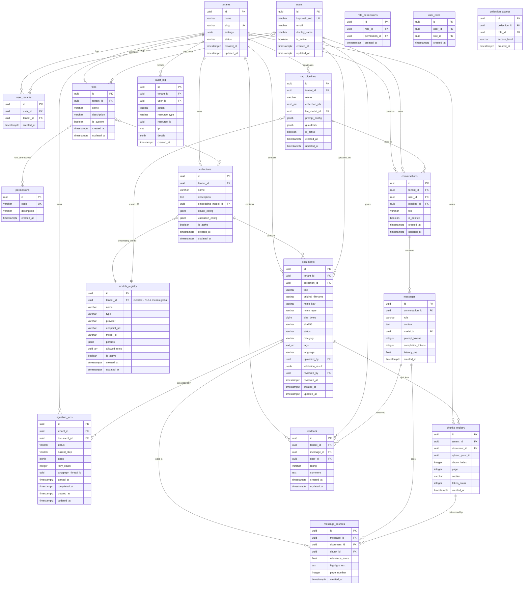
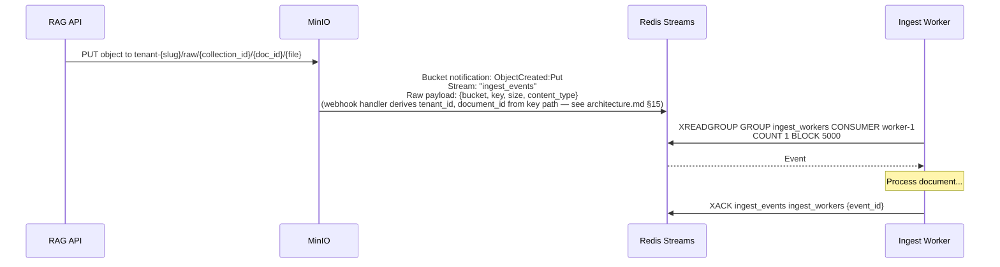
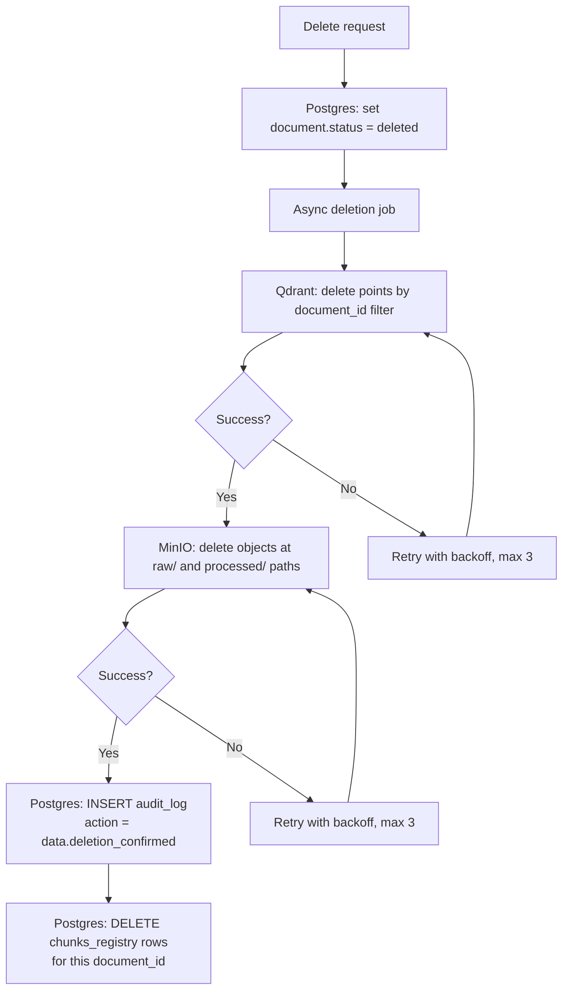

# Data Model

**Project:** Universal RAG Platform
**Version:** 0.2
**Date:** 2026-07-13
**Related:** [Architecture](architecture.md) | [API Specification](api.md) | [Security & GDPR](rodo.md)

**Conventions:** PK = `id UUID DEFAULT gen_random_uuid()`. All tables have `created_at TIMESTAMPTZ DEFAULT now()` and `updated_at TIMESTAMPTZ DEFAULT now()` (trigger-managed). Soft-delete only where explicitly noted. Every business table has `tenant_id UUID NOT NULL` (FK to `tenants`, indexed). Timestamps are always UTC.

**Tenant isolation exemptions:** The following tables do NOT carry `tenant_id` directly: `tenants`, `permissions`, `langgraph_checkpoints`, `role_permissions`, `user_roles`, `user_tenants`, `message_sources`. `users` is a **global** table — users are linked to tenants via `user_tenants` and to roles within tenants via `user_roles`. `message_sources` derives tenant context via `messages → conversations → tenant_id`.

---

## 1. Entity-Relationship Diagram



---

## 2. Table Definitions

### 2.1 Identity and Access

#### `tenants`

The root entity. Each tenant represents an organization using the platform.

| Column | Type | Constraints | Description |
|---|---|---|---|
| `id` | `UUID` | PK, DEFAULT `gen_random_uuid()` | Tenant identifier |
| `name` | `VARCHAR(255)` | NOT NULL | Organization display name |
| `slug` | `VARCHAR(100)` | NOT NULL, UNIQUE | URL-safe identifier; used in MinIO bucket naming (`tenant-{slug}`) |
| `settings` | `JSONB` | NOT NULL, DEFAULT `'{}'` | Tenant-specific configuration: `{max_docs, max_collections, max_users, max_storage_bytes, retention_days, industry, disclaimer_text, allowed_mime_types}`. See Section 8 for full schema. |
| `status` | `VARCHAR(20)` | NOT NULL, DEFAULT `'active'` | `active`, `suspended`, `deleted` |
| `created_at` | `TIMESTAMPTZ` | NOT NULL, DEFAULT `now()` | |
| `updated_at` | `TIMESTAMPTZ` | NOT NULL, DEFAULT `now()` | |

**Indexes:** `slug` (unique), `status`.

---

#### `users`

User profiles linked to Keycloak identities. Keycloak is the source of truth for authentication; this table holds platform-specific attributes. Users are **global** — a single user record can belong to multiple tenants via the `user_tenants` join table. Roles within each tenant are assigned via `user_roles`. There is no `tenant_id` on this table.

| Column | Type | Constraints | Description |
|---|---|---|---|
| `id` | `UUID` | PK, DEFAULT `gen_random_uuid()` | |
| `keycloak_sub` | `VARCHAR(255)` | NOT NULL, UNIQUE | Keycloak `sub` claim; globally unique across all tenants |
| `email` | `VARCHAR(255)` | NOT NULL, UNIQUE | Synced from Keycloak; globally unique (Keycloak enforces this) |
| `display_name` | `VARCHAR(255)` | | |
| `is_active` | `BOOLEAN` | NOT NULL, DEFAULT `true` | Soft deactivation (does not delete data) |
| `created_at` | `TIMESTAMPTZ` | NOT NULL, DEFAULT `now()` | |
| `updated_at` | `TIMESTAMPTZ` | NOT NULL, DEFAULT `now()` | |

**Indexes:** `keycloak_sub` (unique), `email` (unique).

---

#### `user_tenants`

Many-to-many join table linking global users to tenants. A user can belong to multiple tenants; tenant membership is the prerequisite for having roles within that tenant.

| Column | Type | Constraints | Description |
|---|---|---|---|
| `id` | `UUID` | PK, DEFAULT `gen_random_uuid()` | |
| `user_id` | `UUID` | NOT NULL, FK `users(id)` ON DELETE CASCADE | |
| `tenant_id` | `UUID` | NOT NULL, FK `tenants(id)` ON DELETE CASCADE | |
| `created_at` | `TIMESTAMPTZ` | NOT NULL, DEFAULT `now()` | |

**Unique constraint:** `(user_id, tenant_id)`.
**Indexes:** `user_id`, `tenant_id`.

---

#### `roles`

Roles are defined per tenant. System roles (`is_system = true`) are created automatically during tenant provisioning and cannot be deleted: `admin`, `contributor`, `viewer`.

| Column | Type | Constraints | Description |
|---|---|---|---|
| `id` | `UUID` | PK, DEFAULT `gen_random_uuid()` | |
| `tenant_id` | `UUID` | NOT NULL, FK `tenants(id)` | |
| `name` | `VARCHAR(100)` | NOT NULL | Role name, unique within tenant |
| `description` | `TEXT` | | |
| `is_system` | `BOOLEAN` | NOT NULL, DEFAULT `false` | System roles cannot be deleted |
| `created_at` | `TIMESTAMPTZ` | NOT NULL, DEFAULT `now()` | |
| `updated_at` | `TIMESTAMPTZ` | NOT NULL, DEFAULT `now()` | |

**Indexes:** `tenant_id`.
**Unique constraint:** `(tenant_id, name)`.

---

#### `permissions`

Global permission dictionary. Permissions are assigned to roles, not to users directly.

| Column | Type | Constraints | Description |
|---|---|---|---|
| `id` | `UUID` | PK, DEFAULT `gen_random_uuid()` | |
| `code` | `VARCHAR(100)` | NOT NULL, UNIQUE | Permission code: `documents:upload`, `documents:read`, `documents:delete`, `documents:delete_own`, `documents:manage`, `documents:approve`, `chat:query`, `admin:users`, `admin:collections`, `admin:models`, `admin:audit` |
| `description` | `TEXT` | | Human-readable description |
| `created_at` | `TIMESTAMPTZ` | NOT NULL, DEFAULT `now()` | |

**Indexes:** `code` (unique).

---

#### `role_permissions`

Many-to-many: roles to permissions.

| Column | Type | Constraints | Description |
|---|---|---|---|
| `id` | `UUID` | PK, DEFAULT `gen_random_uuid()` | |
| `role_id` | `UUID` | NOT NULL, FK `roles(id)` ON DELETE CASCADE | |
| `permission_id` | `UUID` | NOT NULL, FK `permissions(id)` ON DELETE CASCADE | |
| `created_at` | `TIMESTAMPTZ` | NOT NULL, DEFAULT `now()` | |

**Unique constraint:** `(role_id, permission_id)`.
**Indexes:** `role_id`, `permission_id`.

---

#### `user_roles`

Many-to-many: users to roles. A user can have multiple roles within their tenant.

| Column | Type | Constraints | Description |
|---|---|---|---|
| `id` | `UUID` | PK, DEFAULT `gen_random_uuid()` | |
| `user_id` | `UUID` | NOT NULL, FK `users(id)` ON DELETE CASCADE | |
| `role_id` | `UUID` | NOT NULL, FK `roles(id)` ON DELETE CASCADE | |
| `created_at` | `TIMESTAMPTZ` | NOT NULL, DEFAULT `now()` | |

**Unique constraint:** `(user_id, role_id)`.
**Indexes:** `user_id`, `role_id`.

---

### 2.2 Knowledge and Ingest

#### `collections`

A collection is a logical grouping of documents within a tenant. Each collection has its own embedding model, chunking strategy, and access control configuration.

**Public collections** (`is_public = true`) are platform-wide shared knowledge bases (ICD-11, pharmacopoeia, clinical protocols) managed by a designated platform-admin tenant (`managed_by_tenant_id`). They are readable by all tenants but writable only by the managing tenant. `NULL` in `managed_by_tenant_id` means the collection is system-owned and cannot be written by any single tenant.

| Column | Type | Constraints | Description |
|---|---|---|---|
| `id` | `UUID` | PK, DEFAULT `gen_random_uuid()` | |
| `tenant_id` | `UUID` | NOT NULL, FK `tenants(id)` ON DELETE CASCADE | Owning tenant. For public collections this is still the creating tenant. |
| `name` | `VARCHAR(255)` | NOT NULL | Collection display name, unique within tenant |
| `description` | `TEXT` | | |
| `embedding_model_id` | `UUID` | NOT NULL, FK `models_registry(id)` | Embedding model used for this collection. Changing this requires full reindexation. |
| `chunk_config` | `JSONB` | NOT NULL, DEFAULT `'{"strategy": "recursive", "chunk_size": 512, "overlap": 64, "min_chunk_size": 64}'` | Chunking parameters: `{strategy, chunk_size, overlap, min_chunk_size, separators, document_type_overrides}`. Strategy: `recursive`, `semantic`, `by_section`. See Section 8 for full schema. |
| `validation_config` | `JSONB` | NOT NULL, DEFAULT `'{"confidence_threshold": 0.7, "require_review": false}'` | Ingest validation: `{confidence_threshold, require_review, allowed_categories, pii_action}` |
| `search_config` | `JSONB` | nullable | Per-collection retrieval overrides: `{search_mode, top_k, score_threshold}`. `NULL` = use application defaults. |
| `is_active` | `BOOLEAN` | NOT NULL, DEFAULT `true` | |
| `is_public` | `BOOLEAN` | NOT NULL, DEFAULT `false` | When `true`, this collection is readable by every tenant. Write access restricted to `managed_by_tenant_id`. Migration: `0007_public_collections`. |
| `managed_by_tenant_id` | `UUID` | nullable, FK `tenants(id)` ON DELETE SET NULL | The tenant (platform-admin org) allowed to write this public collection. `NULL` = system-owned, no tenant may write. |
| `created_at` | `TIMESTAMPTZ` | NOT NULL, DEFAULT `now()` | |
| `updated_at` | `TIMESTAMPTZ` | NOT NULL, DEFAULT `now()` | |

**Indexes:** `tenant_id`, `embedding_model_id`, `is_public` (`ix_collections_is_public`), `managed_by_tenant_id`.
**Unique constraint:** `(tenant_id, name)`.

**Security contract for public collections (enforced in `RetrievalService`, not in SQL):**
- Read filter: `(tenant_id = caller AND collection_id IN allowed_ids) OR (collection_id IN public_ids)` — implemented in `filters.build_read_filter()`.
- Write guard: if `collection_id IN public_collection_ids AND collection_id NOT IN allowed_collection_ids` → `PermissionError` before any Qdrant call (`_assert_write_allowed_for_public()`).
- The managing tenant must have the public collection in its own `allowed_collection_ids` (granted via `CollectionAccess`) to satisfy the write guard.

---

#### `collection_access`

Defines which roles can access which collections, and at what level. Enforced both at the API layer (endpoint access) and the retrieval layer (Qdrant query filter).

| Column | Type | Constraints | Description |
|---|---|---|---|
| `id` | `UUID` | PK, DEFAULT `gen_random_uuid()` | |
| `collection_id` | `UUID` | NOT NULL, FK `collections(id)` ON DELETE CASCADE | |
| `role_id` | `UUID` | NOT NULL, FK `roles(id)` ON DELETE CASCADE | |
| `access_level` | `VARCHAR(10)` | NOT NULL, CHECK `IN ('read', 'write')` | `read` = can query; `write` = can query + upload documents |
| `created_at` | `TIMESTAMPTZ` | NOT NULL, DEFAULT `now()` | |

**Unique constraint:** `(collection_id, role_id)`.
**Indexes:** `collection_id`, `role_id`.

---

#### `documents`

Central metadata record for every uploaded document. Status transitions model the full ingest lifecycle. Soft-delete via `status = 'deleted'`.

| Column | Type | Constraints | Description |
|---|---|---|---|
| `id` | `UUID` | PK, DEFAULT `gen_random_uuid()` | |
| `tenant_id` | `UUID` | NOT NULL, FK `tenants(id)` | |
| `collection_id` | `UUID` | NOT NULL, FK `collections(id)` | |
| `title` | `VARCHAR(500)` | NOT NULL | Document title (user-provided or extracted) |
| `original_filename` | `VARCHAR(500)` | NOT NULL | Sanitized original filename |
| `minio_key` | `VARCHAR(1000)` | NOT NULL | Full MinIO object path: `raw/{collection_id}/{document_id}/{filename}` |
| `mime_type` | `VARCHAR(100)` | NOT NULL | Validated MIME type |
| `size_bytes` | `BIGINT` | NOT NULL | File size in bytes |
| `sha256` | `VARCHAR(64)` | NOT NULL | SHA-256 hash of file content |
| `status` | `VARCHAR(20)` | NOT NULL, DEFAULT `'uploaded'` | See status enum below |
| `category` | `VARCHAR(100)` | | LLM-assigned category (e.g., `procedure`, `regulation`, `price_list`) |
| `tags` | `TEXT[]` | DEFAULT `'{}'` | User-provided and LLM-suggested tags |
| `language` | `VARCHAR(10)` | | Detected language (ISO 639-1) |
| `uploaded_by` | `UUID` | FK `users(id)` ON DELETE SET NULL | NULL when the uploader's account has been deleted (GDPR Art. 17) |
| `validation_result` | `JSONB` | | LLM validation output: `{category, confidence, quality_score, document_type, pii_flags[], reasons[]}`. **GDPR note:** may contain PII type labels (e.g., `person_name`). Retention equals the parent document — deleted in cascade with document. Must NOT be logged outside Postgres. |
| `reviewed_by` | `UUID` | FK `users(id)` | Admin who reviewed (if `needs_review`) |
| `reviewed_at` | `TIMESTAMPTZ` | | |
| `created_at` | `TIMESTAMPTZ` | NOT NULL, DEFAULT `now()` | |
| `updated_at` | `TIMESTAMPTZ` | NOT NULL, DEFAULT `now()` | |

**Document status enum:**

```
uploaded -> validating -> needs_review -> indexing -> ready
                      \-> rejected                \-> failed
                      \-> indexing -> ready
                                  \-> failed
                                           -> deleted (from any terminal state)
```

| Status | Meaning |
|---|---|
| `uploaded` | File saved to MinIO; awaiting processing |
| `validating` | Ingest graph running: extraction, deduplication, LLM validation, PII scan |
| `needs_review` | PII detected or low confidence; awaiting admin decision |
| `indexing` | Approved; chunking and embedding in progress |
| `ready` | Fully indexed; chunks available in Qdrant |
| `rejected` | Rejected by LLM validation or admin review |
| `failed` | Processing failed after max retries |
| `deleted` | Soft-deleted; async job removes Qdrant points and MinIO objects |

**Indexes:** `tenant_id`, `collection_id`, `status` (`idx_documents_status`), `uploaded_by`, `category`, `language`.
**Unique constraint (also index):** `(tenant_id, sha256)` (`idx_documents_sha256`) -- prevents duplicate files within a tenant.

---

#### `ingestion_jobs`

Tracks each processing attempt for a document. One document can have multiple jobs (e.g., initial processing + reindexation after config change).

| Column | Type | Constraints | Description |
|---|---|---|---|
| `id` | `UUID` | PK, DEFAULT `gen_random_uuid()` | |
| `tenant_id` | `UUID` | NOT NULL, FK `tenants(id)` | Denormalized from `documents.tenant_id` for direct tenant-scoped queries (e.g., admin job queue views). |
| `document_id` | `UUID` | NOT NULL, FK `documents(id)` ON DELETE CASCADE | |
| `status` | `VARCHAR(20)` | NOT NULL, DEFAULT `'pending'` | `pending`, `processing`, `awaiting_review`, `completed`, `failed` |
| `current_step` | `VARCHAR(50)` | | Current ingest graph node: `fetch`, `extract`, `dedupe`, `validate`, `pii_scan`, `chunk`, `embed`, `upsert`, `persist` |
| `steps` | `JSONB` | NOT NULL, DEFAULT `'[]'` | Ordered array of step execution records: `[{"stage": "fetch", "status": "completed", "started_at": "...", "completed_at": "...", "error": null, "meta": {...}}, ...]`. See Section 8 for full schema. |
| `retry_count` | `INTEGER` | NOT NULL, DEFAULT `0` | Current retry attempt (max 3) |
| `langgraph_thread_id` | `UUID` | | LangGraph checkpoint thread ID for graph resumption |
| `started_at` | `TIMESTAMPTZ` | | When processing began |
| `completed_at` | `TIMESTAMPTZ` | | When processing finished (success or failure) |
| `created_at` | `TIMESTAMPTZ` | NOT NULL, DEFAULT `now()` | |
| `updated_at` | `TIMESTAMPTZ` | NOT NULL, DEFAULT `now()` | |

**Indexes:** `tenant_id`, `document_id` (`idx_ingestion_jobs_document_id`), `status`, `langgraph_thread_id`.

---

#### `chunks_registry`

Maps every chunk to its Qdrant point. Used for cascading deletion (document deleted -> delete all points by `document_id`), citation rendering, and consistency checks.

| Column | Type | Constraints | Description |
|---|---|---|---|
| `id` | `UUID` | PK, DEFAULT `gen_random_uuid()` | |
| `tenant_id` | `UUID` | NOT NULL, FK `tenants(id)` | Denormalized from `documents.tenant_id` for efficient tenant-scoped deletion queries (GDPR Art. 17 cascades). |
| `document_id` | `UUID` | NOT NULL, FK `documents(id)` ON DELETE CASCADE | |
| `qdrant_point_id` | `UUID` | NOT NULL | Deterministic: `uuid5(document_id + chunk_index)` for idempotent upsert |
| `chunk_index` | `INTEGER` | NOT NULL | 0-based position within document |
| `page` | `INTEGER` | | Source page number (if applicable) |
| `section` | `VARCHAR(500)` | | Section heading (if extracted) |
| `token_count` | `INTEGER` | NOT NULL | Token count of chunk text |
| `created_at` | `TIMESTAMPTZ` | NOT NULL, DEFAULT `now()` | |

**Indexes:** `tenant_id`, `document_id` (`idx_chunks_registry_document_id`), `qdrant_point_id` UNIQUE (`idx_chunks_registry_qdrant_point_id`).

---

### 2.3 Conversations and Models

#### `models_registry`

Registry of all LLM and embedding models available on the platform. Models with `tenant_id = NULL` are globally available; tenant-specific models are visible only within that tenant.

| Column | Type | Constraints | Description |
|---|---|---|---|
| `id` | `UUID` | PK, DEFAULT `gen_random_uuid()` | |
| `tenant_id` | `UUID` | FK `tenants(id)`, NULLABLE | NULL = global (available to all tenants) |
| `name` | `VARCHAR(255)` | NOT NULL | Display name (e.g., "Llama 3.1 70B", "BGE-M3") |
| `type` | `VARCHAR(20)` | NOT NULL, CHECK `IN ('llm', 'embedding')` | |
| `provider` | `VARCHAR(50)` | NOT NULL | `ollama`, `vllm`, `openai_compat` |
| `endpoint_url` | `VARCHAR(500)` | NOT NULL | Base URL of the model server (e.g., `http://gpu-host:11434/v1`) |
| `model_id` | `VARCHAR(255)` | NOT NULL | Provider-specific model identifier (e.g., `llama3.1:70b`, `BAAI/bge-m3`) |
| `params` | `JSONB` | NOT NULL, DEFAULT `'{}'` | Model parameters: `{temperature, max_tokens, context_window, dimensions}` |
| `allowed_roles` | `UUID[]` | DEFAULT `'{}'` | If non-empty, only these roles can use this model. Empty = all roles. |
| `is_active` | `BOOLEAN` | NOT NULL, DEFAULT `true` | |
| `created_at` | `TIMESTAMPTZ` | NOT NULL, DEFAULT `now()` | |
| `updated_at` | `TIMESTAMPTZ` | NOT NULL, DEFAULT `now()` | |

**Indexes:** `tenant_id`, `type`, `is_active`.

---

#### `rag_pipelines`

A RAG pipeline combines collections, an LLM model, prompt configuration, and guardrails into a unit that Open WebUI presents as a selectable "model."

| Column | Type | Constraints | Description |
|---|---|---|---|
| `id` | `UUID` | PK, DEFAULT `gen_random_uuid()` | |
| `tenant_id` | `UUID` | NOT NULL, FK `tenants(id)` | |
| `name` | `VARCHAR(255)` | NOT NULL | User-facing name shown in Open WebUI (e.g., "Medical Procedures", "HR Policies") |
| `collection_ids` | `UUID[]` | NOT NULL | Array of collection IDs this pipeline searches across |
| `llm_model_id` | `UUID` | NOT NULL, FK `models_registry(id)` | LLM model used for generation |
| `prompt_config` | `JSONB` | NOT NULL, DEFAULT `'{}'` | `{system_prompt_version, rag_template_version, guardrails_version, top_k, score_threshold, max_context_tokens, reranker_enabled}`. See Section 8 for full schema. |
| `guardrails` | `JSONB` | NOT NULL, DEFAULT `'{}'` | `{pii_filter, max_tokens, blocked_topics[], disclaimer_required, disclaimer_text, require_citations}`. See Section 8 for full schema. |
| `is_active` | `BOOLEAN` | NOT NULL, DEFAULT `true` | |
| `created_at` | `TIMESTAMPTZ` | NOT NULL, DEFAULT `now()` | |
| `updated_at` | `TIMESTAMPTZ` | NOT NULL, DEFAULT `now()` | |

**Indexes:** `tenant_id`, `is_active`.
**Unique constraint:** `(tenant_id, name)`.

---

#### `conversations`

Conversations owned by users. The RAG API is the source of truth for audit; Open WebUI maintains its own parallel history for display.

| Column | Type | Constraints | Description |
|---|---|---|---|
| `id` | `UUID` | PK, DEFAULT `gen_random_uuid()` | |
| `tenant_id` | `UUID` | NOT NULL, FK `tenants(id)` | |
| `user_id` | `UUID` | NOT NULL, FK `users(id)` | |
| `pipeline_id` | `UUID` | FK `rag_pipelines(id)` | Pipeline used (nullable for raw LLM chats) |
| `title` | `VARCHAR(500)` | | Auto-generated or user-provided |
| `is_deleted` | `BOOLEAN` | NOT NULL, DEFAULT `false` | Soft-delete for GDPR Art. 17 |
| `created_at` | `TIMESTAMPTZ` | NOT NULL, DEFAULT `now()` | |
| `updated_at` | `TIMESTAMPTZ` | NOT NULL, DEFAULT `now()` | |

**Indexes:** `tenant_id`, `user_id`, `pipeline_id`, `is_deleted`.

---

#### `messages`

Individual messages within a conversation. Content is stored for audit; it is NOT written to application logs.

| Column | Type | Constraints | Description |
|---|---|---|---|
| `id` | `UUID` | PK, DEFAULT `gen_random_uuid()` | |
| `conversation_id` | `UUID` | NOT NULL, FK `conversations(id)` ON DELETE CASCADE | |
| `role` | `VARCHAR(20)` | NOT NULL, CHECK `IN ('user', 'assistant', 'system')` | |
| `content` | `TEXT` | NOT NULL | Message text. **GDPR/PII:** may contain personal data entered by users. Must NOT be written to application logs, Langfuse traces (mask at write time), or any store other than this Postgres table. Retention governed by `tenants.settings.retention_days`. |
| `model_id` | `UUID` | FK `models_registry(id)` | Model used for assistant messages |
| `prompt_tokens` | `INTEGER` | | Token count for input |
| `completion_tokens` | `INTEGER` | | Token count for output |
| `latency_ms` | `FLOAT` | | End-to-end latency |
| `created_at` | `TIMESTAMPTZ` | NOT NULL, DEFAULT `now()` | |

**Indexes:** `conversation_id` (`idx_messages_conversation_id`), `created_at`.

---

#### `message_sources`

Citations linking assistant messages to the source chunks and documents used to generate them. This is the basis for the citation UI in Open WebUI.

| Column | Type | Constraints | Description |
|---|---|---|---|
| `id` | `UUID` | PK, DEFAULT `gen_random_uuid()` | |
| `message_id` | `UUID` | NOT NULL, FK `messages(id)` ON DELETE CASCADE | |
| `document_id` | `UUID` | FK `documents(id)` ON DELETE SET NULL | Source document; NULL-ed when document is deleted (citation history preserved) |
| `chunk_id` | `UUID` | FK `chunks_registry(id)` ON DELETE SET NULL | Source chunk; NULL-ed when chunk is deleted (citation history preserved). `NOT NULL` removed intentionally. |
| `relevance_score` | `FLOAT` | NOT NULL | Retrieval score (0.0-1.0) |
| `highlight_text` | `TEXT` | | The exact passage used from the chunk (for PDF highlight rendering) |
| `page_number` | `INTEGER` | | Page number for citation display |
| `created_at` | `TIMESTAMPTZ` | NOT NULL, DEFAULT `now()` | |

**Indexes:** `message_id`, `document_id`, `chunk_id`.

---

#### `feedback`

User feedback on assistant responses. Used for quality tracking and retrieval/generation tuning.

| Column | Type | Constraints | Description |
|---|---|---|---|
| `id` | `UUID` | PK, DEFAULT `gen_random_uuid()` | |
| `tenant_id` | `UUID` | NOT NULL, FK `tenants(id)` | Denormalized for tenant-scoped queries; matches `conversations.tenant_id` of the cited message. |
| `message_id` | `UUID` | NOT NULL, FK `messages(id)` ON DELETE CASCADE | |
| `user_id` | `UUID` | NOT NULL, FK `users(id)` | |
| `rating` | `VARCHAR(10)` | NOT NULL, CHECK `IN ('up', 'down')` | |
| `comment` | `TEXT` | | Optional user comment |
| `created_at` | `TIMESTAMPTZ` | NOT NULL, DEFAULT `now()` | |
| `updated_at` | `TIMESTAMPTZ` | NOT NULL, DEFAULT `now()` | |

**Unique constraint:** `(message_id, user_id)` -- one rating per user per message.
**Indexes:** `tenant_id`, `message_id`, `user_id`.

---

### 2.4 System Tables

#### `audit_log`

Append-only audit log. Partitioned by month for query performance and retention management. No updates or deletes allowed (enforced by table-level policy/trigger).

| Column | Type | Constraints | Description |
|---|---|---|---|
| `id` | `UUID` | PK, DEFAULT `gen_random_uuid()` | |
| `tenant_id` | `UUID` | NOT NULL, FK `tenants(id)` | |
| `user_id` | `UUID` | FK `users(id)` | NULL for system actions |
| `action` | `VARCHAR(100)` | NOT NULL | Action code: `user.login`, `document.upload`, `document.approve`, `document.reject`, `document.delete`, `chat.query`, `admin.role_change`, `admin.user_deactivate`, `data.export`, `data.delete_request` |
| `resource_type` | `VARCHAR(50)` | | Entity type: `document`, `conversation`, `user`, `collection`, `role` |
| `resource_id` | `UUID` | | ID of the affected resource |
| `ip` | `INET` | | Client IP address |
| `details` | `JSONB` | DEFAULT `'{}'` | Additional context (no PII, no content -- only IDs and metadata) |
| `created_at` | `TIMESTAMPTZ` | NOT NULL, DEFAULT `now()` | Partition key |

**Partitioning:** `PARTITION BY RANGE (created_at)` — one partition per calendar month (e.g., `audit_log_2026_07`). Partition creation and dropping is automated by the `retention_worker`.
**Indexes:** `(tenant_id, created_at)` (`idx_audit_log_tenant_created`), `user_id`, `action`, `resource_type`.

---

#### `langgraph_checkpoints`

Managed by the LangGraph Postgres checkpointer library (`langgraph-checkpoint-postgres`). Schema is defined and migrated by the library — do NOT modify manually. The library creates the following tables:

| Table | Purpose |
|---|---|
| `checkpoints` | One row per checkpoint (thread + version); stores graph state as binary blob |
| `checkpoint_blobs` | Large state blobs stored separately (channel values) |
| `checkpoint_writes` | Pending writes for in-flight nodes (used for resumption after crash) |
| `checkpoint_migrations` | Internal migration tracking for the checkpointer library |

`tenant_id` is NOT present in these tables (they are execution-engine internals). Tenant context is carried inside the graph state blob and enforced at the application layer. The `ingestion_jobs.langgraph_thread_id` column is the foreign reference from Postgres business tables to a LangGraph checkpoint thread.

Used for:
- Query graph: debugging, tracing node execution.
- Ingest graph: pausing at `needs_review` and resuming after admin approval.

**Retention:** Checkpoint rows are cleaned up by a periodic job after 30 days (see Section 6).

---

## 3. Qdrant Vector Store Structure

### Collection Naming

One physical Qdrant collection per embedding model:

| Collection name | Embedding model | Dimensions | Distance metric |
|---|---|---|---|
| `chunks__bge_m3` | BGE-M3 (BAAI) | 1024 | Cosine |

Adding a new embedding model creates a new collection. Collections for different models are never mixed -- documents in a Postgres collection that uses BGE-M3 have their vectors in `chunks__bge_m3`.

### Point Structure

Each Qdrant point represents one chunk:

| Field | Location | Type | Description |
|---|---|---|---|
| `id` | Point ID | UUID | Same as `chunks_registry.qdrant_point_id`; deterministic (`uuid5(document_id, chunk_index)`) for idempotent upsert |
| `vector` | Vector | float[1024] | Embedding vector from the collection's embedding model |

### Payload Schema

| Payload field | Type | Indexed | Purpose |
|---|---|---|---|
| `tenant_id` | `keyword` | Yes | **Tenant isolation -- ALWAYS in filter. No exceptions.** |
| `collection_id` | `keyword` | Yes | RBAC enforcement -- filter by user's allowed collections |
| `document_id` | `keyword` | Yes | Cascading deletion (delete all points for a document) |
| `category` | `keyword` | Yes | Topic filtering (e.g., "procedure", "regulation") |
| `tags` | `keyword[]` | Yes | Tag-based filtering |
| `language` | `keyword` | Yes | Language filtering |
| `page` | `integer` | No | Source page number (for citations) |
| `section` | `keyword` | No | Section heading (for citations) |
| `chunk_index` | `integer` | No | Position within document (for ordering) |
| `text` | `text` | No | Full chunk text -- returned to LLM as context. NOT indexed for search. |
| `created_at` | `integer` | Yes | Unix timestamp; used for freshness ranking and retention enforcement |

### Mandatory Filter (enforced by RetrievalService)

Every query to Qdrant MUST include:

```json
{
  "must": [
    {"key": "tenant_id", "match": {"value": "<user's tenant_id>"}},
    {"key": "collection_id", "match": {"any": ["<allowed_collection_1>", "<allowed_collection_2>"]}}
  ]
}
```

No code path bypasses this filter. The `RetrievalService` in `src/retrieval/service.py` is the only module that constructs Qdrant queries. This is verified by import linter tests and CI checks.

### Phase 3: Hybrid Retrieval

In the same collection, add sparse vectors for BM25/SPLADE:

```
Point:
  dense_vector: float[1024]   (BGE-M3)
  sparse_vector: {indices: [...], values: [...]}   (BM25 or SPLADE)
```

Retrieval becomes: dense search + sparse search -> reciprocal rank fusion -> cross-encoder reranker -> final ranking.

---

## 4. MinIO Object Storage Layout

### Bucket Structure

One bucket per tenant: `tenant-{slug}`

```
tenant-{slug}/
  raw/
    {collection_id}/
      {document_id}/
        {sanitized_original_filename}     # Original uploaded file
  processed/
    {document_id}/
      extracted.json                       # Docling extraction output (debug/reprocessing)
```

### Bucket Configuration

| Setting | Value | Rationale |
|---|---|---|
| Bucket naming | `tenant-{slug}` | Separate policies and encryption per tenant; clean offboarding (drop bucket) |
| Notifications | `ObjectCreated:Put` on prefix `raw/` only | Triggers ingest pipeline via Redis Streams |
| Versioning | Enabled | Audit trail for file replacements |
| Lifecycle | `processed/` objects deleted after 90 days | Extraction output is for debug; not needed long-term |
| Encryption | SSE-S3 (server-side encryption) | At-rest encryption for all stored objects |
| Access | Internal network only; presigned URLs for user downloads (TTL <= 5 min) | No direct external access to MinIO |

### Event Flow



---

## 5. Cross-Store Consistency Rules

### Source of Truth

**PostgreSQL is the authoritative source.** Qdrant and MinIO are derived stores. If they disagree, Postgres wins.

### Write Order

All multi-store writes follow this order:

```
1. Postgres (status update)  -- committed first
2. MinIO / Qdrant (data write)  -- applied second
3. Postgres (status confirmation)  -- confirms success
```

On failure at step 2: Postgres status is set to `failed`; no partial data in Qdrant/MinIO is visible to users (filtered by document status in retrieval).

### Document Deletion Cascade

GDPR Art. 17 compliance requires complete removal across all stores:



**DeletionService** (`src/domain/deletion_service.py`) orchestrates this cascade. Any new data store added to the platform MUST be registered in `DeletionService` for cascading deletion.

### Nightly Consistency Job

A scheduled job runs daily to detect and resolve inconsistencies:

| Check | Action |
|---|---|
| `chunks_registry` rows with no matching Qdrant point | Re-index or delete orphan registry rows |
| Qdrant points with no matching `chunks_registry` row | Delete orphan points |
| `documents` with `status=ready` but no `chunks_registry` rows | Set status to `failed`; alert |
| MinIO objects with no matching `documents` row | Log and quarantine (do not auto-delete -- may be upload in progress) |
| `documents` with `status=deleted` older than 24h still having Qdrant points or MinIO objects | Re-trigger deletion cascade |

---

## 6. GDPR Retention Policy

| Data category | Default retention | Configurable per tenant | Deletion method |
|---|---|---|---|
| Conversations + messages | 12 months | Yes (`tenants.settings.retention_days`) | Soft-delete (`is_deleted`), then hard purge by retention job |
| `messages.content` (PII in chat) | Same as conversations | Yes | Purged with parent conversation; never written to logs or external stores |
| Audit log | 24 months | Yes (minimum: legal requirement for the industry) | Partition drop after retention period |
| Documents (source files + vectors) | Until admin deletes | Yes | Cascading delete: Postgres -> Qdrant -> MinIO |
| `documents.validation_result` (PII type labels) | Same as parent document | No | Deleted in cascade with document row (no separate action needed) |
| Langfuse traces | 3 months | Yes | Langfuse retention policy; PII masked at write time |
| Processed extraction output (MinIO) | 90 days | No | MinIO lifecycle rule auto-deletes |
| LangGraph checkpoints | 30 days | No | Periodic cleanup job |
| User accounts | Until deactivation + 30 days | Yes | Hard delete of user record; conversations anonymized (`user_id` set to NULL) |

### Retention Enforcement

A scheduled job (`retention_worker`) runs nightly:

1. Query `tenants.settings.retention_days` for each tenant.
2. Soft-delete conversations older than the retention period.
3. Hard-delete previously soft-deleted conversations older than 30 days.
4. Drop audit_log partitions older than the configured retention.
5. Record retention actions in audit_log.

---

## 7. Index Strategy Summary

| Table | Index name | Index columns | Type | Purpose |
|---|---|---|---|---|
| `tenants` | — | `slug` | UNIQUE | Lookup by slug |
| `users` | — | `keycloak_sub` | UNIQUE | Keycloak identity lookup |
| `users` | — | `email` | UNIQUE | Email uniqueness (global) |
| `user_tenants` | — | `(user_id, tenant_id)` | UNIQUE | Membership uniqueness |
| `user_tenants` | — | `tenant_id` | B-tree | Tenant member lookup |
| `roles` | — | `(tenant_id, name)` | UNIQUE | Role name uniqueness within tenant |
| `documents` | — | `tenant_id` | B-tree | Tenant filtering |
| `documents` | — | `collection_id` | B-tree | Collection filtering |
| `documents` | `idx_documents_status` | `status` | B-tree | Status-based queries (review queue, ready docs) |
| `documents` | `idx_documents_sha256` | `(tenant_id, sha256)` | UNIQUE | Deduplication within tenant |
| `documents` | — | `uploaded_by` | B-tree | User's documents |
| `chunks_registry` | — | `tenant_id` | B-tree | Tenant-scoped deletion queries |
| `chunks_registry` | `idx_chunks_registry_document_id` | `document_id` | B-tree | Cascading operations |
| `chunks_registry` | `idx_chunks_registry_qdrant_point_id` | `qdrant_point_id` | UNIQUE | Qdrant cross-reference |
| `ingestion_jobs` | — | `tenant_id` | B-tree | Tenant-scoped job queue |
| `ingestion_jobs` | `idx_ingestion_jobs_document_id` | `document_id` | B-tree | Job lookup per document |
| `ingestion_jobs` | — | `status` | B-tree | Queue monitoring |
| `conversations` | — | `(tenant_id, user_id)` | B-tree | User's conversations within tenant |
| `messages` | `idx_messages_conversation_id` | `conversation_id` | B-tree | Message retrieval |
| `message_sources` | — | `message_id` | B-tree | Citation retrieval |
| `feedback` | — | `tenant_id` | B-tree | Tenant-scoped feedback queries |
| `audit_log` | `idx_audit_log_tenant_created` | `(tenant_id, created_at)` | B-tree | Partitioned queries per tenant |
| `audit_log` | — | `action` | B-tree | Action-based filtering |

---

## 8. JSONB Schema Reference

### `tenants.settings`

```json
{
  "max_docs": 10000,
  "max_collections": 50,
  "max_users": 200,
  "max_storage_bytes": 10737418240,
  "retention_days": 365,
  "industry": "medical",
  "disclaimer_text": "This response is not medical advice. Always consult a qualified healthcare professional.",
  "allowed_mime_types": ["application/pdf", "application/vnd.openxmlformats-officedocument.wordprocessingml.document", "text/plain", "text/markdown", "text/html"],
  "max_file_size_bytes": 104857600,
  "rate_limit_chat_per_minute": 30,
  "max_concurrent_ingest_jobs": 20
}
```

### `collections.chunk_config`

```json
{
  "strategy": "recursive",
  "chunk_size": 512,
  "overlap": 64,
  "min_chunk_size": 64,
  "separators": ["\n\n", "\n", ". ", " "],
  "document_type_overrides": {
    "table": {"strategy": "by_section", "chunk_size": 1024},
    "legal": {"strategy": "recursive", "chunk_size": 768, "overlap": 128}
  }
}
```

### `collections.validation_config`

```json
{
  "confidence_threshold": 0.7,
  "require_review": false,
  "allowed_categories": ["procedure", "regulation", "guideline", "form"],
  "pii_action": "flag_for_review",
  "quality_threshold": 0.5
}
```

### `documents.validation_result`

```json
{
  "category": "procedure",
  "confidence": 0.92,
  "quality_score": 0.85,
  "document_type": "pdf_text",
  "pii_detected": true,
  "pii_types": ["person_name", "phone_number"],
  "reviewer_notes": "Approved after anonymizing patient references in section 3.",
  "reasons": ["Contains structured medical procedure", "PII detected in section 3"],
  "language_detected": "pl",
  "page_count": 12,
  "word_count": 4500
}
```

> **GDPR note:** `pii_types` contains type labels only (e.g., `person_name`) — never actual PII values. `reviewer_notes` may contain free-form admin text; treat as internal and subject to the same retention as the parent document.

### `rag_pipelines.prompt_config`

```json
{
  "system_prompt_version": "v2_medical",
  "rag_template_version": "v1_citations",
  "guardrails_version": "v1_medical",
  "top_k": 8,
  "score_threshold": 0.35,
  "max_context_tokens": 4096,
  "reranker_enabled": false,
  "decompose_complex_queries": true
}
```

> Version strings reference named, versioned templates stored in `graphs/prompts/`. Changing a version here triggers re-evaluation in `tests/eval/`.

### `rag_pipelines.guardrails`

```json
{
  "pii_filter": true,
  "max_tokens": 2048,
  "blocked_topics": ["investment_advice", "legal_advice"],
  "disclaimer_required": true,
  "disclaimer_text": "This information is from organizational documents and is not a substitute for professional medical advice.",
  "require_citations": true
}
```

### `ingestion_jobs.steps`

An ordered array of step execution records. Each element corresponds to one ingest graph node. Array order equals execution order; partial arrays are valid for in-progress jobs.

```json
[
  {"stage": "fetch",    "status": "completed", "started_at": "2026-07-13T10:00:00Z", "completed_at": "2026-07-13T10:00:01Z", "error": null, "meta": {"size_bytes": 204800}},
  {"stage": "extract",  "status": "completed", "started_at": "2026-07-13T10:00:01Z", "completed_at": "2026-07-13T10:00:03Z", "error": null, "meta": {"page_count": 12, "word_count": 4500}},
  {"stage": "dedupe",   "status": "completed", "started_at": "2026-07-13T10:00:03Z", "completed_at": "2026-07-13T10:00:03Z", "error": null, "meta": {"duplicate": false}},
  {"stage": "validate", "status": "completed", "started_at": "2026-07-13T10:00:03Z", "completed_at": "2026-07-13T10:00:06Z", "error": null, "meta": {"confidence": 0.92, "category": "procedure"}},
  {"stage": "pii_scan", "status": "completed", "started_at": "2026-07-13T10:00:06Z", "completed_at": "2026-07-13T10:00:07Z", "error": null, "meta": {"pii_detected": true, "pii_types": ["person_name"]}},
  {"stage": "chunk",    "status": "completed", "started_at": "2026-07-13T10:00:07Z", "completed_at": "2026-07-13T10:00:08Z", "error": null, "meta": {"chunk_count": 34}},
  {"stage": "embed",    "status": "completed", "started_at": "2026-07-13T10:00:08Z", "completed_at": "2026-07-13T10:00:12Z", "error": null, "meta": {"model_id": "BAAI/bge-m3"}},
  {"stage": "upsert",   "status": "completed", "started_at": "2026-07-13T10:00:12Z", "completed_at": "2026-07-13T10:00:13Z", "error": null, "meta": {"points_upserted": 34}},
  {"stage": "persist",  "status": "completed", "started_at": "2026-07-13T10:00:13Z", "completed_at": "2026-07-13T10:00:13Z", "error": null, "meta": {}}
]
```

> **Schema:** `stage` (string, one of the node names), `status` (`pending` | `running` | `completed` | `failed` | `skipped`), `started_at` (ISO 8601 UTC or null), `completed_at` (ISO 8601 UTC or null), `error` (error message string or null), `meta` (arbitrary key-value step output — no PII).

---

## 9. SQLAlchemy 2.x Implementation Conventions

All models in `src/db/models/` follow these conventions. Deviations require explicit justification in the PR.

### Base class

```python
from sqlalchemy.orm import DeclarativeBase, MappedAsDataclass

class Base(DeclarativeBase):
    pass
```

### Column declarations

Use `Mapped[T]` + `mapped_column()` exclusively. Do not use the legacy `Column()` API.

```python
from uuid import UUID, uuid4
from datetime import datetime
from sqlalchemy import func, text
from sqlalchemy.dialects.postgresql import UUID as PG_UUID, JSONB
from sqlalchemy.orm import Mapped, mapped_column

class ExampleModel(Base):
    __tablename__ = "example"

    id: Mapped[UUID] = mapped_column(
        PG_UUID(as_uuid=True), primary_key=True, default=uuid4
    )
    tenant_id: Mapped[UUID] = mapped_column(PG_UUID(as_uuid=True), nullable=False, index=True)
    name: Mapped[str] = mapped_column(nullable=False)
    settings: Mapped[dict] = mapped_column(JSONB, nullable=False, server_default=text("'{}'"))
    created_at: Mapped[datetime] = mapped_column(
        nullable=False, server_default=func.now()
    )
    updated_at: Mapped[datetime] = mapped_column(
        nullable=False, server_default=func.now(), onupdate=func.now()
    )
```

### Key rules

| Convention | Detail |
|---|---|
| `Mapped[T]` + `mapped_column()` | Required for all columns. No bare `Column()`. |
| `UUID(as_uuid=True)` | Use `sqlalchemy.dialects.postgresql.UUID`. Store as native Postgres UUID, return as Python `uuid.UUID`. Default via `default=uuid4` (Python-side) — do not rely solely on server default for ORM-created objects. |
| `updated_at` | Always `onupdate=func.now()`. Also set `server_default=func.now()` so DB-level inserts are covered. |
| `JSONB` | Use `sqlalchemy.dialects.postgresql.JSONB`, not `JSON`. |
| Async sessions | All database access via `AsyncSession` from `sqlalchemy.ext.asyncio`. No synchronous sessions in `src/`. |
| Session factory | Injected via FastAPI `Depends`; never instantiated ad-hoc inside business logic. |
| Repositories | One repository class per aggregate root in `src/db/repositories/`. Methods accept `AsyncSession` as first argument. No ORM calls outside repository classes. |
| Alembic | One logical change per migration file. Every migration must implement `downgrade()`. Autogenerate with `alembic revision --autogenerate -m "..."` then review the diff before committing. |
| `tenant_id` filtering | Repositories that query business tables MUST receive `tenant_id` as an explicit parameter and apply it as a `WHERE` clause filter. Never derive `tenant_id` from a default or global state. |

---

## Data Engineer Review

**Review date:** 2026-07-13
**Reviewer:** Data Engineer (db layer, SQLAlchemy 2.x, GDPR)
**Document version reviewed:** 0.2

The following issues were found and corrected directly in this document. All changes are real schema defects or missing documentation — no speculative additions.

### A. Tenant isolation

| # | Issue | Fix applied |
|---|---|---|
| A1 | `users` table had `tenant_id UUID NOT NULL` making it a per-tenant table, which contradicts the global Keycloak identity model and `keycloak_sub UNIQUE` globally. A user can belong to multiple tenants; a `tenant_id` column on `users` would force one-tenant-per-user. | Removed `tenant_id` from `users`. Added `user_tenants` join table (`user_id`, `tenant_id`, UNIQUE constraint) to model multi-tenant membership. Updated ERD and all relationship lines accordingly. |
| A2 | `ingestion_jobs` had no `tenant_id`. To list all ingest jobs for a tenant (admin dashboard, metrics) without a multi-table join through `documents`, a denormalized `tenant_id` is required. | Added `tenant_id UUID NOT NULL FK tenants(id)` to `ingestion_jobs`. Added `tenant_id` to its index list. |
| A3 | `chunks_registry` had no `tenant_id`. GDPR Art. 17 deletion cascade queries against `chunks_registry` by tenant (e.g., "delete all chunks for tenant X") require this field. | Added `tenant_id UUID NOT NULL FK tenants(id)` to `chunks_registry`. Added to index list. |
| A4 | `feedback` had no `tenant_id`. It is a business table with user-generated content scoped to a tenant conversation. Querying tenant feedback KPIs without a join chain requires it. | Added `tenant_id UUID NOT NULL FK tenants(id)` to `feedback`. Added `tenant_id` index. |
| A5 | Header conventions note listed exemptions incorrectly (did not mention `user_tenants`; implied `users` was a tenant-scoped table). | Rewrote the exemption note in the document header to explicitly list all exempt tables and explain the `users` global model. |

### B. Standard columns

| # | Issue | Fix applied |
|---|---|---|
| B1 | `feedback` had no `updated_at`. It is not an append-only table (a user can change their rating or comment). | Added `updated_at TIMESTAMPTZ NOT NULL DEFAULT now()` to `feedback`. |
| B2 | `users.email` was `UNIQUE` only within `(tenant_id, email)`. After removing `tenant_id`, email must be globally unique (Keycloak guarantees this). | Changed constraint to global `UNIQUE` on `email`. |

### C. Constraints and foreign keys

| # | Issue | Fix applied |
|---|---|---|
| C1 | `documents.uploaded_by` was `NOT NULL, FK users(id)` with no delete action. When a user account is hard-deleted (GDPR Art. 17 + 30-day grace period), this FK would block the delete or cascade-delete the document (data loss). The correct behavior is to null the uploader reference. | Changed to `FK users(id) ON DELETE SET NULL` and removed `NOT NULL`. |
| C2 | `ingestion_jobs.document_id` had no `ON DELETE CASCADE`. When a document is deleted, its ingest jobs become orphans. | Added `ON DELETE CASCADE` to `ingestion_jobs.document_id` FK. |
| C3 | `message_sources.chunk_id` was `NOT NULL, FK chunks_registry(id)` with no delete action. Chunks are deleted when documents are removed. Citation history (which chunk was cited) should be preserved for audit purposes, with the FK nulled. Same applies to `document_id`. | Changed both `document_id` and `chunk_id` on `message_sources` to nullable with `ON DELETE SET NULL`. |

### D. Critical indexes

| # | Issue | Fix applied |
|---|---|---|
| D1 | Named index identifiers were absent from table definitions and the Section 7 summary, making it impossible to reference them in Alembic migrations or EXPLAIN output. | Added canonical index names (`idx_documents_status`, `idx_documents_sha256`, `idx_ingestion_jobs_document_id`, `idx_chunks_registry_document_id`, `idx_chunks_registry_qdrant_point_id`, `idx_messages_conversation_id`, `idx_audit_log_tenant_created`) in both table definitions and Section 7. |
| D2 | `audit_log` partitioning was documented as "Range on `created_at`, monthly partitions" but without the SQL syntax hint. | Clarified: `PARTITION BY RANGE (created_at)`, monthly partitions named `audit_log_YYYY_MM`. |
| D3 | Section 7 still referenced `users.tenant_id` index (no longer valid). | Removed. Replaced with `keycloak_sub` and `email` unique indexes. Added `user_tenants` indexes. Added `feedback.tenant_id` index. |

### E. JSONB schema examples

| # | Issue | Fix applied |
|---|---|---|
| E1 | `tenants.settings` lacked `max_collections` and `max_users` keys (checklist requirement; needed for provisioning enforcement). Had `max_documents` instead of `max_docs`. | Renamed `max_documents` -> `max_docs`, added `max_collections: 50` and `max_users: 200`. |
| E2 | `collections.chunk_config` lacked `min_chunk_size`. The key `per_type_overrides` diverged from the standard name `document_type_overrides` (used in rag-conventions.md). Key `chunk_overlap` should be `overlap` for consistency. | Added `min_chunk_size: 64`, renamed `per_type_overrides` -> `document_type_overrides`, renamed `chunk_overlap` -> `overlap`. |
| E3 | `documents.validation_result` had `pii_flags: []` (an array without a boolean flag) and was missing `pii_detected` (boolean), `pii_types` (renamed from `pii_flags`), and `reviewer_notes`. These fields are required for the review workflow logic. | Added `pii_detected: true`, renamed `pii_flags` -> `pii_types`, added `reviewer_notes`. Added GDPR note that only type labels are stored, never PII values. |
| E4 | `rag_pipelines.prompt_config` stored `"system_prompt_template": "v2_medical"` as a freeform string, not a versioned reference. The rag-conventions require versioned prompt templates. Added `rag_template_version` and `guardrails_version` were missing. | Renamed `system_prompt_template` -> `system_prompt_version`, added `rag_template_version` and `guardrails_version`. Added note linking to `graphs/prompts/`. |
| E5 | `rag_pipelines.guardrails` used field names that diverged from the platform standard: `pii_output_filter` (should be `pii_filter`), `max_response_tokens` (should be `max_tokens`). `disclaimer_required` boolean was missing (the disclaimer text alone is ambiguous — does the pipeline require it or not?). | Renamed fields, added `disclaimer_required: true`. |
| E6 | `ingestion_jobs.steps` used a JSONB object/dict keyed by stage name. This format prevents ordering, makes partial-job states ambiguous, and is inconsistent with the array-of-records pattern required by the checklist. | Changed to an ordered array of `{stage, status, started_at, completed_at, error, meta}` objects. Updated table column description (`DEFAULT '[]'` instead of `'{}'`). |

### F. Missing items

| # | Issue | Fix applied |
|---|---|---|
| F1 | No `user_tenants` table documented. | Added full table definition with columns, constraints, and indexes. |
| F2 | `langgraph_checkpoints` section only said "managed by library" without naming the actual tables. Developers cannot write correct Alembic `op.execute()` statements or know what to exclude from autogenerate without knowing the table names. | Added table list: `checkpoints`, `checkpoint_blobs`, `checkpoint_writes`, `checkpoint_migrations`. Added note about `ingestion_jobs.langgraph_thread_id` as the cross-reference. Added retention note. |

### G. SQLAlchemy 2.x conventions

| # | Issue | Fix applied |
|---|---|---|
| G1 | No SQLAlchemy implementation conventions existed in the document. Without them, developers would mix legacy `Column()` with `Mapped[T]`, use sync sessions in async context, or scatter ORM calls outside repository classes. | Added Section 9 with `DeclarativeBase` base class pattern, `Mapped[T]` + `mapped_column()` code example, `UUID(as_uuid=True)` guidance, `onupdate=func.now()` for `updated_at`, `AsyncSession` requirement, and a key rules table. |

### H. GDPR

| # | Issue | Fix applied |
|---|---|---|
| H1 | `messages.content` column description was "Message text" with a sentence about not writing to logs, but lacked an explicit GDPR/PII note and reference to retention policy. | Expanded column description with GDPR/PII classification, prohibition on external logging (including Langfuse masking), and retention reference. |
| H2 | `documents.validation_result` column description did not note that it may contain PII type labels or that its retention equals the parent document. | Added GDPR note to column description. |
| H3 | Section 6 GDPR Retention table did not cover `messages.content` (PII in chat) or `documents.validation_result` as distinct data categories. | Added two rows to the retention table for these categories. |
