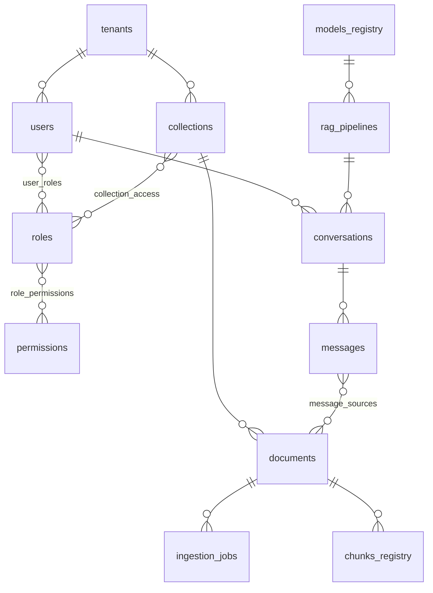

# Model danych

**Wersja:** 0.1 · Konwencje: PK = `id UUID`, wszędzie `created_at/updated_at`, soft-delete tylko tam, gdzie wskazano; każda tabela biznesowa ma `tenant_id` (FK + indeks).

## 1. PostgreSQL — tabele

### Tożsamość i dostęp

| Tabela | Kluczowe kolumny | Uwagi |
|---|---|---|
| `tenants` | name, slug, settings JSONB (limity, retencja, branża/disclaimer), status | organizacja |
| `users` | keycloak_sub (unique), email, display_name, is_active | źródłem tożsamości Keycloak; tu profil i przypisania |
| `roles` | tenant_id, name, description, is_system | role systemowe (admin/pracownik/user) + custom per tenant |
| `permissions` | code (unique), description | słownik: `documents:upload`, `chat:query`… |
| `role_permissions` | role_id, permission_id | M:N |
| `user_roles` | user_id, role_id | M:N |

### Wiedza i ingest

| Tabela | Kluczowe kolumny | Uwagi |
|---|---|---|
| `collections` | tenant_id, name, description, embedding_model_id FK, chunk_config JSONB (strategia, size, overlap), validation_config JSONB (progi, wymagana akceptacja) | |
| `collection_access` | collection_id, role_id, access_level (read/write) | egzekwowane przy retrievalu i uploadzie |
| `documents` | tenant_id, collection_id, title, original_filename, minio_key, mime_type, size_bytes, sha256 (unique per tenant), status ENUM(uploaded, validating, needs_review, indexing, ready, rejected, failed, deleted), category, tags TEXT[], language, uploaded_by FK, validation_result JSONB (kategoria LLM, confidence, powody, pii_flags), reviewed_by, reviewed_at | soft-delete (status) |
| `ingestion_jobs` | document_id, status, current_step, steps JSONB (etap→status, ts, error), retry_count, langgraph_thread_id | 1 dokument : N jobów (reindeksacja) |
| `chunks_registry` | document_id, qdrant_point_id, chunk_index, page, section, token_count | mapowanie do kasowania kaskadowego i cytowań |

### Konwersacje i modele

| Tabela | Kluczowe kolumny | Uwagi |
|---|---|---|
| `models_registry` | tenant_id (NULL = globalny), name, type ENUM(llm, embedding), provider (ollama/vllm/openai_compat), endpoint_url, model_id, params JSONB, allowed_roles UUID[], is_active | wybór modeli |
| `rag_pipelines` | tenant_id, name (widoczne w Open WebUI jako "model"), collection_ids UUID[], llm_model_id FK, prompt_config JSONB, guardrails JSONB | co user widzi na liście modeli |
| `conversations` | tenant_id, user_id, pipeline_id, title, is_deleted | |
| `messages` | conversation_id, role ENUM(user, assistant, system), content, model_id, prompt_tokens, completion_tokens, latency_ms | |
| `message_sources` | message_id, document_id, chunk_id FK chunks_registry, relevance_score | cytowania |
| `feedback` | message_id, user_id, rating ENUM(up, down), comment | |

### Systemowe

| Tabela | Kluczowe kolumny | Uwagi |
|---|---|---|
| `audit_log` | tenant_id, user_id, action, resource_type, resource_id, ip, details JSONB, created_at | append-only, partycjonowana po miesiącu |
| `langgraph_checkpoints` | schemat własny biblioteki (checkpointer Postgres) | |

## 2. Relacje (ERD skrót)



## 3. Qdrant — struktura

- **Kolekcja fizyczna per model embeddingów**: `chunks__bge_m3` (dim 1024, cosine). Zmiana modelu = nowa kolekcja + reindeksacja.
- **Point:** `id = chunks_registry.qdrant_point_id`, wektor + payload:

| Pole payload | Typ | Indeks | Cel |
|---|---|---|---|
| tenant_id | keyword | ✅ | izolacja (zawsze w filtrze) |
| collection_id | keyword | ✅ | RBAC |
| document_id | keyword | ✅ | kasowanie kaskadowe |
| category, tags | keyword | ✅ | filtrowanie tematyczne |
| language | keyword | ✅ | |
| page, section, chunk_index | int/keyword | — | cytowania |
| text | text | — | zwrot treści do LLM |
| created_at | int (ts) | ✅ | świeżość / retencja |

- Faza 3: hybryda — dodatkowo sparse vectors (BM25/SPLADE) w tej samej kolekcji + reranker.

## 4. MinIO — układ

```
bucket: tenant-{slug}
  raw/{collection_id}/{document_id}/{original_filename}     ← oryginał
  processed/{document_id}/extracted.json                    ← wynik ekstrakcji (debug/reproc.)
```

- Bucket per tenant → osobne polityki dostępu i szyfrowanie (SSE), prosty offboarding (drop bucketu).
- Bucket notifications → Redis Streams: event `ObjectCreated:Put` tylko dla prefixu `raw/`.
- Wersjonowanie włączone; lifecycle: `processed/` czyszczone po 90 dniach.

## 5. Spójność między magazynami

Źródło prawdy: **Postgres**. Reguły:

1. Zapis zawsze w kolejności: Postgres (status) → MinIO/Qdrant; rollback statusem `failed`.
2. Kasowanie dokumentu: transakcja Postgres (status `deleted`) → async job usuwa punkty Qdrant (po `document_id`) i obiekty MinIO → potwierdzenie w audit.
3. Nocny job spójności: porównanie `chunks_registry` ↔ Qdrant, `documents` ↔ MinIO; osierocone wpisy raportowane i czyszczone.

## 6. Retencja (RODO)

| Dane | Domyślna retencja | Konfigurowalne per tenant |
|---|---|---|
| Konwersacje | 12 mies. | ✅ |
| Audit log | 24 mies. | ✅ (min. wymóg prawny) |
| Dokumenty | do usunięcia przez admina | ✅ |
| Langfuse traces | 3 mies., PII maskowane | ✅ |